Lab 1: Preparing Development Environment
======================================


This lab covers the following topics:

-   Building the React and GraphQL stack
-   Installing and configuring Node.js
-   Setting up a React development environment with webpack, Babel, and
    other requirements
-   Using `webpack-bundle-analyzer` to check the bundle size

Hint:  Use VSCode for all exercises because it supports copy and paste.

The basic setup
---------------

The basic setup to make an application work is the logical request flow,
which looks as follows:

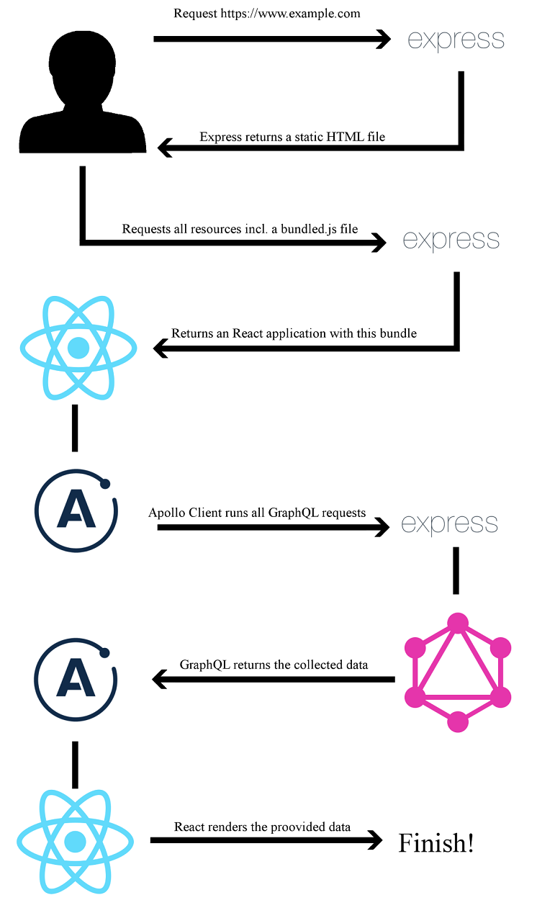


### Lab Solution

Complete solution for this lab is available in the following directory:

`cd ~/Desktop/react-graphql-course/labs/Lab01`

Run following command to install all required packages for the solution only:

`npm install`


### Running Solution

Run following command to run application in the Lab01 folder:

`npm run client`


**Note:** 

- VCode is already installed in the lab environment, you can open solution folder in vscode.
- Use Midori browser installed in the lab environment for accessing application.

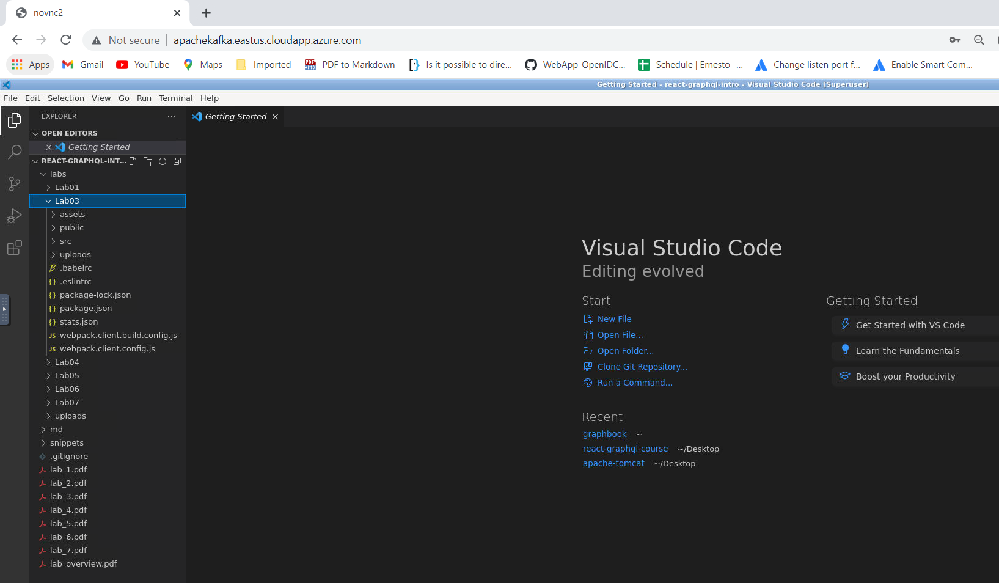


Node.js
=======

Let\'s open a terminal and verify that node is installed:

```
node --version
```

**ProTip**

The installation of Node.js via the package manager automatically installs npm.

```
npm --version
```

Setting up React
================

The development environment for our project is ready. In this section,
we are going to install and configure React, which is one primary aspect
of this course. Let\'s start by creating a new directory for our project:

```
mkdir ~/graphbook
cd ~/graphbook
```


Our project will use Node.js and many npm packages. Create a
[package.json] file to install and manage all of the dependencies
for our project.

This stores information about the project, such as the version number,
name, dependencies, and much more.

Just run [npm init] to create an empty [package.json] file from inside of the graphbook folder:

```
npm init
```


Npm will ask some questions, such as asking for the package name, which
is, in fact, the project name. Enter [Graphbook] to insert the
name of your application in the generated [package.json] file.


You can skip all other questions using the *Enter* key to save the
default values of npm. Most of them are not relevant because they just
provide information such as a description or the link to the repository.
We are going to fill the other fields, such as the scripts while working
through this course. You can see an example of the command line in the
following screenshot:


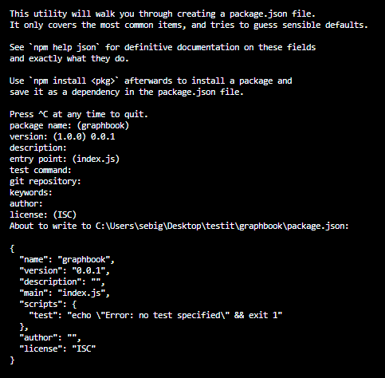


The first and most crucial dependency for this course is React. Use npm to
add React to our project:

```
npm install --save react@16.6.3 react-dom@16.6.3

npm install --save-dev webpack@4.26.1 webpack-cli@3.1.2 webpack-dev-server@3.1.10
```

Preparing and configuring webpack
---------------------------------

Our browser requests an [index.html] file when accessing our
application. It specifies all of the files that are required to run our
application. We need to create the [index.html], which we serve as
the entry point of our application:

1.  Create a separate directory for our [index.html] file:

```
mkdir public
cd public
touch index.html
```

**Note:** You can also use vscode to create and edit files.

2.  Then, save this inside [index.html]:

```
<!DOCTYPE html>
<html lang="en">
  <head>
    <meta charset="UTF-8">
    <meta name="viewport" content="width=device-width, initial-
      scale=1.0">
    <meta http-equiv="X-UA-Compatible" content="ie=edge">
    <title>Graphbook</title>
  </head>
  <body>
    <div id="root"></div>
  </body>
</html>
```


As you can see, no JavaScript is loaded here. There is only [div]
with the [root] id. This [div] tag is the DOMNode in which
our application will be rendered by [ReactDOM].

So, how do we get React up and running with this [index.html]
file?

To accomplish this, we need to use a web application bundler. It
prepares and bundles all our application assets.
For our use case, we will use webpack. It is the most common
module bundler, which has a large community surrounding it. To bundle
our JavaScript code, we need to install webpack and all of its
dependencies as follows:

```
cd ~/graphbook

npm install --save-dev @babel/core@7.1.6 babel-eslint@10.0.1 babel-loader@8.0.4 @babel/preset-env@7.1.6 @babel/preset-react@7.0.0 clean-webpack-plugin@1.0.0 css-loader@1.0.1 eslint@5.3.0 file-loader@2.0.0 html-webpack-plugin@3.2.0 style-loader@0.23.1 url-loader@1.1.2 webpack@4.26.1 webpack-cli@3.1.2 webpack-dev-server@3.1.10 @babel/plugin-proposal-decorators@7.1.6 @babel/plugin-proposal-function-sent@7.1.0 @babel/plugin-proposal-export-namespace-from@7.0.0 @babel/plugin-proposal-numeric-separator@7.0.0 @babel/plugin-proposal-throw-expressions@7.0.0 @babel/plugin-proposal-class-properties@7.1.0
```

As you can see in the preceding code, we also installed eslint, which
goes through our code on the fly and checks it for errors. We need an
[eslint] configuration file. The following handy shortcut
installs the [eslint] configuration created by the people at
Airbnb, including all peer dependencies. Execute it straight away:

```
npx install-peerdeps --dev eslint-config-airbnb@17.1.0
```


Create a [.eslintrc] file in the root of your project folder to
use the [airbnb] configuration:

```
{
  "extends": ["airbnb"],
  "env": {
    "browser": true,
    "node": true
  },
  "rules": {
    "react/jsx-filename-extension": "off"
  }
}
```

In short, this [.eslinrc] file loads the [airbnb] config; we
define the environments where our code is going to run, and we turn off
one default rule.

Let\'s create a [webpack.client.config.js] file in the root folder of your
project to setup webpack.

Enter the following:

```
const path = require('path');
const HtmlWebpackPlugin = require('html-webpack-plugin');
const CleanWebpackPlugin = require('clean-webpack-plugin');
const outputDirectory = 'dist';
module.exports = {
    mode: 'development',
    entry: './src/client/index.js',
    output: {
        path: path.join(__dirname, outputDirectory),
        filename: 'bundle.js'
    },
    module: {
        rules: [
          {
            test: /\.js$/,
            exclude: /node_modules/,
            use: {
              loader: 'babel-loader'
            }
          },
          {
            test: /\.css$/,
            use: ['style-loader', 'css-loader']
          }
       ]
    }, 
    devServer: {
        port: 3000,
        open: 'midori'
    },
    plugins: [
        new CleanWebpackPlugin([outputDirectory]),
        new HtmlWebpackPlugin({
          template: './public/index.html'
        })
    ]
};
```


The webpack configuration file is just a regular JavaScript file in
which you can require [node\_modules] and custom JavaScript files.
This is the same as everywhere else inside Node.js.


Let\'s move on. We are missing the
[src/client/index.js] file from our webpack configuration, so
let\'s create it as follows:

```
mkdir src
mkdir src/client
touch ./src/client/index.js
```


You can leave this file empty for the moment. It can be bundled by
webpack without content inside. We are going to change it later in this
lab.

To spin up our development webpack server, we add a command to
[package.json] , which we can run using [npm].

Add this line to the [scripts] object inside [package.json] from the graphbook directory:

```
"client": "webpack-dev-server --devtool inline-source-map --hot --config webpack.client.config.js"
```


Now execute `npm run client` in your console, and watch how a new
browser window opens. We are running [webpack-dev-server] with the
newly created configuration file.


```
cd ~/graphbook

npm run client
```

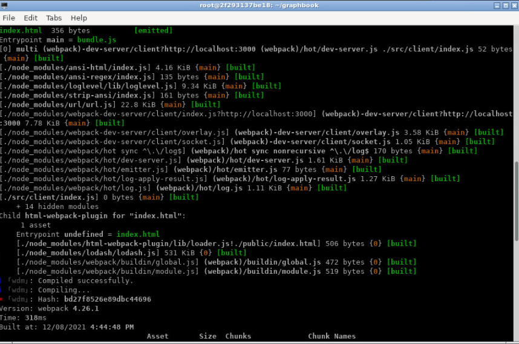

We have accomplished including our empty `index.js` file with the
bundle and can serve it to the browser. Next, we\'ll render our first
React component inside our template [index.html] file.


Render your first React component
---------------------------------

First, copy **uploads** folder from `~/Desktop/react-graphql-course/labs` and paste in `~/graphbook` folder.

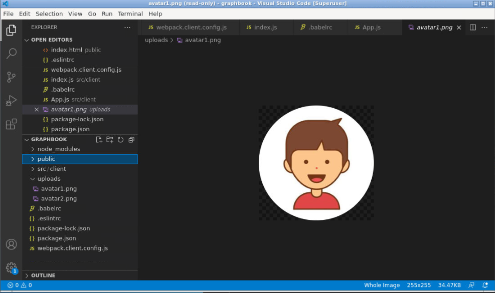

Our `index.js` file is the main starting point of our front end
code, and this is how it should stay. Do not include any business logic
in this file. Instead, keep it as clean and slim as possible.

The `index.js` file should include this code:

```
import React from 'react';
import ReactDOM from 'react-dom';
import App from './App';

ReactDOM.render(<App/>, document.getElementById('root'));
```

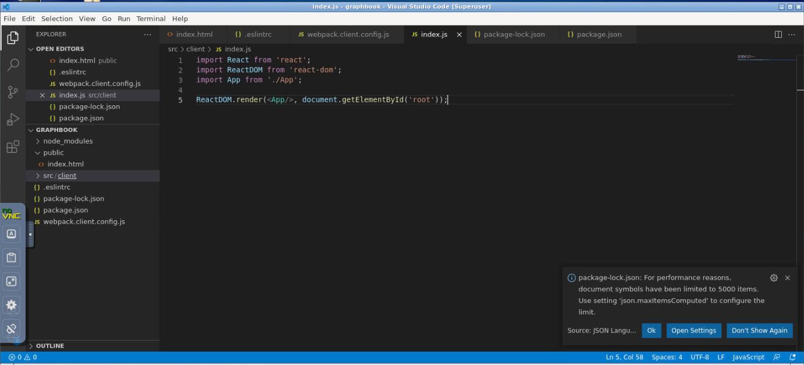

Create the [App.js] file next to your `index.js` file, with
the following content:

```
import React, { Component } from 'react';

export default class App extends Component {
  render() {
    return (
      <div>Hello World!</div>
    )
  }
}
```

This class is exported and then imported by the `index.js` file.
As explained before, we are now actively using [ReactDOM.render]
in our `index.js` file.

Let\'s create a [.babelrc] file in the root folder with this content:

```
{
  "plugins": [
    ["@babel/plugin-proposal-decorators", { "legacy": true }],
    "@babel/plugin-proposal-function-sent",
    "@babel/plugin-proposal-export-namespace-from",
    "@babel/plugin-proposal-numeric-separator",
    "@babel/plugin-proposal-throw-expressions",
    ["@babel/plugin-proposal-class-properties", { "loose": false }]
  ],
  "presets": ["@babel/env","@babel/react"]
}
```

<span style="color:red;">Important!</span>

You have to stop and start the server again because the [.babelrc] file is
not reloaded when changes happen to the file. After a few moments, you
should see the standard [Hello World!] message in your
browser.

**Output**

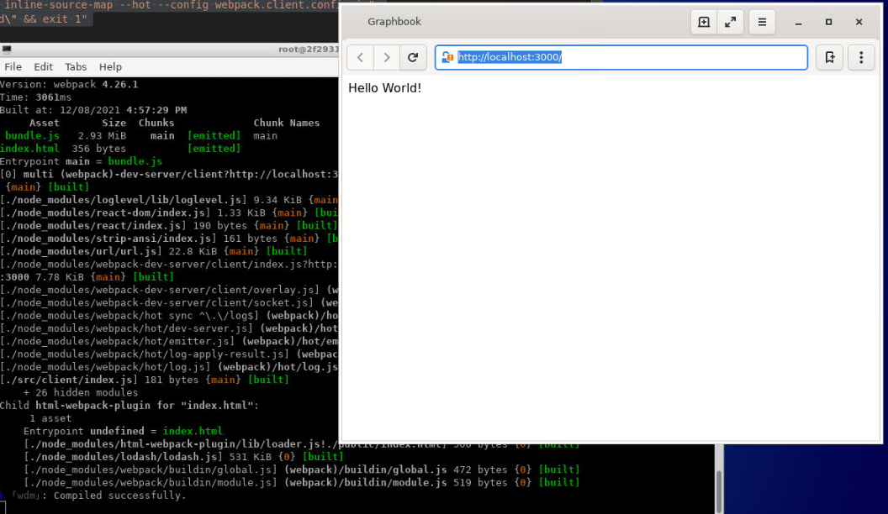


Rendering arrays from React state
---------------------------------

A social network such as Facebook or Graphbook, which we are writing at
the moment, needs a news feed and an input to post news. Let\'s
implement this.

For the simplicity of the first lab, we do this inside
[App.js].

We should work with some fake data here since we have not yet set up our
GraphQL API. We can replace this later with real data.

Define a new variable above your [App] class like this:

```
const posts = [{
  id: 2,
  text: 'Lorem ipsum',
  user: {
    avatar: '/uploads/avatar1.png',
    username: 'Test User'
  }
},
{
  id: 1,
  text: 'Lorem ipsum',
  user: {
    avatar: '/uploads/avatar2.png',
    username: 'Test User 2'
  }
}];
```


We now render these two fake posts in React.

Replace the current content of your [render] method with the
following code:

```
const { posts } = this.state;

return (
  <div className="container">
    <div className="feed">
      {posts.map((post, i) => 
        <div key={post.id} className="post">
          <div className="header">
            
            <h2>{post.user.username}</h2>
          </div>
          <p className="content">
            {post.text}
          </p>
        </div>
      )}
    </div>
  </div>
)
```


We iterate over the [posts] array with the [map] function,
which again executes the inner callback function, passing each array
item as a parameter one by one. Everything returned from the [map] function is then
rendered by React.

As you can see in the preceding code, we are extracting the posts we
want to render from the component\'s state with a destructuring
assignment. This data flow is very convenient because we can update the
state at any point later in our application and the posts will rerender.

To get our posts into the state, we can define them inside our class
with **property initializers**. Add this to the top of the [App]
class:

```
state = {
  posts: posts
}
```


Upon initialization of the [App] class, the posts will be inserted
into its state and rendered. It is vital that you run [super]
before having access to [this].

After doing the changes, your `App.js` file should like this:

```
import React, { Component } from 'react';

const posts = [{
  id: 2,
  text: 'Lorem ipsum',
  user: {
    avatar: '/uploads/avatar1.png',
    username: 'Test User'
  }
},
{
  id: 1,
  text: 'Lorem ipsum',
  user: {
    avatar: '/uploads/avatar2.png',
    username: 'Test User 2'
  }
}];

export default class App extends Component {
  state = {
    posts: posts
  }

  render() {
    const { posts } = this.state;

    return (
      <div className="container">
        <div className="feed">
          {posts.map((post, i) => 
            <div key={post.id} className="post">
              <div className="header">
                
                <h2>{post.user.username}</h2>
              </div>
              <p className="content">
                {post.text}
              </p>
            </div>
          )}
        </div>
      </div>
    )
  }
}
```

The preceding method is much cleaner, and I recommend this for
readability purposes. When saving, you should be able to see rendered
posts. They should look like this:


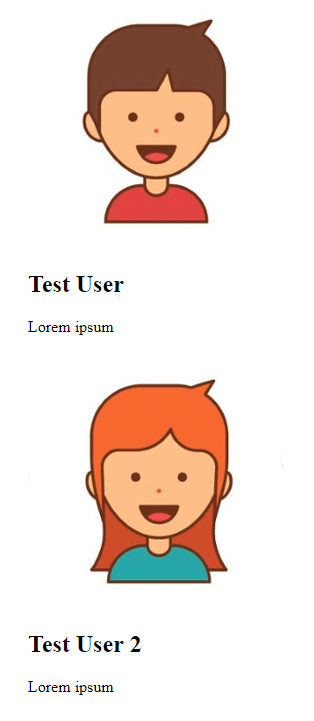


CSS with webpack
----------------

The posts from the preceding picture have not been designed yet. I have
already added CSS classes to the HTML our component returns.

What we\'ve already done in our [webpack.client.config.js] file is
to specify a CSS rule, as you can see in the following code snippet:

```
{
  test: /\.css$/,
  use: ['style-loader', 'css-loader'],
},
```


The [style-loader] injects your bundled CSS right into the DOM.
The [css-loader] will resolve all [import] or [url]
occurrences in your CSS code.

Create a [style.css] file in [./assets/css] and fill in the
following:

```
body {
  background-color: #f6f7f9;
  margin: 0;
  font-family: 'Courier New', Courier, monospace
}
p {
  margin-bottom: 0;
}
.container {
  max-width: 500px;
  margin: 70px auto 0 auto;
}
.feed {
  background-color: #bbb;
  padding: 3px;
  margin-top: 20px;
}
.post {
  background-color: #fff;
  margin: 5px;
}
.post .header {
  height: 60px;
}
.post .header > * {
  display: inline-block;
  vertical-align: middle;
}
.post .header img {
  width: 50px;
  height: 50px;
  margin: 5px;
}
.post .header h2 {
  color: #333;
  font-size: 24px;
  margin: 0 0 0 5px;
}
.post p.content {
  margin: 5px;
  padding: 5px;
  min-height: 50px;
}
```


Refreshing your browser leaves you with the same old HTML as before.

This problem happens because webpack is a module bundler and does not
know anything about CSS; it only knows JavaScript. We must import the
CSS file somewhere in our code.

Instead of using [index.html] and adding a [head] tag, we
can use webpack and our CSS rule to load it right in [App.js].
This solution is very convenient, since all of the required CSS
throughout our application gets minified and bundled. Webpack automates
this process.

In your [App.js] file, add the following behind the React
[import] statement:

```
import '../../assets/css/style.css';
```


Webpack magically rebuilds our bundle and refreshes our browser tab.

You have now successfully rendered fake data via React and styled it
with bundled CSS from webpack. It should look something like this:


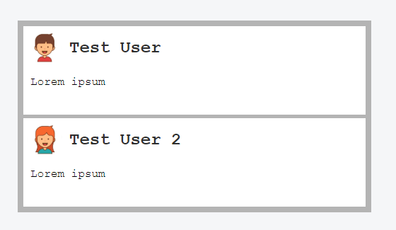

The output looks very good already.


Event handling and state updates with React
-------------------------------------------

At the beginning of this project, it would be great to have a simple
[textarea] where you can click a button and then have a new post
added to the static [posts] array we wrote in the [App]
class.

Add this above the [div] with the [feed] class:

```
<div className="postForm">
  <form onSubmit={this.handleSubmit}>                      
    <textarea value={postContent} onChange={this.handlePostContentChange}
      placeholder="Write your custom post!"/>
    <input type="submit" value="Submit" />
  </form>
</div>
```

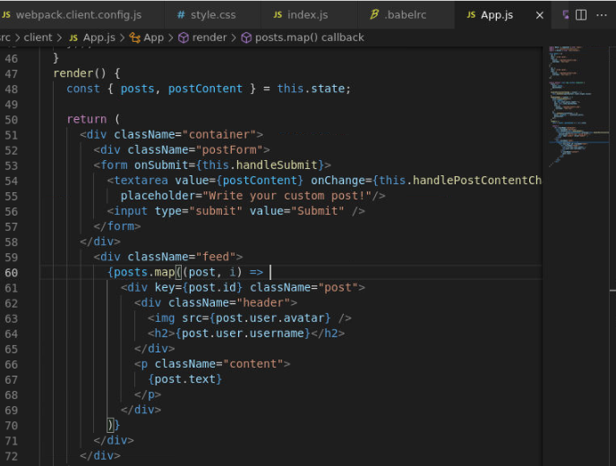

You can use forms in React without any problems. React can intercept the
submit event of requests by giving the form an [onSubmit]
property, which will be a function to handle the logic behind the form.

We are passing the [postContent] variable to the [value]
property of [textarea] to have what\'s called a **controlled component**.

Create an empty string variable at the [state] property
initializer, as follows:

```
state = {
  posts: posts,
  postContent: ''
}
```


Then, extract this from the class state inside the [render]
method:

```
const { posts, postContent } = this.state;
```


Now, the new state variable stays empty, although, you can write inside
[textarea]. This issue occurs because you are directly changing
the DOM element but did not bind the change event to an existing React
function. This function has the task of updating the React internal
state that is not automatically connected to the browser\'s DOM state.

In the preceding code, we already passed the update function called
[this.handlePostContentChange] to the [onChange] property of
[textarea].

The logical step is to implement this function:

```
handlePostContentChange = (event) => {
  this.setState({postContent: event.target.value})
}
```

Look at your browser again. The form is there, but it is not pretty, so
add this CSS:

```
form {
  padding-bottom: 20px;
}
form textarea {
  width: calc(100% - 20px);
  padding: 10px;
  border-color: #bbb;
}
form [type=submit] {
  border: none;
  background-color: #6ca6fd;
  color: #fff;
  padding: 10px;
  border-radius: 5px;
  font-size: 14px;
  float: right;
}
```


The last step is to implement the [handleSubmit] function for our
form:

```
handleSubmit = (event) => {
  event.preventDefault();
  const newPost = {
    id: this.state.posts.length + 1,
    text: this.state.postContent,
    user: {
      avatar: '/uploads/avatar1.png',
      username: 'Fake User'
    }
  };
  this.setState((prevState) => ({
    posts: [newPost, ...prevState.posts],
    postContent: ''
  }));
}
```

We need to run [event.preventDefault] to stop our browser from
actually trying to submit the form and reload the page.

Next, we save our new post in the [newPost] variable that we want
to add to our feed. The text for our new post comes from the [postContent] variable
from the component state.

Finally, we update the component state again. This is where it gets a
bit complicated. We are not passing an object as if we are doing it
inside the [handlePostContentChange] function; we are passing an
[update] function.

Now go ahead and play with your working React form. Do not forget that
all posts you create do not persist since they are only held in the
local memory of the browser and not saved to a database. Consequently,
refreshing deletes your posts.


Controlling document heads with React Helmet
--------------------------------------------

React Helmet is a great package that offers you to control document heads, including overriding multiple headers and server-side rendering.

Install it with the following command:

```
npm install --save react-helmet@5.2.0
```


You can add all standard HTML headers with React Helmet.

I recommend keeping standard [head] tags inside your template.
They have the advantage that, before React has rendered, there is always
the default document head. For our case, you can directly apply a title
and description in [App.js].

Import [react-helmet] at the top of the file:

```
import { Helmet } from 'react-helmet';
```


Add [Helmet] itself directly above [postForm] [div]:

```
<Helmet>
  <title>Graphbook - Feed</title>
  <meta name="description" content="Newsfeed of all your friends on 
    Graphbook" />
</Helmet>
```


If you reload the browser and watch the title on the tab bar of your
browser carefully, you will see that it changes from [Graphbook]
to [Graphbook - Feed]. This behavior happens because we already
defined a title inside [index.html]. When React finishes
rendering, the new document head is applied.

**Note:** After doing all the changes, your `App.js` file should like this: 
`~/Desktop/react-graphql-course/labs/Lab01/src/client/App.js`


Production build with webpack
-----------------------------

The last step for our React setup is to have a production build. Until
now, we were only using [webpack-dev-server], but this naturally
includes an unimproved development build. Furthermore, webpack
automatically spawns a web server. In a later lab, we introduce
Express.js as our web server so we won\'t need webpack to host it.

A production bundle does merge all JavaScript files, but also CSS files
into two separate files. Those can be used directly in the browser. To
bundle CSS files, we will rely on another webpack plugin, called
[MiniCss]:


```
npm install --save-dev mini-css-extract-plugin@0.4.5
```


We do not want to change the current [webpack.client.config.js]
file, because it is made for development work. Add this command to the
[scripts] object of your [package.json]:

```
"client:build": "webpack --config webpack.client.build.config.js"
```


This command runs webpack using an individual production webpack config
file. Let\'s create this one. First, clone the original
[webpack.client.config.js] file and rename it
[webpack.client.build.config.js].

Change the following things in the new file:

1.  The [mode] needs to be [production], not
    [development].
2.  Require the [MiniCss] plugin:

```
const MiniCssExtractPlugin = require('mini-css-extract-plugin');
```


3.  Replace the current CSS rule:

```
{
  test: /\.css$/,
  use: [{ loader: MiniCssExtractPlugin.loader,
    options: {
      publicPath: '../'
    }
 }, 'css-loader'],
},
```


We no longer use the [style-loader] but instead use the
[MiniCss] plugin. The plugin goes through the complete CSS code,
merges it in a separate file, and removes the [import] statements
from the [bundle.js] we generate in parallel.

4.  Lastly, add the plugin to the plugins at the bottom of the
    configuration file:

```
new MiniCssExtractPlugin({
  filename: 'bundle.css',
})
```


5.  Remove the entire [devServer] property.


**Note:** After doing the changes, your `webpack.client.build.config.js` file should like this: `~/Desktop/react-graphql-course/labs/Lab01/webpack.client.build.config.js`

When running the new configuration, it won\'t spawn a server or browser
window; it only creates a production JavaScript and CSS bundle, and
requires them in our [index.html] file. According to our
[webpack.client.build.config.js] file, those three files are going
to be saved to the [dist/client] folder.

You can run this command by executing `npm run client:build`.

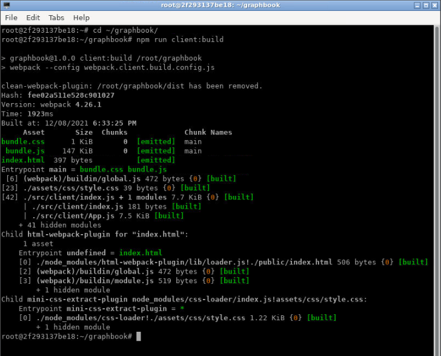

Look in the [dist] folder, and you will see three files.
You can open the [index.html] in `Midori` browser. The images
are broken because the image URLs are not right anymore. We accept this
for the moment because it will be automatically fixed when we have a
working back end.

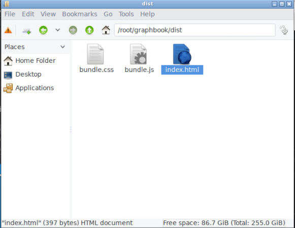

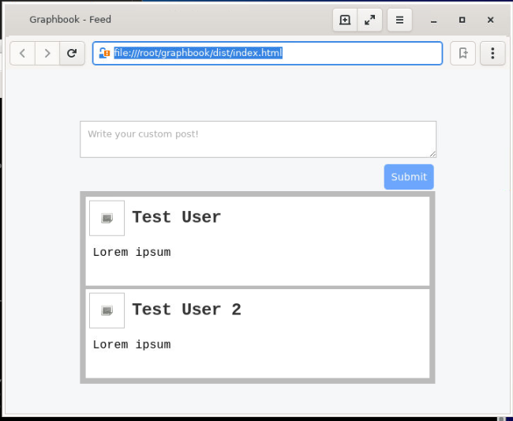

You are now finished with the basic setup of React.


Analyzing bundle size
---------------------

In webpack, there is a simple solution for analyzing our bundle.
This solution is called [webpack-bundle-analyzer], and it does
exactly what it sounds like.

Install this with the following:

```
npm install --save-dev webpack-bundle-analyzer@3.0.3
```


You then need to add two commands to the [scripts] object in the
[package.json]:

- "stats": "webpack --profile --json --config webpack.client.build.config.js > stats.json"

- "analyze": "webpack-bundle-analyzer stats.json"

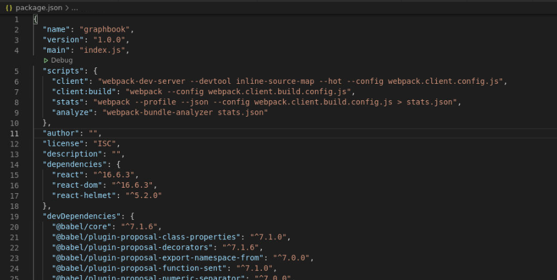

The first command creates a production build as well as a
[stats.json] file in the root folder. This file holds the
information we need.

The [analyze] command spins up the
[webpack-bundle-analyzer], showing us how our bundle is built
together and how big each package that we use is.

Do this as follows:

```
npm run stats
npm run analyze
```

Open `http://localhost:8888` in Midori browser after running above command.

You can visually see our bundle and package sizes. Remove unnecessary
packages in your projects and see how your bundle is reorganized. You
can take an example from the following screenshot:


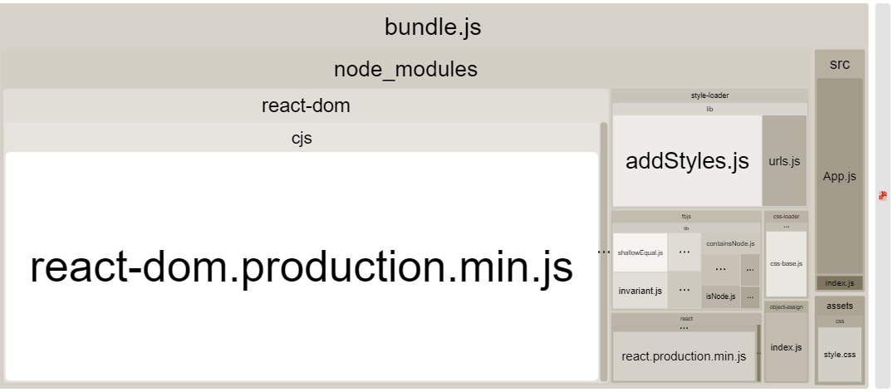


This diagram looks a lot like WinDirStat which is a software to display
the disk usage of your computer. We can identify the packages that make
up the majority of our bundle.


Summary
=======

In this lab, we completed a working React setup. This is a good
starting point for our front end. We can write and build static web
pages with this setup.

The next lab primarily focuses on our setup for the back end. We
will configure Express.js to accept our first requests and pass all
GraphQL queries to Apollo. Furthermore, you will also learn how to use
Postman to test your API.
