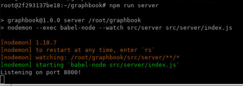
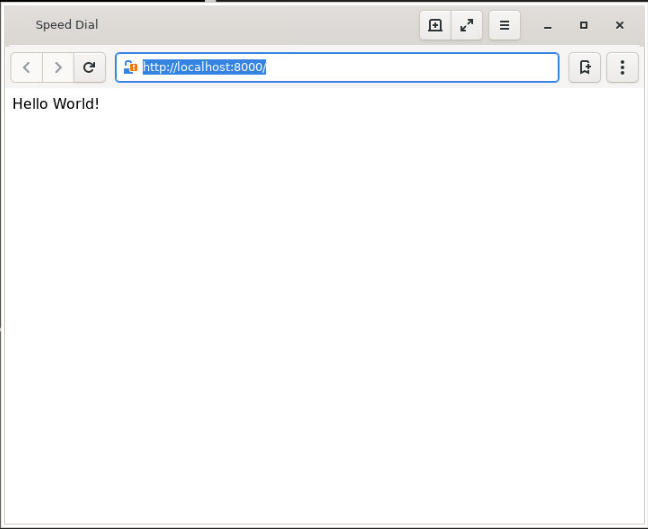
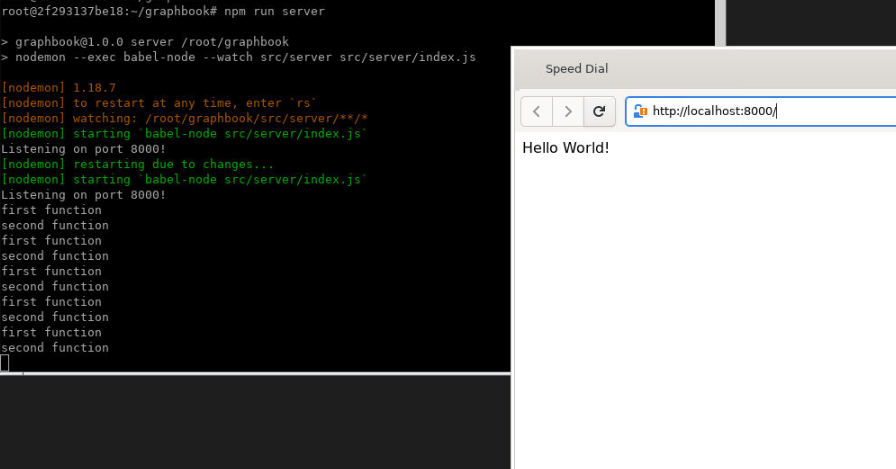
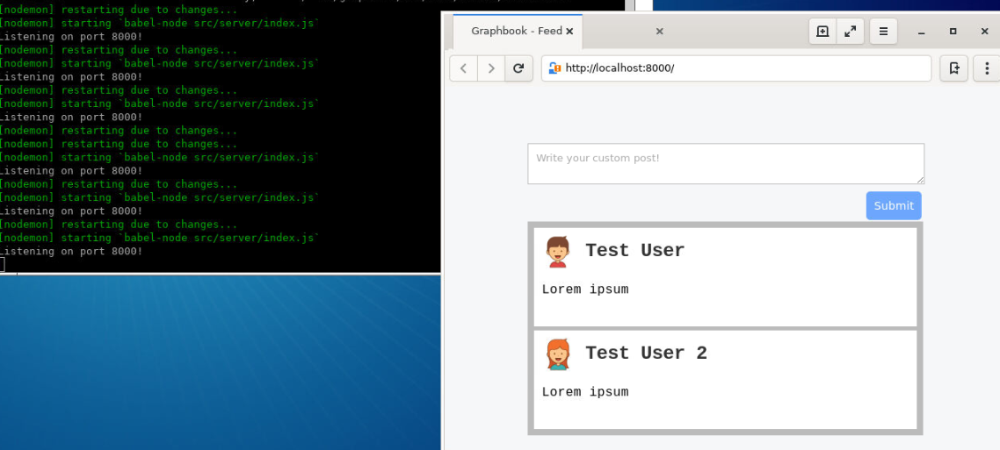
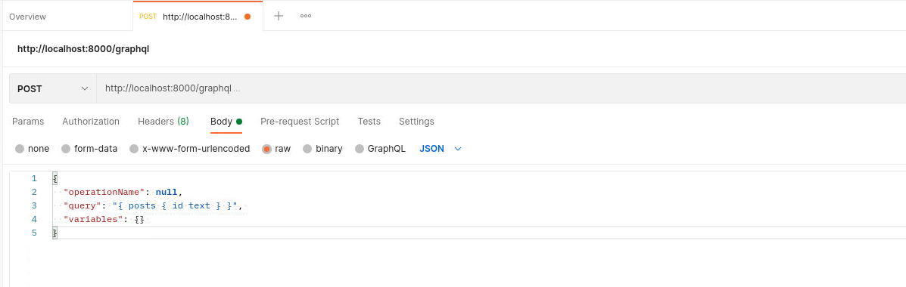
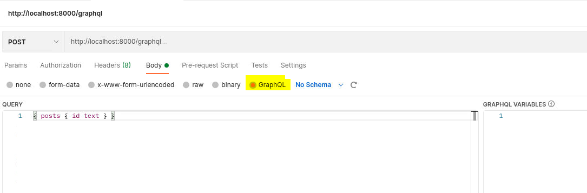
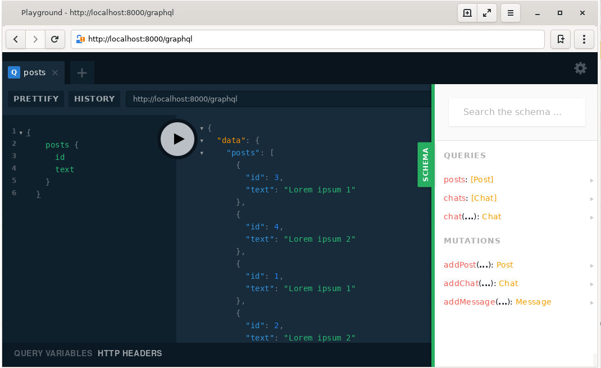
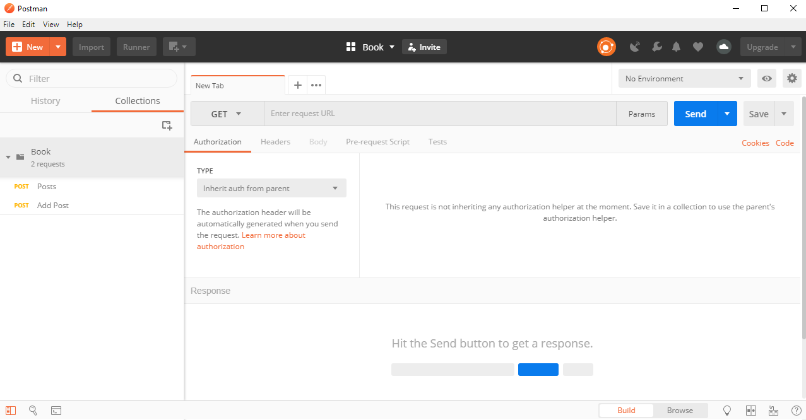
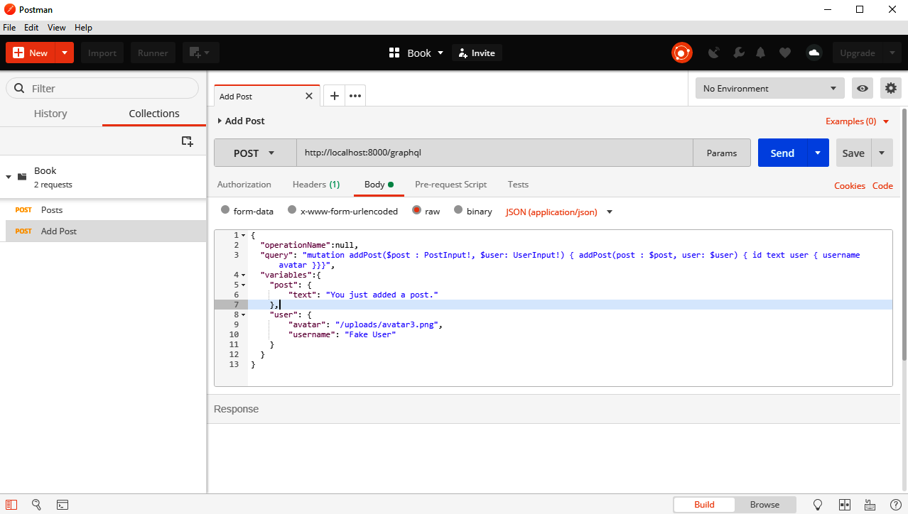

Lab 2: Setting up GraphQL with Express.js
==================================


This lab explains the installation process for Express.js, as well
as the configuration of our GraphQL endpoint. We will quickly go through
all the essential features of Express.js.

This lab covers the following points:

-   Express.js installation and explanation
-   Routing in Express.js
-   Middleware in Express.js
-   Binding Apollo Server to a GraphQL endpoint
-   Serving static assets with Express.js
-   Back end debugging and logging


### Lab Solution

Complete solution for this lab is available in the following directory:

`cd ~/Desktop/react-graphql-course/labs/Lab02`

Run following command to install all required packages:

`npm install`


### Running Solution

Run following commands to run application:


`npm run client:build`

`npm run server`


Open `http://localhost:8000/` in Midori browser to access application.


Node.js and Express.js
======================

**Note:** You can use project created in Lab 1.

Installing Express.js is pretty easy. We can use npm in the same way as
in the first lab:

```
npm install --save express@4.16.4
```


This command adds the latest version of Express to [package.json].

In the first lab, we created all JavaScript files directly in the
[src/client] folder. Now, let\'s create a separate folder for our
server-side code. This separation gives us a tidy directory structure.
We will create the folder with the following command:

```
mkdir src/server
```


We can now continue with the configuration of Express.js.


Setting up Express.js
---------------------

As always, we need a root file loaded with all the main components that
combines them to a real application.

Create an `index.js` file in the [server] folder. This file
is the starting point for the back end. Here\'s how we go about it:

1.  First, we import [express] from [node\_modules], which
    we just installed. We can use [import] here since our back end
    gets transpiled by Babel.

```
import express from 'express';
```

2.  We initialize the server with the [express] command. The
    result is stored in the [app] variable. Everything our back
    end does is executed through this object.

```
const app = express();
```

3.  Then, we specify the routes that accept requests. For this
    straightforward introduction, we accept all HTTP [GET]
    requests matching any path, by using the [app.get] method.
    Other HTTP Methods are catchable with [app.post],
    [app.put], and so on.

```
app.get('*', (req, res) => res.send('Hello World!'));
app.listen(8000, () => console.log('Listening on port 8000!'));
```

To match all paths, you use an asterisk, which generally stands for
[any] in the programming environment, as we have done it in the
preceding [app.get] line.

The last step to make our server publicly available is to tell
Express.js on which port it should listen for requests. In our code, we
are using [8000] as the first parameter of [app.listen]. You
can replace [8000] with any port or URL you want to listen on. The
callback is executed when the HTTP server binding has finished, and
requests can be accepted on this port.

**Note:** After doing the changes, your `index.js` file should like this:

```
import express from 'express';
const app = express();

app.get('*', (req, res) => res.send('Hello World!'));
app.listen(8000, () => console.log('Listening on port 8000!'));
```

This is the easiest setup we can have for Express.js.


Running Express.js in development
---------------------------------

To launch our server, we have to add a new script to our
[package.json].

We will add the following line to the [scripts] property of the
[package.json] file:

```
"server": "nodemon --exec babel-node --watch src/server src/server/index.js"
```

As you can see, we are using a command called [nodemon]. We need
to install it first:

```
npm install --save nodemon@1.18.7
```


Nodemon is an excellent tool for running a Node.js application. It can
restart your server when the source changes.

For example, to get the above command working follow the steps below:

1.  Furthermore, we must install the [\@babel/node] package,
    because we are transpiling the back end code with Babel, using the
    [\--exec babel-node] option. It allows the use of the
    [import] statement:

```
npm install --save-dev @babel/node@7.0.0
```


Providing [\--watch] as the option following a path or file will
permanently track changes on that file or folder and reload the server
to represent the latest state of your application. The last parameter
refers to the actual file being the starting execution point for the
back end.

2.  Start the server now:

```
npm run server
```



When you now go to your browser and enter [http://localhost:8000],
you will see the text [Hello World!] from our Express.js
callback function.



Routing in Express.js
=====================

Understanding routing is essential to extend our back end code. We are
going to play through some simple routing examples.

In general, routing stands for how an application responds to specific
endpoints and methods.

In Express.js, one path can respond to different HTTP methods and can
have multiple handler functions. These handler functions are executed
one by one in the order they were specified in the code. A path can be a
simple string, but also a complex regular expression or pattern.

When using multiple handler functions --- either provided as an array or
multiple parameters---be sure to pass [next] to every callback
function. When you call [next], you hand over the execution from
one callback function to the next function in the row. Those functions
can also be middleware. We\'ll cover this in the next section.

Here is a simple example. Replace this with the current [app.get] line:

```
app.get('/', function (req, res, next) {
  console.log('first function');
  next();
}, function (req, res) {
  console.log('second function');
  res.send('Hello World!');
});
```



When you look at the server logs in the terminal, you will see both
[first function] and [second function] printed. If you
remove the execution of [next] and try to reload the browser tab,
the request will time out. This problem occurs because neither
[res.send] nor [res.end], or any alternative is called. The
second handler function is never executed when [next] is not run.


Serving our production build
----------------------------

We can serve our production build of the front end through Express.js.
This approach is not great for development purposes but is useful for
testing the build process and seeing how our live application will act.

**Build Client Application**

Firstly, open `webpack.client.build.config.js` and `webpack.client.config.js`. And replace line `const outputDirectory = 'dist';` with following snippet:

```
const buildDirectory = 'dist';
const outputDirectory = buildDirectory + '/client';
```

Run following command to build react application:

`npm run client:build`

**Express Server**

Again, replace the previous routing example with the following:

```
import express from 'express';
import path from 'path';

const app = express();
const root = path.join(__dirname, '../../');

app.use('/', express.static(path.join(root, 'dist/client')));
app.use('/uploads', express.static(path.join(root, 'uploads')));
app.get('/', (req, res) => {
  res.sendFile(path.join(root, '/dist/client/index.html'));
});

app.listen(8000, () => console.log('Listening on port 8000!'));
```

Express.js provides the [use] function which runs a series of
commands when a given path matches. When executing this function without
a path, it is executed for every request.

We use this feature to serve our static files (the avatar images) with
[express.static]. They include [bundle.js] and
[bundle.css], created by `npm run client:build`.

In our case, we first pass [\'/\'] with [express.static]
following it. The result of this is that all files and folders in
[dist] are served beginning with [\'/\']. Other paths in the
first parameter of [app.use], such as [\'/example\'], would
lead to the result that our [bundle.js] would be downloadable
under [\'/example/bundle.js\'] instead.

For example, all avatar images are served under [\'/uploads/\'].

We are now prepared to let the client download all necessary files. The
initial route for our client is [\'/\'] specified by
[app.get]. The response to this path is [index.html]. We run
[res.sendFile] and the file path to return this file---that is all
we have to do here.

Be sure to execute `npm run client:build` first. Otherwise, you
will receive an error message that these files were not found.
Furthermore, when running `npm run client`, the [dist]
folder is deleted, so you have to rerun the build process.

Refreshing the browser now presents you with the *post* feed and form from Lab 1.




Using Express.js middleware
===========================

For our application, we have already used one built-in Express.js
middleware: [express.static]. Throughout this course, we continue to
install further middleware:

```
npm install --save compression@1.7.3 cors@2.8.5 helmet@3.15.0
```


Now, execute the [import] statement on the new packages inside the
server `index.js` file so that all dependencies are available
within the file:


```
import helmet from 'helmet';
import cors from 'cors';
import compress from 'compression';
```


Let\'s see what these packages do and how we can use them.


Express Helmet
--------------

Helmet is a tool that allows you to set various HTTP headers to secure
your application.

We can enable the Express.js Helmet middleware as follows in the server
`index.js` file:

```
app.use(helmet());
app.use(helmet.contentSecurityPolicy({
  directives: {
    defaultSrc: ["'self'"],
    scriptSrc: ["'self'", "'unsafe-inline'"],
    styleSrc: ["'self'", "'unsafe-inline'"],
    imgSrc: ["'self'", "data:", "*.amazonaws.com"]
  }
}));
app.use(helmet.referrerPolicy({ policy: 'same-origin' }));
```


We are doing multiple things here at once. We add some
**XSS(Cross-Site-Scripting)** protection tactics and remove the
[X-Powered-By] HTTP header and some other useful things just by
using the [helmet()] function in the first line.

Furthermore, to ensure that no one can inject malicious code, we are
using the [Content-Security-Policy] HTTP header or, in short, CSP.
This header prevents attackers from loading resources from external
URLs.

The last enhancement is to set the [Referrer] HTTP header only
when making requests on the same host. When going from domain A to
domain B, for example, we do not include the referrer, which is the URL
the user is coming from. This enhancement stops any internal routing or
requests being exposed to the internet.

It is important to initialize Helmet very high in your Express router so
that all responses are affected.

Compression with Express.js
---------------------------

Enabling compression for Express.js saves you and your user bandwidth,
and this is pretty easy to do. The following code must also be added to
the server `index.js` file:

```
app.use(compress());
```


This middleware compresses all responses going through it. Remember to
add it very high in your routing order so that all requests are
affected.


CORS in Express.js
------------------

Allow **CORS (Cross-origin resource sharing)** requests with the
following command to the `index.js` file:

```
app.use(cors());
```

We can move on now and finally set up a GraphQL server.


Combining Express.js with Apollo
================================

First things first; we need to install the Apollo and GraphQL
dependencies:

```
npm install --save apollo-server-express@2.3.3 graphql@14.0.2 graphql-tools@4.0.3
```

Create a separate folder for services. A service can be GraphQL or other
routes:

```
mkdir src/server/services/
mkdir src/server/services/graphql
```


Our GraphQL service must handle multiple things for initialization.
Let\'s go through all of them one by one:

1.  We require the [apollo-server-express] and [graphql-tools] packages.

```
import { ApolloServer } from 'apollo-server-express';
import { makeExecutableSchema } from 'graphql-tools';
```


2.  We must combine the GraphQL schema with the [resolver]
    functions. We import the corresponding schema and resolver functions
    at the top from separate files. The GraphQL schema is the
    representation of the API, that is, the data and functions a client
    can request or run. Resolver functions are the implementation of the
    schema. Both need to match 100 percent. You cannot return a field or
    run a mutation that is not inside the schema.\

```
import Resolvers from './resolvers';
import Schema from './schema';
```


3.  The [makeExecutableSchema] function of the
    [graphql-tools] package merges the GraphQL schema and the
    resolver functions, resolving the data we are going to write. The
    [makeExecutableSchema] function throws an error when you
    define a query or mutation that is not in the schema. The resulting
    schema is executable by our GraphQL server resolving the data or
    running the mutations we request.

```
const executableSchema = makeExecutableSchema({
  typeDefs: Schema,
  resolvers: Resolvers
});
```


4.  We pass this as a [schema] parameter to the Apollo Server. The
    [context] property contains the [request] object of
    Express.js. In our resolver functions, we can access the request if
    we need to.

```
const server = new ApolloServer({
  schema: executableSchema,
  context: ({ req }) => req
});
```


5.  This `index.js` file exports the initialized server object,
    which handles all GraphQL requests.

```
export default server;
```


Now that we are exporting the Apollo Server, it needs to be imported
somewhere else, of course. I find it convenient to have one
`index.js` file on the services layer so that we only rely on this
file if a new service is added.

Create an `index.js` file in the [services] folder and enter
the following code:

```
import graphql from './graphql';

export default {
  graphql,
};
```


The preceding code requires our `index.js` file from the
`graphql` folder and re-exports all services in one big object. We
can define further services here if we need them.

To make our GraphQL server publicly accessible to our clients, we are
going to bind the Apollo Server to the [/graphql] path.

Import the services `index.js` file in the [server/index.js]
file as follows:

```
import services from './services';
```


The [services] object only holds the `graphql` index. Now we
must bind the GraphQL server to the Express.js web server with the
following code:

```
const serviceNames = Object.keys(services);

for (let i = 0; i < serviceNames.length; i += 1) {
  const name = serviceNames[i];
  if (name === 'graphql') {
    services[name].applyMiddleware({ app });
  } else {
    app.use(`/${name}`, services[name]);
  }
}
```


For convenience, we loop through all indexes of the `services`
object and use the index as the name of the route the service will be
bound to. The path would be `/example` for the `example`
index in the `services` object. For a typical service, such as a
REST interface, we rely on the standard `app.use` method of
Express.js.

Since the Apollo Server is kind of special, when binding it to
Express.js, we need to run the `applyMiddleware` function provided
by the initialized Apollo Server and avoid using the `app.use`
function of Express.js. Apollo automatically binds itself to the
`/graphql` path because it is the default option.

Two things are missing now: the schema and the resolvers. The schema is
next on our to-do list.


Writing your first GraphQL schema
---------------------------------

Let\'s start by creating a `schema.js` inside the `graphql`
folder. You can also stitch multiple smaller schemas to one bigger
schema. This would be cleaner and would make sense when your
application, types, and fields grow. For this course, one file is okay and
we insert the following code into the `schema.js` file:

```
const typeDefinitions = `
  type Post {
    id: Int
    text: String
  }

  type RootQuery {
    posts: [Post]
  }

  schema {
    query: RootQuery
  }
`;

export default [typeDefinitions];
```


The preceding code represents a basic schema, which would be able to at
least serve the fake posts array from Lab 1, excluding the users.

First, we define a new type called [Post]. A [Post] type has
[id] as [Int] and [text] as [String].

For our GraphQL server, we need a type called [RootQuery]. The
[RootQuery] type wraps all of the queries a client can run. It can
be anything from requesting all posts, all users, or posts by just one
user, and so on. You can compare this to all [GET] requests as you
find them with a common REST API. The paths would be [/posts],
[/users], and [/users/ID/posts] to represent the GraphQL API
as a REST API. When using GraphQL, we only have one route, and we send
the query as a JSON-like object.

The first query we will have is going to return an array of all of the
posts we have got.

If we query for all posts and want to return each user with its
corresponding post, this would be a sub-query that would not be
represented in our [RootQuery] type but in the [Post] type
itself. You will see how it is done later.

At the end of the JSON-like schema, we add [RootQuery] to the
[schema] property. This type is the starting point for the Apollo
Server.

Later, we are going to add the mutation key to the schema where we
implement a [RootMutation] type. It is going to serve all of the
actions a user can run. Mutations are comparable to the [POST],
[UPDATE], [PATCH], and [DELETE] requests of a REST
API.

At the end of the file, we export the schema as an array. If we wanted
to, we could push other schemas to this array to merge them.

The last thing missing here is the implementation of our resolvers.


Implementing GraphQL resolvers
------------------------------

Now that the schema is ready, we need the matching resolver functions.

Create a [resolvers.js] file in the `graphql` folder as
follows:

```
const resolvers = {
  RootQuery: {
    posts(root, args, context) {
      return []; 
    }, 
  }, 
}; 

export default resolvers;
```


The [resolvers] object holds all types as a property. We set up
[RootQuery], holding the [posts] query in the same way as we
did in our schema. The [resolvers] object must equal the schema
but recursively merged. If you want to query a subfield, such as the
user of a post, you have to extend the [resolvers] object with a
[Post] object containing a [user] function next to
[RootQuery].

If we send a query for all posts, the [posts] function is
executed. There, you can do whatever you want, but you need to return
something that matches the schema. So, if you have an array of
[posts] as the response type of [RootQuery], you cannot
return something different, such as just one post object instead of an
array. In that case, you would receive an error.

Furthermore, GraphQL checks the data type of every property. If
[id] is defined as [Int], you cannot return a regular
MongoDB [id] since these ids are of type [String]. GraphQL
would throw an error too.

**ProTip**

GraphQL will parse or cast specific data types for you if the value type
is matching. For example, a [string] with the value of [2.1]
is parsed to [Float] without any problems. On the other hand, an
empty string cannot be converted to [Float], and an error would be
thrown. It is better to directly have the correct data types, because
this saves you casting and also prevents unwanted problems.


Our [posts] query will return an empty array, which would be a
correct response for GraphQL. We will come back to the [resolver]
functions later, but it is okay for the moment. You should be able to
start the server again.


Sending GraphQL queries
-----------------------

We can test this query using any HTTP client, such as Postman, Insomnia,
or any you are used to. This course covers HTTP clients in the next
section of this lab. If you want to send the following queries on
your own, you can read the next section and come back here.

You can test our new function when you send the following JSON as a
[POST] request to [http://localhost:8000/graphql]:

```
{
  "operationName": null,
  "query": "{ posts { id text } }", 
  "variables": {} 
}
```




The `operationName` field is not required to run a query, but it
is great for logging purposes.

The `query` object is a JSON-like representation of the query we
want to execute. In this example, we run the `RootQuery` posts and
request the `id` and `text` fields of every post. We do not
need to specify `RootQuery` because it is the highest layer of our
GraphQL API.

The `variables` property can hold parameters such as user the ids
by which we want to filter the posts, for example. If you want to use
`variables`, they need to be defined in the query by their name
too.


**Note:**

Postman has special tab for `GraphQL` where we can place the query directly as shown in screenshot below:




#### GraphQL Playground

There is also the option to open the GraphQL endpoint in a separate browser tab.
Here, you can insert the content of the [query] property and hit
the play button. Because we set up Helmet to secure our application, we
need to deactivate it in development. Otherwise, it's
not going to work. Just wrap the Helmet initialization inside this
[if] statement:

```
if(process.env.NODE_ENV === 'development' || true)
```


This short condition only activates Helmet when the environment is in
development. Now you can send the request with playground or any HTTP
client.



The resulting answer of [POST] will look like the following code snippet:

```
{
  "data": { 
    "posts": [] 
  } 
}
```


We received the empty posts array as expected.

Going further, we want to respond with the fake data we statically wrote
in our client to come from our back end. Copy the [posts] array
from [App.js] above the [resolvers] object. We can respond
to the GraphQL request with this filled [posts] array.

Replace the content of the [posts] function in the GraphQL
resolvers with this:

```
return posts;
```


You can rerun the [POST] request and receive both fake posts.
Apparently, the response does not include the user object we have in our
fake data. We must define a user property on the [post] type in
our schema to fix this issue.


Using multiples types in GraphQL schemas
----------------------------------------

Let\'s create a [User] type and use it with our posts. First, add
it somewhere to the schema:

```
type User {
  avatar: String
  username: String
}
```


Now that we have a [User] type, we need to use it inside the
[Post] type. Add it to the [Post] type as follows:

```
user: User
```


The [user] field allows us to have a sub-object inside our posts
with the post\'s author information.

Our extended query to test this looks like the following:

```
"query":"{ posts { id text user { avatar username } } }"
```


You cannot just specify the user as a property of the query. Instead,
you need to provide a sub-selection of fields. This is required whenever
you have multiple GraphQL types stacked inside each other. Then, you
need to select the fields your result should contain.

Running the updated query gives us the fake data, which we already have
in our front end code; just the [posts] array as it is.

We have made good progress with querying data, but we also want to be
able to add and change data.


Writing your first GraphQL mutation
-----------------------------------

One thing our client already offered was to add new posts to the fake
data temporarily. We can realize this in the back end by using GraphQL
mutations.

Starting with the schema, we need to add the mutation as well as the
input types as follows:

```
input PostInput {
  text: String!
}

input UserInput {
  username: String!
  avatar: String!
}

type RootMutation {
  addPost (
    post: PostInput!
    user: UserInput!
  ): Post
}
```


GraphQL inputs are not more than types. Mutations can use them as
parameters inside requests. They may look weird, because our current
output types look almost the same. However, it would be wrong to have an
[id] property on [PostInput], for example, since the back
end chooses the id and the client cannot give it. Consequently, it does
make sense to have separate objects for input and output types.

The [addPost] function receiving our two new required input
types---[PostInput] and [UserInput], is a new feature here.
Those functions are called mutations, since they mutate the current
state of the application. The response to this mutation is an ordinary
[Post] object. When creating a new post with the [addPost]
mutation, we will directly get the created post from the back end in
response.

The exclamation mark in the schema tells GraphQL that the field is a
required parameter.

The [RootMutation] type corresponds to the [RootQuery] type
and is an object that holds all of our GraphQL mutations.

The last step is to enable the mutations in our schema for the Apollo
Server:

```
schema {
  query: RootQuery
  mutation: RootMutation
}
```


**ProTip**

Usually, the client does not send the user with the mutation. This is
because the user is authenticated first, before adding a post, and
through that, we already know which user initiated the Apollo request.
However, we can ignore this for the moment and implement authentication
later in Lab 6.


The [addPost] resolver function needs to be implemented now in the
[resolvers.js] file.

Add the following [RootMutation] object to the [RootQuery]
in [resolvers.js]:

```
RootMutation: {
  addPost(root, { post, user }, context) {
    const postObject = { 
      ...post,
      user,
      id: posts.length + 1,
    };
    posts.push(postObject);
    return postObject;
  },
},
```


This resolver extracts the `post` and `user` objects from
the mutation\'s parameters, which are passed in the second argument of
the function. Then, we build the `postObject` variable. We want to
add our `posts` array as property by destructuring the
`post` input and adding the `user` object. The `id`
field is just the length of the `posts` array plus one.

The `postObject` variable looks like a `post` from the
`posts` array now. Our implementation does the same as the front
end is already doing. The return value of our `addPost` function
is the `postObject`. To get this working, you need to change the
initialization of the `posts` array from `const` to
`let`. Otherwise, the array will be static and unchangeable.

You can run this mutation via your preferred HTTP client like this:


<span style="color:red;">Remove line breaks from query field using an online tool first. i-e; https://www.textfixer.com/tools/remove-line-breaks.php</span>


```
{
  "operationName": null,
  "query": "mutation addPost($post : PostInput!, $user: UserInput!) {
    addPost(post : $post, user: $user) { 
      id
      text
      user {
        username
        avatar
      }
    }
  }",
  "variables": {
    "post": { 
      "text": "You just added a post."
    },
    "user": {
      "avatar": "/uploads/avatar3.png",
      "username": "Fake User"
    }
  }
}
```


Here, we are using the [variables] property to send the data we
want to insert in our back end. We need to pass them as parameters
within the [query] string. We define both parameters with a dollar
sign and the awaited data type inside the [operation] string.
Those variables marked with a dollar sign can then be mapped into the
actual action we want to trigger on the back end. Again, we need to send
a selection of fields our response should have.

The result will have a [data] object including an [addPost]
field. The [addPost] field holds the post, which we send with our
request.

Query the posts again, and you will see that there are now three posts.
Great, it worked!

As with our client, this is only temporary until we restart the server.
Next, we\'ll cover the various ways to debug your back end properly.


Back end debugging and logging
==============================

There are two things that are very important here: the first is that we
need to implement logging for our back end in case we receive errors
from our users, and the second is that we need to look into Postman to
debug our GraphQL API efficiently.

So, let\'s get started with logging.


Logging in Node.js
------------------

The most popular logging package for Node.js is called [winston].
Configure [winston] by following the steps below:

1.  Install [winston] with npm:

```
npm install --save winston@3.1.0
```


2.  We create a new folder for all of the helper functions of the back
    end:

```
mkdir src/server/helpers
```


3.  Then, insert a [logger.js] file in the new folder with the
    following content:

```
import winston from 'winston';

let transports = [
  new winston.transports.File({
    filename: 'error.log',
    level: 'error',
  }),
  new winston.transports.File({
    filename: 'combined.log',
    level: 'verbose',
  }),
];

if (process.env.NODE_ENV !== 'production') {
  transports.push(new winston.transports.Console());
}

const logger = winston.createLogger({
  level: 'info',
  format: winston.format.json(),
  transports,
});

export default logger;
```


This file can be imported everywhere where we want to log.

In the preceding code, we defined the standard [transports] for
[winston]. A transport is nothing more than the way in which
[winston] separates and saves various log types in different
files.

The first [transport] generates an [error.log] file where
only real errors are saved.

The second transport is a combined log where we save all other log
messages, such as warnings or info logs.

If we are running the server in a development environment, which we are
currently doing, we add a third transport. We will also directly log all
messages to the console while developing on the server.

Most people who are used to JavaScript development know the difficulty
with [console.log]. By directly using [winston], we can see
all messages in the terminal, but we do not need to clean the code from
[console.log] either, as long as the things we log make sense, of
course.

To test this, we can try the [winston] logger in the only mutation
we have.

In [resolvers.js], add this to the top of the file:

```
import logger from '../../helpers/logger';
```


Now, we can extend the [addPost] function by logging the
following:

```
logger.log({ level: 'info', message: 'Post was created' });
```


When you send the mutation now, you will see that the message was logged
to the console.

Furthermore, if you look in the root folder of your project, you will
see the [error.log] and [combined.log] files. The
[combined.log] file should contain the log from the console.

Now that we can log all operations on the server, we should explore
Postman to send requests comfortably.


Debugging with Postman
----------------------

Postman is already installed. Start application from icon on desktop, it should look something like this:





As you can see, I have already created a collection called
[Book] in the left-hand panel. This collection includes
our two requests: one to request all posts and one to add a new post.

As an example, the following screenshot shows you how the [Add Post] mutation looks in Postman:





The request body looks pretty much like what we saw before.

**ProTip**

In my case, I need to write the query inline because Postman is not able
to handle multi-row text inside JSON. If this is not the case for you,
please ignore it.


Be sure to select [application/json] as [Content-Type] next
to the [raw] format.

The URL is localhost, including port [8000] as expected.

If you add a new request, you can use the [Ctrl + S] shortcut to
save it. You need to select a collection and a name to save it


Summary
=======

At this point, we have set up our Node.js server with Express.js and
bound Apollo Server to respond to requests on a GraphQL endpoint. We are
able to handle queries, return fake data, and mutate that data with
GraphQL mutations.

Furthermore, we can log every process in our Node.js server. Debugging
an application with Postman leads to a well-tested API, which can be
used later in our front end.

In the next lab, we will learn how to persist data in a SQL server.
We will also implement models for our GraphQL types and cover migrations
for our database. We need to replace our current [resolver]
functions with queries via Sequelize.
