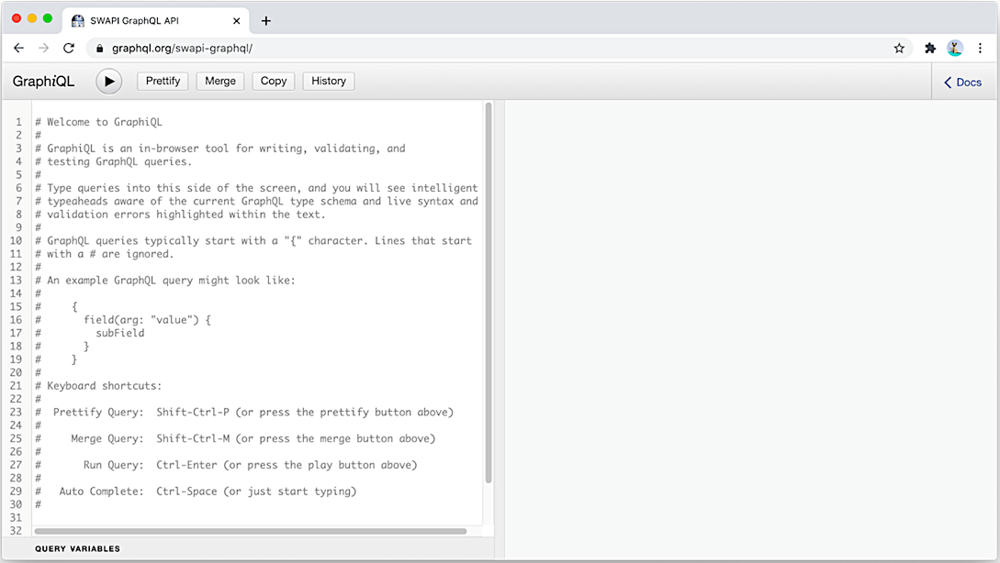
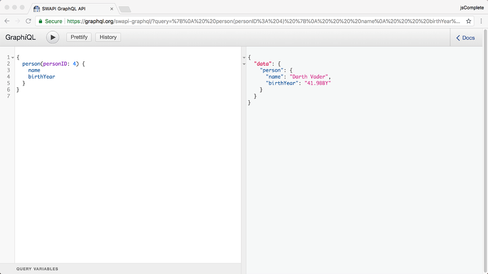
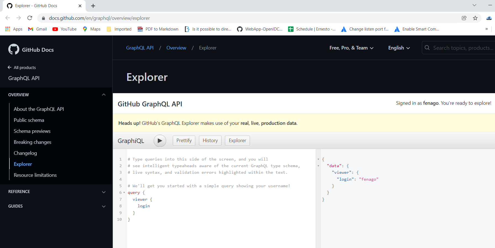
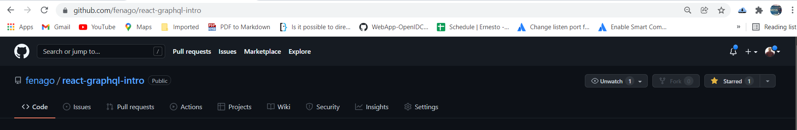
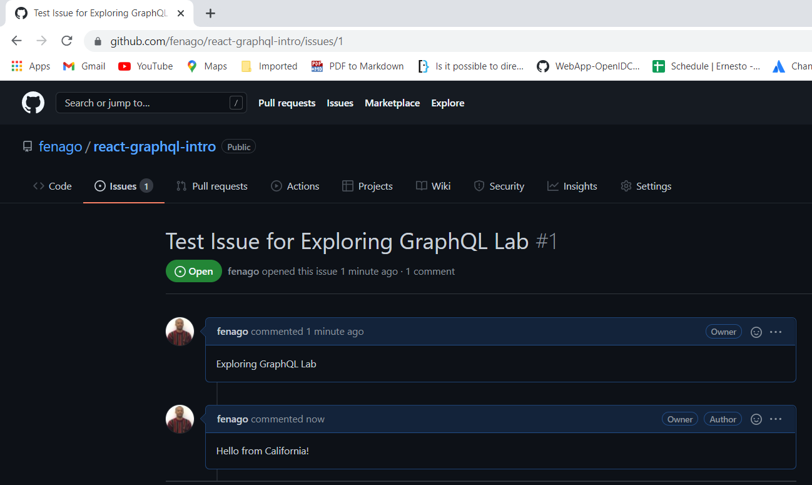
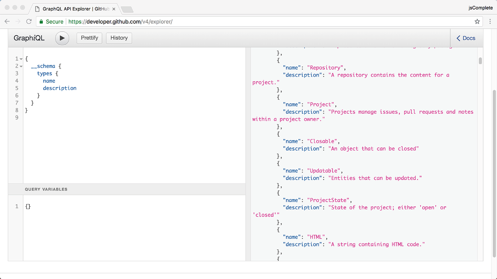

Lab 2: Exploring GraphQL APIs 
=============================

This lab covers:

- Using GraphQL’s in-browser IDE to test GraphQL requests
- Exploring read and write example operations from the GitHub GraphQL API
- Exploring GraphQL’s introspective features


The GraphiQL editor 
-----------------------


Head over to [graphql.org/swapi-graphql/](https://graphql.org/swapi-graphql/) in your
browser to find the GraphiQL editor, which works with the Star Wars data
and is publicly available for you to test:





This editor is a simple two-pane application: the left pane is the editor,
and the right pane is where the results of executing GraphQL requests
appear.

Go ahead and type the following simple GraphQL query in the editor.

####  field

```
{
  person(personID: 4) {
    name
    birthYear
  }
}
```

This simple GraphQL query asks for the name and birth year of the person
whose ID is 4. To execute the query, you can press Ctrl-Enter or press
the run button (with the little black triangle). When you do, the result
pane shows the data that the query is asking for.





For the above example, the
editor is completely aware that there
is a `person` object with `name` and `birthYear` fields. In addition, the
editor has live syntax and validation error highlighting for any text you type.


#### GraphQL Query

1. You define a query called AllFilms. The query will fetch the desired films along with information about them.
2. You specify that you want all the films available.
3. For each film within your collection, what attributes and values do you want to get? This is how you define the scope of data to fetch for an individual film.
4. You want the ID, director, episode ID, title, and release date for each film.
5. For an individual film, you also want to fetch the first ten characters associated with it.
6. For each character, you specify what information to retrieve.
7. You want the ID, name, birth year, eye color, and hair color of each character.
8. You also want the homeworld for the character.
9. And, for that homeworld, you need its name.


Go to https://graphql.org/swapi-graphql/ to Launch the GraphiQL Interface:

Please add the following Query:


```
query AllFilms {
  allFilms {
    films {

      id
      director
      episodeID
      title
      releaseDate
      characterConnection(first: 10) {

        characters {

          id
          name
          birthYear
          eyeColor
          hairColor


          homeworld {

            name
          }
        }
      }
    }
  }
}
```


As you can see, it looks a bit Swift-y or JSON-y. Feel free to experiment with the GraphQL playground for SWAPI. Add or remove things in the query, run it, and check out the results.

Try these queries:

```
query AllFilms {
  allFilms {
    films {
      title
    }
  }
}
```


Query for Planet Residents to Star Wars film "A New Hope"

```
query AllFilms {
  film(id: "ZmlsbXM6MQ==") {
    id
    title
    planetConnection {
      planets {
        name
        residentConnection {
          residents {
            name
          }
        }
      }
    }
  }
}
```


Notice how the root query film() takes in the id parameter of the film "A New Hope" and the projection from GQL returns the title, planets connected to the film, and then resident names of the planets. 


Examples from the GitHub API 
----------------------------

Let's explore some real-world examples of
GraphQL requests from the GitHub API. We can use GitHub's GraphQL API explorer at
[https://docs.github.com/en/graphql/overview/explorer](https://docs.github.com/en/graphql/overview/explorer); this embedded GraphiQL
editor includes the proper authentication headers for the
API (you need to be logged in with a GitHub.com account).





Let's first look at some common queries from this API.


#### Warning

The GitHub API uses your real, live production data at GitHub.com.

**Reading data from GitHub**

When you first launch the GitHub GraphQL API explorer, it has a default
simple query that displays your login. The currently logged-in user is
represented
by the `viewer` field. Under this field, you can read all the
information that is available about you at GitHub.


Here is a query to see information about the most recent 10
repositories that you own or contribute to.

```
{
  viewer {
    repositories(last: 10) {
      nodes {
        name
        description
      }
    }
  }
}
```


Here is another query to see all the supported licenses in GitHub along with
their URLs.


```
{
  licenses {
    name
    url
  }
}
```


Next is a more complex query to find the first 10 issues of the
facebook/graphql repository. It asks for the name of the author and the
title used for the issue page, along with the date when the issue was
created.


```
{
  repository(owner: "facebook", name: "graphql") {
    issues(first: 10) {
      nodes {
        title
        createdAt
        author {
          login
        }
      }
    }
  }
}
```


**Updating data at GitHub**


Let's now explore some mutations we can do with the GitHub GraphQL API. The
simplest mutation is to "star" a repository. If you execute the
following mutation under your logged-in user, its action is equivalent
to going to [github.com/fenago/react-graphql-intro](https://github.com/fenago/react-graphql-intro) and clicking the star button.


```
mutation {
  addStar(input: { starrableId: "R_kgDOGoeL3w" }) {
    starrable {
      stargazers {
        totalCount
      }
    }
  }
}
```

**Output**

After running the mutation using your github user. Go to following github repo, you will see that repository has been starred:




The mutation stars the repository and then reads the new total number of
stargazers after the mutation. The input for this mutation is a simple
object that
has a `starrableId` value, which is the node identifier for the
react-graphql-intro repository. I was able to find that value using this
query.


```
{
  repository(name: "react-graphql-intro", owner: "fenago") {
    id
  }
}
```


Let's execute another mutation. This time, let's add a comment to an issue in
a repository. I created an issue for you to test this mutation under the
repository at
[github.com/fenago/react-graphql-intro](https://github.com/fenago/react-graphql-intro).
You can see the details of this issue using the following query.


```
query GetIssueInfo {
  repository(owner: "fenago", name: "react-graphql-intro") {
    issue(number: 1) {
      id
      title
    }
  }
}
```


This gives you the value of the `id` field needed to add a comment to the issue using a mutation. Now execute the following mutation, which uses that `id` value.

```
mutation AddCommentToIssue {
  addComment(input: {
    subjectId: "I_kwDOGoeL385BTxzR",
    body: "Hello from California!"
  }) {
    commentEdge {
      node {
        createdAt
      }
    }
  }
}
```

After the mutation saves your comment to the special issue, it
reports the `createdAt` date for that comment.

You can see the comments you added and all the other comments on this issue at
[github.com/fenago/react-graphql-intro/issues/1](https://github.com/fenago/react-graphql-intro/issues/1).





**Introspective queries**

Let's ask the GitHub API schema what types it supports. Here is an introspective query to do that.


```
{
  __schema {
    types {
      name
      description
    }
  }
}
```


This query returns all the types this schema supports, and it also includes
the descriptions of these types. This is a helpful list to explore the
custom types defined in the GitHub GraphQL schema. For example, you
should see that the GitHub API schema defines types like `Repository`,
`Commit`, `Project`, `Issue`, `PullRequest`, and many more (figure 2.9).





If you need to retrieve information about a single type, you can
use the `__type` meta-field. For example, here is a query to find all the
supported fields under the
type
`Commit` along with any arguments they accept.


```
{
  __type(name: "Commit") {
    fields {
      name
      args {
        name
      }
    }
  }
}
```


Use the GraphiQL type-ahead feature to discover what other information you
can retrieve under these introspective meta-fields.


#### Summary

- GraphiQL is an in-browser IDE for writing and testing GraphQL requests. It offers many great features to write, validate, and inspect GraphQL queries and mutations. These features are made possible thanks to GraphQL’s introspective nature, which comes with its mandatory schemas.
- GitHub has a powerful GraphQL API that you can use to read data about repositories and users and do mutations like adding a star to a repository or commenting on an issue in a repository.
- GraphQL introspective queries offer a way for clients to get meta-information about the GraphQL API.