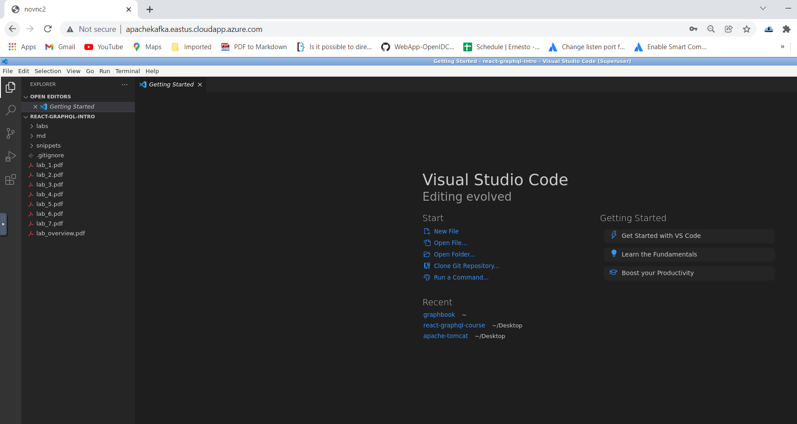
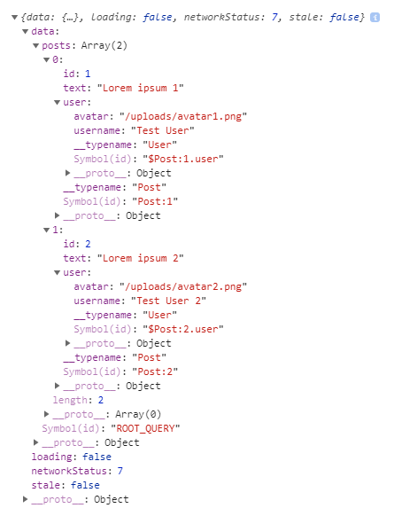
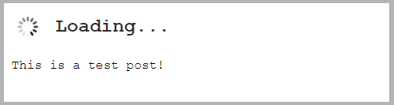
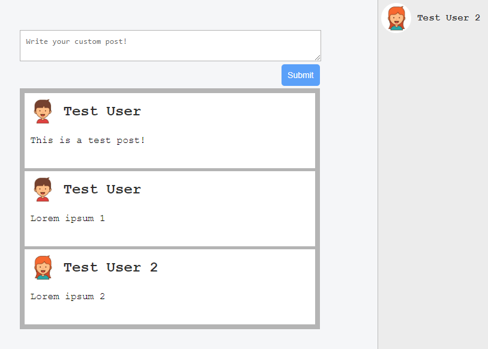
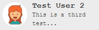
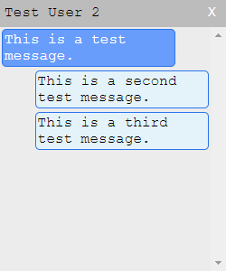
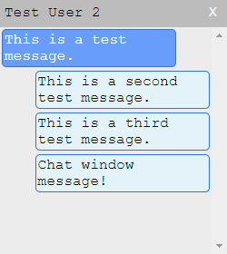

Lab 4: Integrating React into the Back end with Apollo
===============================================


In this lab, we will introduce Apollo\'s React client to our front
end, in order to connect it with the back end. We will query, create,
and update post data, using our front end.

This lab will cover the following points:

-   Installing and configuring Apollo Client
-   Sending requests with GQL and Apollo\'s Query component
-   Mutating data with Apollo


### Lab Solution

Complete solution for this lab is available in the following directory:

`cd ~/Desktop/react-graphql-course/labs/Lab04`

Run following command to install all required packages:

`npm install`




Setting up Apollo Client
========================

We have tested our GraphQL API multiple times during development. We can
now start to implement the data layer of our front end code. In later
chapters, we will focus on other tasks, such as authentication and
client-side routing. For now, we will aim to use our GraphQL API with
our React app.

To start, we must install the React Apollo Client library. Apollo Client
is a GraphQL client that offers excellent integration with React, and
the ability to easily fetch data from our GraphQL API. 


Installing Apollo Client
------------------------

We use [npm] to install our client dependencies, as follows:

```
npm install --save apollo-client@2.4.8 apollo-cache-inmemory@1.3.12 apollo-link-http@1.5.9 apollo-link-error@1.1.5 apollo-link@1.2.6 react-apollo@2.3.3
```


You will see how these packages work together in this section. The great
thing about this approach is that you can customize almost all parts of
Apollo Client, according to your requirements.


To get started with the manual setup of the Apollo Client, create a new
folder and file for the client, as follows:

```
mkdir src/client/apollo
touch src/client/apollo/index.js
```


We will set up Apollo Client in this `index.js` file. Our first
setup will represent the most basic configuration to get a working
GraphQL client.


Just insert the following code:

```
import { ApolloClient } from 'apollo-client';
import { InMemoryCache } from 'apollo-cache-inmemory';
import { HttpLink } from 'apollo-link-http';
import { onError } from 'apollo-link-error';
import { ApolloLink } from 'apollo-link';

const client = new ApolloClient({
  link: ApolloLink.from([
    onError(({ graphQLErrors, networkError }) => {
      if (graphQLErrors) {
        graphQLErrors.map(({ message, locations, path }) => 
        console.log(`[GraphQL error]: Message: ${message}, Location: 
        ${locations}, Path: ${path}`));
        if (networkError) {
          console.log(`[Network error]: ${networkError}`);
        }
      }
    }),
    new HttpLink({
      uri: 'http://localhost:8000/graphql',
    }),
 ]),
 cache: new InMemoryCache(),
});

export default client;
```


The basic setup to send GraphQL request using the Apollo Client is
finished. In the next section, we will send our first GraphQL request
through Apollo Client.


Testing the Apollo Client
-------------------------

Before inserting the GraphQL client directly into our React application
tree, we should test it. This is also the next step in Apollo\'s
official documentation. We will write some temporary code to send our
first GraphQL query. After testing our GraphQL client, we will remove
the code again. The easiest way to do this is to use the
[graphl-tag] package:

1.  First, install this package with [npm], as follows:

```
npm install --save graphql-tag@2.10.0
```


2.  Import the package at the top of the Apollo Client setup, as
    follows:

```
import gql from 'graphql-tag';
```


3.  Then, add the following code before the client is exported:

```
client.query({
  query: gql`
    { 
      posts { 
        id
        text
        user {
          avatar
          username
        }
      }
    }`
}).then(result => console.log(result));
```


The preceding code is almost the same as the example from the Apollo
documentation, but we have replaced their query with one that matches our
back end.


To test the preceding code, we should start the server and the front
end. One option is to build the front end now, and then start the
server. In this case, the URL to browse the front end would be
[http://localhost:8000]. A better option would be to spawn the
server with `npm run server`, and then open a second terminal.
Then, you can start the webpack development server by executing `npm run client`. A new browser tab should open automatically.

However, we have forgotten something: the client is set up in our new
file, but it is not yet used anywhere. Import it in the `index.js`
root file of our client React app, below the import of the [App]
class:

```
import client from './apollo';
```


The browser should be reloaded, and the query sent. You should be able
to see a new log inside the console of the developer tools of your
browser.

The output should look like the following screenshot:





The [data] object looks much like the response that we received
when sending requests through Postman, except that, now, it has some new
properties: [loading], [networkStatus], and [stale].
Each of these stands for a specific status, as follows:

-   [loading], as you might expect, indicates whether the query is
    still running or has already finished.
-   [networkStatus] goes beyond this and gives you the exact
    status of what happened. For example, the number seven indicates
    that there are no running queries that produce errors. The number
    eight means that there has been an error. You can look up the other
    numbers in the official GitHub repository, at
    <https://github.com/apollographql/apollo-client/blob/master/packages/apollo-client/src/core/networkStatus.ts>.
-   [stale] is set whenever data is missing and is only partially
    available to the user.

Now that we have verified that the query has run successfully, we can
connect Apollo Client to the React DOM. Please remove the temporary code
that we wrote in this section before continuing. This includes
everything except the import statement in the [App.js] file.


Binding the Apollo Client to React
----------------------------------

We have tested Apollo Client, and have confirmed that it works. However,
React does not yet have access to it. Since Apollo Client is going to be
used everywhere in our application, we can set it up in our root
`index.js` file, as follows:

```
import React from 'react';
import ReactDOM from 'react-dom';
import { ApolloProvider } from 'react-apollo';
import App from './App';
import client from './apollo';

ReactDOM.render(
  <ApolloProvider client={client}>
    <App />
  </ApolloProvider>, document.getElementById('root')
);
```


As we mentioned in Lab 1, you should only edit this file
when the whole application needs access to the new component. In the
preceding code, you can see that we import the last package that we
installed at the beginning, with [react-apollo]. The
[ApolloProvider] that we extracted from it is the first layer of
our React application. It surrounds the [App] class, passing the
Apollo Client that we wrote to the next level. To do this, we pass the
[client] to the provider as a property. Every underlying React
component can now access the Apollo Client.

We should be now able to send GraphQL requests from our React app.


Using the Apollo Client in React
================================

The Apollo Client gives us everything that we need to send requests from
our React components. We have already tested that the client works.
Before moving on, we should clean up our file structure, in order to
make it easier for us later in the development process. Our front end
is, at the moment, still displaying posts that come from static demo
data. The first step is to move over to the Apollo Client and fetch the
data from our GraphQL API.

Follow the instructions below to connect your first React component with
the Apollo Client:

1.  Clone the [App.js] file to another file, called
    [Feed.js].
2.  Remove all parts where React [Helmet] is used, and rename the
    class [Feed], instead of [App].
3.  From the [App.js] file, remove all of the parts that we have
    left in the [Feed] class.
4.  Furthermore, we must render the [Feed] class inside of the
    [App] class. It should like the following code:

```
import React, { Component } from 'react';
import { Helmet } from 'react-helmet';
import Feed from './Feed';
import '../../assets/css/style.css';

export default class App extends Component {
  render() {
    return (
      <div className="container">
        <Helmet>
          <title>Graphbook - Feed</title>
          <meta name="description" content="Newsfeed of all your 
           friends on Graphbook" />
        </Helmet>
        <Feed />
      </div>
    )
  }
}
```


The corresponding [Feed] class should only include the parts where
the news feed is rendered.

We imported the [Feed] class and inserted it inside of the
[render] method of our [App] class, so that it is rendered.
The next lab focuses on reusable React components, and how to write
well-structured React code. Now, let\'s take a look at why we split our
[App] class into two separate files.


Querying in React with the Apollo Client
----------------------------------------

There are two main approaches offered by Apollo that can be used to
request data. The first one is a **higher-order component** (**HoC**),
provided by the [react-apollo] package. The second one is the
[Query] component of Apollo, which is a special React component.
Both approaches have their advantages and disadvantages.


Apollo HoC query
----------------

A higher-order component is a function that takes a component as input
and returns a new component. This method is used in many cases wherein
we have multiple components all relying on the same functionalities,
such as querying for data. In these cases, you extract the logic to
query for data in a separate function, which extends the original
components and enables them to fetch their data. The necessary
properties are passed to the component by a higher-order function.

**ProTip**

If you are not familiar with higher-order components, you should read up
on them. The official React documentation provides you with the
essential information at
<https://reactjs.org/docs/higher-order-components.html>.


To see a real example of this, we use the [posts] feed. Follow
these instructions to get a working Apollo Query HoC:

1.  Remove the demo posts from the top of the [Feed.js] file.
2.  Remove the [posts] field from the state initializer.
3.  Import [graphl-tag] and parse our query with it, as follows:

```
import gql from 'graphql-tag';
import { graphql } from 'react-apollo';

const GET_POSTS = gql`{ 
  posts { 
    id
    text
    user {
      avatar
      username
    }
  }
}`;
```


4.  Replace everything in the [render] function, before the final
    [return] statement, with the following code:

```
const { posts, loading, error } = this.props;
const { postContent } = this.state;

if(loading) {
  return "Loading...";
}
if(error) {
  return error.message;
}
```


Note that the [render] function is now very clean, as it was
before. It only includes and renders the markup and the loop over the
posts.

5.  Remove the [export] statement from the [Feed] class. We
    will export the new component returned from the HoC at the end of
    the file. The export must look as follows:

```
export default graphql(GET_POSTS, {
  props: ({ data: { loading, error, posts } }) => ({
    loading,
    posts,
    error
  })
})(Feed)
```


Notably, we also imported the `graphql` HoC function from the
[react-apollo] package. This function accepts the actual GraphQL
query that we want to send as the first parameter. The second parameter
allows us to map the result of the HoC to specific properties of the
child component, which is our [Feed] class. The [posts],
[loading], and [error] parameters are passed as properties
to the [Feed] component, via the HoC. This separates the rendering
logic from the data fetching. The last parameter is the [Feed]
class (the component that is processed by the HoC). We pass it to a new
function call, which is the result of the `graphql` function. We
do not pass it as the third parameter of the `graphql` function.

This approach is my favorite solution to query data from a GraphQL API
through Apollo. However, I would recommend that you use a different
solution, which we will look at in the following section.


The Apollo Query component
--------------------------

We will now take a look at the second approach, which is also the
approach of the official Apollo documentation. Before getting started,
undo the HoC implementation to send requests from the previous section.
The new way of fetching data through the Apollo Client is via
[render] props, or [render] functions. These were introduced
to the Apollo Client in March 2018, and they replaced the good old HoC
process.

**ProTip**

Take a look at the official React documentation about render props,
because this is not a particularly easy topic:
[https://reactjs.org/docs/render-props.html](https://reactjs.org/docs/render-props.html)


Now, follow these instructions to get the [Query] component
running:

1.  Remove the demo posts from the top of the [Feed.js] file.
2.  Remove the [posts] from the state and stop extracting them
    from the component state in the [render] method, too.
3.  Import the [Query] component from the [react-apollo]
    package and [graphl-tag], as follows:

```
import gql from 'graphql-tag';
import { Query } from 'react-apollo';

const GET_POSTS = gql`{ 
  posts { 
    id
    text
    user {
      avatar
      username
    }
  }
}`;
```


4.  The [Query] component can now be rendered. The only parameter,
    for now, is the parsed query that we want to send. Replace the
    complete [render] method with the following code:

```
render() {
  const { postContent } = this.state;

  return (
    <div className="container">
      <div className="postForm">
        <form onSubmit={this.handleSubmit}> 
          <textarea value={postContent} onChange=
          {this.handlePostContentChange} placeholder="Write your 
           custom post!"/>
          <input type="submit" value="Submit" />
        </form>
      </div>
      <div className="feed">   
        <Query query={GET_POSTS}>
          {({ loading, error, data }) => {
            if (loading) return "Loading...";
            if (error) return error.message;

            const { posts } = data;
            return posts.map((post, i) => 
              <div key={post.id} className="post">
                <div className="header">
                  
                  <h2>{post.user.username}</h2>
                </div>
                <p className="content">
                  {post.text}
                </p>
              </div>
            )
          }}
        </Query>
      </div>
    </div>
  )
}
```


In the preceding code, you can see why I prefer not to use this
approach. The [Query] component requires a function as its child.
This function receives three properties---[loading],
[error], and [data]---much like with the HoC approach.
Inside of this function, you can handle whatever you want to render. If
the [posts] request is successful, we render the posts feed as
before.

You may think that you could render a component directly, as a child
instead of as a function, as with the higher-order component, but this
is not possible. Apollo requires us to specify a function, not a React
component, as a child.

In my opinion, this is a dirty way of rendering and requesting data. It
moves away from the standard component workflow of React. The React
community, however, prefers render props, which is why it was
implemented in Apollo Client. To improve this, you can write separate
components for each [Query] or [Mutation] component that you
use. Then, you can hand over all of the properties given by our Apollo
components to our custom ones. This way, the [render] function is
more readable when using the [Query] component. You will see this
solution soon.

We will continue to use the [Query] and [Mutation]
components, as this is the default way of writing GraphQL requests in
the latest versions of Apollo Client.


No matter which approach you take, the rendered output should look like
that in Lab 1. The form to create a new post
is not working at the moment because of our changes; let\'s fix this in
the next section.


Mutations with the Apollo Client
================================

We have replaced the way that we get the data in our client. The next
step is to switch the way that we create new posts, too. Before Apollo
Client, we had to add the new fake posts to the array of demo posts
manually, within the memory of the browser. Now, everything in our text
area is sent with the [addPost] mutation to our GraphQL API,
through Apollo Client.

As with GraphQL queries, there is a [Mutation] component that we
are going to use. We are also going to compare it to the HoC method. To
keep up the comparisons between them, we will start with the HoC method.
Both approaches are valid ways to do this; there is nothing that is
vastly different between them behind the scenes.

Let\'s start with the higher-order component approach.


The Apollo Mutation HoC
-----------------------

The complete HoC workflow requires you to have the HoC [Query]
method set up, too. Otherwise, you won\'t be able to see why this
approach has some advantages over the other one.

So, if you have undone the [Query] HoC, you should insert the code
again, in order to test the mutation HoC. You can also skip to the next
section, where you will learn how to use the [Mutation] component.

Follow these instructions to set up the mutation HoC:

1.  Import the [compose] method from the [react-apollo]
    package, as follows:

```
import { graphql, compose } from 'react-apollo';
```


2.  Add the [addPost] mutation and parse it with
    [graphql-tag]:

```
const ADD_POST = gql`
  mutation addPost($post : PostInput!) {
    addPost(post : $post) {
      id
      text
      user {
        username
        avatar
      }
    }
  }
`;
```


3.  We will adjust the way that the [Feed] class is exported. In
    the first HoC example, we had the `graphql` method, which sent
    the GraphQL query and inserted that response data into the
    underlying [Feed] component. Now, we will use the
    [compose] function of [react-apollo], which takes a set
    of GraphQL queries, or mutations. These are run or passed as
    functions to the component. Add the following code to the bottom,
    and remove the old [export] statement:

```
const ADD_POST_MUTATION = graphql(ADD_POST, {
  name: 'addPost'
});

const GET_POSTS_QUERY = graphql(GET_POSTS, {
  props: ({ data: { loading, error, posts } }) => ({
    loading,
    posts,
    error
  })
});

export default compose(GET_POSTS_QUERY, ADD_POST_MUTATION)(Feed);
```


Instead of using the `graphql` method directly on the [Feed]
component, we first save the mutation and query in two separate
variables. The mutation takes a parameter, [name], which says that
the mutation can be run under the name [addPost], inside of the
[Feed] component. The query looks similar to the query that we
used in the previous section. The [compose] method takes both
variables and connects them with the [Feed] component. All of the
queries are directly executed, if not specified differently. All
mutations are passed as functions to the component to be run
programmatically.

4.  Our form works as expected. Every piece of text that you enter in
    the text area is saved to the state of the component. When
    submitting the form, we want to send the [addPost] mutation
    with the Apollo Client. The [addPost] function is available
    under the properties of the [Feed] component, as we specified
    it in the preceding code. When giving a [variables] object as
    a parameter, we can fill in our input fields in the mutation, as is
    expected by our GraphQL schema:

```
handleSubmit = (event) => {
  const self = this;
  event.preventDefault();
  const newPost = {
    text: this.state.postContent
  };
  this.props.addPost({ variables: { post: newPost }}).then(() => {
    self.setState((prevState) => ({
      postContent: ''
    }));
  });
}
```


The code looks very clean when using the HoC approach. We first parse
all of the queries. Then, we define our class, including the
[render] method, which we haven\'t touched at all. Finally, we
define the two GraphQL requests that we are going to send, and export
the constructed component. The code is very readable.

If you try to add a new post through the front end, you won\'t be able
to see it immediately. The form will be empty, and everything will look
as though it should have worked, but the new post will not be shown.
This happens because the current state (or cache) of our component has
not yet received the new post. The easiest way to test that everything
has worked is to refresh the browser.

Of course, this is not the way that it should work. After the mutation
has been sent, the new post should be directly visible in the feed. We
will fix this after we have had a look at the second approach, which
uses the [Mutation] component.


The Apollo Mutation component
-----------------------------

The [Mutation] component is very similar to the [Query]
component. Be sure to undo the HoC solution changes before continuing.
Follow these steps to get the [Mutation] component running:

1.  Import the [Mutation] component from the [react-apollo]
    package, as follows:

```
import { Query, Mutation } from 'react-apollo';
```


2.  Export the [Feed] component again, as we did in the previous
    [Query] component example. Remove the
    [ADD\_POST\_MUTATION] and [GET\_POSTS\_QUERY] variables
    when doing so:

<div>

```
export default class Feed extends Component
```


</div>

3.  Next, add the [Mutation] component inside of the
    [render] function. We will surround the form with this
    component, as this is the only part of our content where we need to
    send a mutation:

```
render() {
  const self = this;
  const { postContent } = this.state;

  return (
    <Query query={GET_POSTS}>
      {({ loading, error, data }) => {
        if (loading) return <p>Loading...</p>;
        if (error) return error.message;

        const { posts } = data;

        return (
          <div className="container">
            <div className="postForm">
              <Mutation mutation={ADD_POST}>
                {addPost => (
                  <form onSubmit={e => {
                    e.preventDefault();
                    addPost({ variables: { post: { text: 
                      postContent 
                    } } }).then(() => {
                      self.setState((prevState) => ({
                        postContent: ''
                      }));
                    });
                  }}>
                  <textarea value={postContent} onChange=
                  {self.handlePostContentChange} placeholder="Write 
                  your custom post!"/>
                  <input type="submit" value="Submit" />
                </form>
              )}
            </Mutation>
          </div>
          <div className="feed">
            {posts.map((post, i) =>
                <div key={post.id} className="post">
                  <div className="header">
                    
                    <h2>{post.user.username}</h2>
                  </div>
                  <p className="content">
                    {post.text}
                  </p>
                </div>
              )}
            </div>
          </div>
        )
      }}
    </Query>
  )
}
```


The surrounded form now directly implements the [onSubmit]
function. We could also extract this to a separate class method, but it
is working this way. The [Mutation] component accepts the
[mutation] property, which receives the GraphQL request that we
want to send. The form can access the [addPost] function, which is
exposed inside of the [render] prop function.

The [render] function is now more complex than it was before. In
my opinion, the HoC solution looks much cleaner, despite the advantages
that this solution might have. In the next lab, we will look at how
to make this more readable and reusable. No matter which approach you
choose, the result will be the same.

You can now try out the [Mutation] component by submitting a new
post. Our feed does not show the post until we refresh the browser
again. In the next section, we will look at how to fix this issue.


Updating the UI with the Apollo Client
--------------------------------------

After running the [addPost] mutation, the request goes through to
the server and saves the new post in our database without any problems.
However, we still cannot see the changes take effect in the front end
immediately.

In this introduction to direct cache access and refetching, we will
focus on the new standard [Query] and [Mutation] components.


Refetching queries
------------------

This is the easiest method to update your user
interface. The only step is to set an array of queries to be refetched.
The [Mutation] component should look as follows:

```
<Mutation
  refetchQueries={[{query: GET_POSTS}]}
```


Each object that you enter in the [refetchQueries] array needs a
[query] property. Each component relying on one of those requests
is rerendered when the response for its associated query arrives. It
also includes components that are not inside of the [Feed] class.
All components using the post\'s [GET\_POSTS] query are
rerendered.

You can also provide more fields to each query, such as variables to
send parameters with the re-fetch request. Submitting the form resends
the query, and you can see the new post directly in the feed. Refetching
also reloads the posts that are already showing, which is unnecessary.

Now, let\'s take a look at how we can do this more efficiently.


Updating the Apollo cache
-------------------------

We want to explicitly add only the new post to the cache of the Apollo
Client. Using the cache helps us to save data, by not refetching the
complete feed or rerendering the complete list. To update the cache, you
should remove the [refetchQueries] property. You can then
introduce a new property, called [update], as shown in the
following code:

```
<Mutation
  update = {(store, { data: { addPost } }) => {
    const data = store.readQuery({ query: GET_POSTS });
    data.posts.unshift(addPost);
    store.writeQuery({ query: GET_POSTS, data });
  }}
```


The new property runs when the GraphQL [addPost] mutation has
finished. The first parameter that it receives is the [store] of
the Apollo Client, in which the whole cache is saved. The second
parameter is the returned response of our GraphQL API.


We wait for the response to arrive, and then push the new item to the
list afterward. In the next section, we will be a bit more optimistic
about the response of our server, and will add the item before the
request\'s response successfully arrives.


Optimistic UI
-------------

This section expects the [update] function of the [Mutation]
component to already be implemented. Otherwise, this UI feature will not
work. We need to add the [optimisticResponse] property to our
mutation, as follows:

```
optimisticResponse= {{
  __typename: "mutation",
  addPost: {
    __typename: "Post",
    text: postContent,
    id: -1,
    user: {
      __typename: "User",
      username: "Loading...",
      avatar: "/public/loading.gif"
    }
  }
}}
```


The [optimisticResponse] can be anything from a function to a
simple object. The return value, however, needs to be a GraphQL response
object. What you see here is an [addPost] object that looks like
our GraphQL API could return it, if our request is successful. You need
to fill in the [\_\_typename] fields, according to the GraphQL
schema that you are using. That is why the type names [Post] and
[User] are inside of this fake object.

The [id] of the optimistic response is set to minus one. React
expects that every component in a loop gets a unique [key]. We
usually use the id of a post as the key. Minus one is never used by any
other post, because MySQL starts counting at one. Another advantage is
that we can use this id to set a special class to the post item in our
list.

Furthermore, the username and the user\'s avatar are set to
[loading]. That is because we don\'t have built-in authentication.
React and Apollo do not have a user associated with the current session,
so we cannot enter the user\'s data into the [optimisticResponse].
We fix this once the authentication is ready. This is an excellent
example of how to handle a situation in which you do not have all of the
data until you receive a response from the server.

To set a particular class on the list item, we conditionally set the
correct [className] in our [map] loop. Insert the following
code into the [render] method:

```
{posts.map((post, i) => 
  <div key={post.id} className={'post ' + (post.id < 0 ? 'optimistic': 
    '')}>
    <div className="header">
      
      <h2>{post.user.username}</h2>
    </div>
    <p className="content">
      {post.text}
    </p>
  </div>
)}
```


An example CSS style for this might look as follows:

```
.optimistic {
  -webkit-animation: scale-up 0.4s cubic-bezier(0.390, 0.575, 0.565, 1.000) 
    both;
  animation: scale-up 0.4s cubic-bezier(0.390, 0.575, 0.565, 1.000) both;
}

@-webkit-keyframes scale-up {
  0% {
    -webkit-transform: scale(0.5);
    transform: scale(0.5);
  }
  100% {
    -webkit-transform: scale(1);
    transform: scale(1);
  }
}

@keyframes scale-up {
  0% {
    -webkit-transform: scale(0.5);
    transform: scale(0.5);
  }
  100% {
    -webkit-transform: scale(1);
    transform: scale(1);
  }
}
```


CSS animations make your applications more modern and flexible. If you
experience issues when viewing these in your browser, you may need to
check whether your browser supports them.

You can see the result in the following screenshot:





The loading spinner and the username are removed once the response
arrives from our API, and the [update] function is executed again
with the real data. You do not need to take care of removing the loading
post yourself; it is done by Apollo automatically. Any spinner component
from an npm package or GIF file can be used where I have inserted the
loading animation. The file that I am using needs to be saved under the
[public] folder, with the name [loading.gif], so that it can
be used through the CSS that we added in the preceding code.

Everything is now set up for sending new posts. The user interface
responds immediately, and shows you the new post.

However, what about new posts from your friends and colleagues?
Currently, you need to reload the page to see them, which is not very
intuitive. At the moment, we only add the posts that we send on our own,
but do not receive any information about new posts from other people. I
will show you the quickest way to handle this in the following section.


Polling with the Query component
--------------------------------

**Polling** is nothing more than rerunning a request after a specified
interval. This procedure is the simplest way to implement real-time
updates for our news feed. However, multiple issues are associated with
polling, as follows:

-   It is inefficient to send requests without knowing whether there is
    any new data. The browser might send dozens of requests without ever
    receiving a new post.
-   If we directly send the initial request again, we will get all of
    the posts, including those that we are already showing to the user.
-   When sending requests, the server needs to query the database and
    calculate everything. Unnecessary requests cost money and time.

There are some use cases in which polling makes sense. One example is a
real-time graph, in which every axis tick is displayed to the user,
whether there is data or not. You do not need to use an interrupt-based
solution, since you want to show everything. Despite the issues that
come with polling, let\'s quickly run through how it works. All you need
to do is fill in the [pollInterval] property, as follows:

```
<Query query={GET_POSTS} pollInterval={5000}>
```


The [Query] component looks like the preceding code. The request
is resent every 5 seconds (5,000 milliseconds).


Let\'s continue and integrate the rest of our GraphQL API.


Implementing chats and messages
===============================

In the previous lab, we programmed a pretty dynamic way of creating
chats and messages with your friends and colleagues, either one-on-one
or in a group. There are some things that we have not discussed yet,
such as authentication, real-time subscriptions, and friend
relationships. First, however, we are going to work on our new skills,
using React with Apollo Client to send GraphQL requests. It is a
complicated task, so let\'s get started.


Fetching and displaying chats
-----------------------------

Our news feed is working as we expected. Now, we also want to cover
chats. As with our feed, we need to query for every chat that the
current user (or, in our case, the first user) is associated with.

The initial step is to get the rendering working with some demo chats.
Instead of writing the data on our own, as we did in the first lab,
we can now execute the [chats] query. Then, we can copy the result
into the new file as static demo data, before writing the real
[Query] component.

Let\'s get started, as follows:

1.  Send the GraphQL query. Use Postman, as you did previously:

```
query {
  chats {
    id
    users {
      avatar
      username
    }
  }
}
```


The request looks a bit different from the one we tested with Postman.
The chat panel that we are going to build only needs specific data. We
do not need to render any messages inside of this panel, so we don\'t
need to request them. A complete chat panel only requires the chat
itself, the id, the usernames, and the avatars. Later, we will retrieve
all of the messages, too, when viewing a single chat.

Next, create a new file called [Chats.js], next to the
[Feed.js] file.

Copy the complete response over to an array inside of the
[Chats.js] file, as follows. Add it to the top of the file:

```
const chats = [{
  "id": 1,
  "users": [{
      "id": 1,
      "avatar": "/uploads/avatar1.png",
      "username": "Test User"
    },
    {
      "id": 2,
      "avatar": "/uploads/avatar2.png",
      "username": "Test User 2"
    }]
  }
];
```


2.  Import React ahead of the [chats] variable. Otherwise, we will
    not be able to render any React components:

```
import React, { Component } from 'react';
```


3.  Set up the React [Component]. I have provided the basic markup
    here. Just copy it beneath the [chats] variable. I am going to
    explain the logic of the new component shortly:

```
export default class Chats extends Component {
  usernamesToString(users) {
    const userList = users.slice(1);
    var usernamesString = '';

    for(var i = 0; i < userList.length; i++) {
      usernamesString += userList[i].username;
      if(i - 1 === userList.length) {
        usernamesString += ', ';
      }
    }
    return usernamesString;
  }
  shorten(text) {
    if (text.length > 12) {
      return text.substring(0, text.length - 9) + '...';
    }

    return text; 
  }
  render() {
    return (
      <div className="chats">
        {chats.map((chat, i) => 
          <div key={chat.id} className="chat">
            <div className="header">
               2 ? 
                '/public/group.png' : chat.users[1].avatar)} />
              <div>
                <h2>{this.shorten(this.usernamesToString(chat.users
                   ))}</h2>
              </div>  
            </div>
          </div>
        )}
      </div>
    )
  }
}
```


The component is pretty basic, at the moment. In the [render]
method, we [map] over all of the chats, and return a new list item
for each chat. Each list item has an image, which is taken from the
second user of the array, since we defined that the first user in the
list is the current user, as long as we have not implemented
authentication. We use a group icon if there are more than two users.
When we have implemented authentication, and we know the logged-in user,
we can take the specific avatar of the user that we are chatting with.

The title displayed inside of the [h2] tag at the top of the chat
is the name (or names) of the user(s). For this, I have implemented the
[usernamesToString] method, which loops over all of the usernames
and concatenates them into a long string. The result is passed into the
[shorten] function, which removes all of the characters of the
string that exceed the size of the maximum-twelve characters.

4.  Our new component needs some styling. Copy the new CSS to our
    [style.css] file.

To save the file size in our CSS file, replace the two [post
header] styles to also cover the style of the chats, as follows:

```
.post .header > *, .chats .chat .header > * {
  display: inline-block;
  vertical-align: middle;
}

.post .header img, .chats .chat .header img {
  width: 50px;
  margin: 5px;
}
```


We must append the following CSS to the bottom of the [style.css]
file:

```
.chats {
  background-color: #eee;
  width: 200px;
  height: 100%;
  position: fixed;
  top: 0;
  right: 0;
  border-left: 1px solid #c3c3c3;
}

.chats .chat {
  cursor: pointer;
}

.chats .chat .header > div {
  width: calc(100% - 65px);
  font-size: 16px;
  margin-left: 5px;
}

.chats .chat .header h2, .chats .chat .header span {
  color: #333;
  font-size: 16px;
  margin: 0;
}

.chats .chat .header span {
  color: #333;
  font-size: 12px;
}
```


5.  To get the code working, we must also import the [Chats] class
    in our [App.js] file:

```
import Chats from './Chats';
```


6.  Render the [Chats] class inside of the [render] method,
    beneath the [Feed] class inside of the [App.js] file.

The current code generates the following screenshot:





On the right-hand side, you can see the chats panel that we have just
implemented. Every chat is listed there as a separate row.

The result isn\'t bad, but it would be much more helpful to at least
have the last message of every chat beneath the username, so that you
could directly see the last content of your conversations.

Just follow these instructions to get the last message into the chats
panel:

1.  The easiest way to do this would be to add the messages to our query
    again, but querying all of the messages for every chat that we
    wanted to display in the panel would not make much sense. Instead,
    we will add a new property to the chat entity, called
    [lastMessage]. That way, we will only get the newest message.
    We will add the new field to the GraphQL schema of our chat type, in
    the back end code, as follows:

```
lastMessage: Message
```


Of course, we must also implement a function that retrieves the
[lastMessage] field.

2.  Our new [resolvers.js] function orders all of the chat
    messages by id, and takes the first one. By definition, this should
    be the latest message in our chat. We need to resolve the promise on
    our own and return the first element of the array, since we expect
    to return only one message object. If you return the promise
    directly, you will receive [null] in the response from the
    server, because an array is not a valid response for a single
    message entity:

```
lastMessage(chat, args, context) {
  return chat.getMessages({limit: 1, order: [['id', 'DESC']]}).then((message) => {
    return message[0];
  });
},
```


3.  You can add the new property to our static data, inside of
    [Chats.js]. Rerunning the query (as we did in step 1) would
    also be possible:

<div>

```
"lastMessage": {
  "text": "This is a third test message."
}
```


</div>


4.  We can render the new message with a simple [span] tag beneath
    the [h2] of the username. Copy it directly into the
    [render] method, inside of our [Chats] class:

```
<span>{this.shorten(chat.lastMessage.text)}</span>
```


The result of the preceding changes renders every chat row with the last
message inside of the chat. This looks like the following screenshot:





Since everything is displayed correctly from our test data, we can
introduce the [Query] component, in order to fetch all of the data
from our GraphQL API. We can remove the [chats] array. Then, we
will import all of the dependencies and parse the GraphQL query, as in
the following code:

```
import gql from 'graphql-tag';
import { Query } from 'react-apollo';

const GET_CHATS = gql`{ 
  chats {
    id
    users {
      id
      avatar
      username
    }
    lastMessage {
      text
    }
  }
}`;
```


Our new [render] method does not change much. We just include the
Apollo [Query] component, as follows:

```
<div className="chats">
  <Query query={GET_CHATS}>
    {({ loading, error, data }) => {
      if (loading) return <p>Loading...</p>;
      if (error) return error.message;
 
      const { chats } = data;
      
      return chats.map((chat, i) => 
        <div key={"chat" + chat.id} className="chat">
          <div className="header">
             2 ? '/public/group.png' : 
             chat.users[1].avatar)} />
            <div>
              <h2>{this.shorten(this.usernamesToString(chat.users))}
              </h2>
              <span>{chat.lastMessage && 
              this.shorten(chat.lastMessage.text)}</span>
            </div>
          </div>
        </div>
      )
    }}
  </Query>
</div>
```


Be sure to render the [div] with the [chats] class name
first, and after that, the chat loop function. The reason for this is
that we want to show the user the gray panel, with a loading indicator.
If you do it the other way round, the gray panel will be displayed when
the response is successfully received. You should have run the
[addChat] mutation from the previous lab through Postman.
Otherwise, there will be no chats to query for, and the panel will be
empty. You have to execute this mutation also for any following lab
because we are not going to implement a special button for this
functionality.

One obvious question that you might have is as follows: How can we
create new chats with other users? We will focus on this issue when we
have implemented the authentication properly, and can visit users\'
profiles. Next, we want to display the chat messages after opening a
specific chat.


Fetching and displaying messages
--------------------------------

We will start with the [Query] component from the beginning.
First, however, we have to store the chats that were opened by a click
from the user. Every chat is displayed in a separate, small chat window,
like in Facebook. Add a new [state] variable to save the ids of
all of the opened chats to the [Chats] class:

```
state = {
  openChats: []
}
```


To let our component insert something into the array of open chats, we
will add the new [openChat] method to our [Chats] class:

```
openChat = (id) => {
  var openChats = this.state.openChats.slice();
 
  if(openChats.indexOf(id) === -1) {
    if(openChats.length > 2) {
      openChats = openChats.slice(1);
    }
    openChats.push(id);
  }

  this.setState({ openChats });
}
```


When a chat is clicked on, we will first check that it is not already
open, by searching the id using the [indexOf] function inside of
the [openChats] array.

Every time a new chat is opened, we will check whether there are three
or more chats. If that is the case, we will remove the first opened chat
from the array, and exchange it with the new one by appending it to the
array with the [push] function. We will only save the chat ids,
not the whole JSON object.

The last step is to bind the [onClick] event to our component. In
the [map] function, we can replace the wrapping [div] tag
with the following line:

```
<div key={"chat" + chat.id} className="chat" onClick={() => self.openChat(chat.id)}>
```


Here, we use [onClick] to call the [openChat] method, with
the chat id as the only parameter. At this point, the new function is
already working, but the updated state isn\'t used. Let\'s take care of
that:

1.  Add a surrounding wrapper [div] tag to the whole
    [render] method:

```
<div className="wrapper">
```


2.  We insert the new markup for the open chats next to the chats panel.
    You cannot insert it inside the panel directly, due to the CSS that
    we are going to use:

```
<div className="openChats">
  {openChats.map((chatId, i) => 
    <Query key={"chatWindow" + chatId} query={GET_CHAT} 
      variables={{ chatId }}>
      {({ loading, error, data }) => {
        if (loading) return <p>Loading...</p>;
        if (error) return error.message;
 
        const { chat } = data;
 
        return (
          <div className="chatWindow">
            <div className="header">
              <span>{chat.users[1].username}</span>
              <button className="close">X</button>
            </div>
            <div className="messages">
              {chat.messages.map((message, j) => 
                <div key={'message' + message.id} className=
                {'message ' + (message.user.id > 1 ? 'left' : 
                'right')}>
                  {message.text}
                </div>
              )}
            </div>
          </div>
        )
      }}
    </Query>
  )}
</div>
```


Here, we are walking over the [openChats] variable by using the
[map] function again. Every id in this array is given to the
[Query] component as a variable for the GraphQL request. The rest
can be understood easily.

Once the request arrives, we render a [div] tag with the
[chatWindow] class name, in which all messages are displayed.
Again, we are using the user id to fake the class name of the messages.
We will replace it when we get authentication running.

3.  As you can see in the preceding code, we are not only passing the
    chat id as a parameter to the [variables] property of the
    [Query] component, but we also use another query stored in the
    [GET\_CHAT] variable. We must parse this query first, with
    [graphql-tag]. Add the following code to the top of the file:

```
const GET_CHAT = gql`
  query chat($chatId: Int!) {
    chat(chatId: $chatId) {
      id
      users {
        id
        avatar
        username
      }
      messages {
        id
        text
        user {
            id
        }
      }
    }
  }
`;
```


4.  Because we rely on the [openChats] state variable, we must
    extract it in our [render] method. Add the following code
    before the [return] state, in the [render] method:

```
const self = this;
const { openChats } = this.state;
```


5.  The [close] button function relies on the [closeChat]
    method, which we will implement in our [Chats] class:

```
closeChat = (id) => {
  var openChats = this.state.openChats.slice();
  
  const index = openChats.indexOf(id);
  openChats.splice(index,1),
  
  this.setState({ openChats });
}
```


6.  The last thing missing is some styling. The CSS is pretty big. Every
    message from the other users should be displayed on the left, and
    our own messages on the right, in order to differentiate them.
    Insert the following CSS into the [style.css] file:

```
.chatWindow {
  width: 250px;
  float: right;
  background-color: #eee;
  height: 300px;
  margin-right: 10px;
  border-left: 1px solid #c3c3c3;
  border-right: 1px solid #c3c3c3;
}

.chatWindow .header {
  width: calc(100% - 10px);
  background-color: #c3c3c3;
  padding: 5px;
  height: 20px;
}

.chatWindow .header .close {
  float: right;
  border: none;
  background: none;
  color: #fff;
  cursor: pointer;
}

.chatWindow .header .close:focus {
  outline: none;
}

.chatWindow .messages {
  overflow-y: scroll;
  height: calc(100% - 50px);
}

.chatWindow .messages .message {
  width: 80%;
  border: 1px solid #4079f3;
  margin: 2px;
  border-radius: 5px;
  padding: 2px;
}

.chatWindow .messages .message.left {
  background-color: #78a3ff;
  color: #fff;
  float: left;
}

.chatWindow .messages .message.right {
  float: right;
  background-color: #E8F4FB;
  color: #000;
}

.openChats {
  position: fixed;
  right: 200px;
  width: calc(100% - 200px);
  bottom: 0;
}

.wrapper {
    height: 100%;
    right: 0;
    top: 0;
}
```


Take a look at the following screenshot:





We have forgotten something important. We can see all of the messages
from our chat, but we are not able to add new messages, which is
essential. Let\'s take a look at how to implement a chat message form in
the next section.


Sending messages through Mutations
----------------------------------

The [addMessage] mutation already exists in our back end, so we
can add it to our [Chats] component. First, parse the mutation at
the top, next to the other requests:

```
const ADD_MESSAGE = gql`
  mutation addMessage($message : MessageInput!) {
    addMessage(message : $message) {
      id
      text
      user {
        id
      }
    }
  }
`;
```


For each open chat, we will have one input where the user can type his
message. There are multiple solutions to save all of the inputs\' text
inside the React component\'s state. For now, we will keep it simple,
but we will take a look at a better way to do this later.

Open a new object inside of the state initializer in our [Chats]
class:

```
textInputs: {}
```


This object is indexed with the chat id. The current input value is
saved under each key. If we open or close a chat, we need to either add
the index to the object with an empty string, or remove the property
again. You should not use this in a production-ready application, as it
is an example implementation. We will rework this in the next lab.

Import the [Mutation] component from the [react-apollo]
package, as follows:

```
import { Query, Mutation } from 'react-apollo';
```


Replace the existing [openChat] and [closeChat] methods with
the following code:

```
openChat = (id) => {
  var openChats = this.state.openChats.slice();
  var textInputs = Object.assign({}, this.state.textInputs);
  
  if(openChats.indexOf(id) === -1) {
    if(openChats.length > 2) {
      openChats = openChats.slice(1);
    }
    openChats.push(id);
    textInputs[id] = '';
  }
  this.setState({ openChats, textInputs });
}

closeChat = (id) => {
  var openChats = this.state.openChats.slice();
  var textInputs = Object.assign({}, this.state.textInputs);
 
  const index = openChats.indexOf(id);
  openChats.splice(index,1);
  delete textInputs[id];
  this.setState({ openChats, textInputs });
}
```


The new functions in the preceding code include some logic to clear or
create the input\'s state variable, once the chat is closed or opened.

Now, we must also handle the change event of the input by implementing a
special function, as follows:

```
onChangeChatInput = (event, id) => {
  event.preventDefault();
  var textInputs = Object.assign({}, this.state.textInputs);
  textInputs[id] = event.target.value;
  this.setState({ textInputs });
}
```


We must prepare the markup needed to render a fully functional input.
Put the input below the messages list, inside of the chat window. The
[Mutation] component is rendered before the input, so that we can
pass the mutation function to the input. The input inside receives the
[onChange] property, in order to execute the
[onChangeChatInput] function while typing:

```
<Mutation
    update = {(store, { data: { addMessage } }) => {
        const data = store.readQuery({ query: GET_CHAT, variables: { 
         chatId: chat.id } });
        data.chat.messages.push(addMessage);
        store.writeQuery({ query: GET_CHAT, variables: { chatId: chat.id }, 
         data });
    }}
    mutation={ADD_MESSAGE}>
        {addMessage => (
        <div className="input">
            <input type="text" value={textInputs[chat.id]} onChange={(event
            ) => self.onChangeChatInput(event, chat.id)} onKeyPress={(event
             ) => {self.handleKeyPress(event, chat.id, addMessage)}}/>
        </div>
        )}
</Mutation>
```


We have already covered pretty much everything here in previous
examples. To quickly sum it up, we are using the [update] method
to insert the server response inside of our cache, instead of refetching
all of the messages. The input saves all changes directly inside of the
component state. Furthermore, we use the [onKeyPress] event to
handle *Enter* key hits, so that we can send the chat message. To make
it just a bit cleaner, we pass the [addMessage] mutation to the
[handleKeyPress] function, so that the mutation is run if we hit
the *Enter* key.

The implementation of the [handleKeyPress] method is pretty
straightforward. Just copy it into our component, as follows:

```
handleKeyPress = (event, id, addMessage) => {
  const self = this;
  var textInputs = Object.assign({}, this.state.textInputs);
 
  if (event.key === 'Enter' && textInputs[id].length) {
    addMessage({ variables: { message: { text: textInputs[id], chatId: id } 
     } }).then(() => {
      textInputs[id] = '';
      self.setState({ textInputs });
    });
  }
}
```


Every time you hit *Enter* inside of the input, if you have entered
valid text, the message will be sent to the GraphQL API. The new message
is pushed to our local cache, and the input is cleared.

Let\'s quickly add some CSS to our [style.css] file, to make the
input field look good:

```
.chatWindow .input input {
  width: calc(100% - 4px);
  border: none;
  padding: 2px;
}
.chatWindow .input input:focus {
  outline: none;
}
```


The following screenshot shows the chat window, with a new message
inserted through the chat window input:





There are many features that we have not implemented, and that we won\'t
cover in this course. For example, it would make sense to have the
username next to the chat message if it is a group chat, to show the
avatar next to the message, or to update the [lastMessage] in the
chats panel once a new message is sent. The workload required to achieve
a fully-fledged social network, such as Facebook, is impossible to cover
in this course, but you are going to learn all of the required techniques,
tools, and tactics, so that you can approach this on your own. The next
important feature that we are going to cover is pagination.


Pagination in React and GraphQL
===============================

In this section, we\'re going to look at how to use pagination with the
posts feed, as it is the most straightforward example. In Lab
5, we will focus on writing efficient and
reusable React code. Sequelize offers the pagination feature by default.
We can first insert some more demo posts, so that we can paginate in
batches of 10.

We need to adjust the back end a bit before implementing it on our front end:

1.  Add a new [RootQuery] to our GraphQl schema, as follows:

```
postsFeed(page: Int, limit: Int): PostFeed
```


2.  The [PostFeed] type only holds the [posts] field. Later
    on, in the development of the application, you can return more
    information, such as the overall count of items, the page count, and
    so on:

```
type PostFeed {
  posts: [Post]
}
```


3.  Next, we must implement the [PostFeed] entity in our
    [resolvers.js] file. Copy the new resolver function over to
    the [resolvers] file, as follows:

```
postsFeed(root, { page, limit }, context) {
  var skip = 0;

  if(page && limit) {
    skip = page * limit;
  }

  var query = {
    order: [['createdAt', 'DESC']],
    offset: skip,
  };

  if(limit) {
    query.limit = limit;
  }

  return {
   posts: Post.findAll(query)
  };
},
```


We build a simple [query] object that Sequelize understands, which
allows us to paginate our posts. The [page] number is multiplied
by the [limit], in order to skip the calculated number of rows.
The [offset] parameter skips the number of rows, and the parameter
limit stops selecting rows after a specified number (which, in our case,
is 10).

Our front end needs some adjustments to support pagination. Install a
new React package with npm, which provides us with an infinite scroll
implementation:

```
npm install react-infinite-scroller@1.2.4 --save
```


Infinite scrolling is an excellent method to let a user load more
content by scrolling to the bottom of the browser window.

You are free to program this on your own, but we are not going to cover
that here. Go back to the [Feed.js] file, replace the
[GET\_POSTS] query, and import the [react-infinite-scroller]
package, with the following code:

```
import InfiniteScroll from 'react-infinite-scroller';

const GET_POSTS = gql`
  query postsFeed($page: Int, $limit: Int) { 
    postsFeed(page: $page, limit: $limit) { 
      posts {
        id
        text
        user {
          avatar
          username
        }
      }
    }
  }
`;
```


Since the [postsFeed] query expects parameters other than the
standard query from before, we need to edit our [Query] component
in the [render] method. The changed lines are as follows:

```
<Query query={GET_POSTS} variables={{page: 0, limit: 10}}>
  {({ loading, error, data, fetchMore }) => {
  if (loading) return <p>Loading...</p>;
  if (error) return error.message;

  const { postsFeed } = data;
  const { posts } = postsFeed;
```


In the preceding code, we extract the [fetchMore] function from
the [Query] component, which is used to run the pagination request
to load more post items. According to the new data structure defined in
our GraphQL schema, we extract the [posts] array from the
[postsFeed] object. Replace the markup of the [div] tag of
our current feed to make use of our new infinite scroll package:

```
<div className="feed">
  <InfiniteScroll
    loadMore={() => self.loadMore(fetchMore)}
    hasMore={hasMore}
    loader={<div className="loader" key={"loader"}>Loading ...</div>}
  >
    {posts.map((post, i) =>
      <div key={post.id} className={"post " + (post.id < 0 ? 
      "optimistic": "")}>
        <div className="header">
          
          <h2>{post.user.username}</h2>
        </div>
        <p className="content">
          {post.text}
        </p>
      </div>
    )}
  </InfiniteScroll>
</div>
```


The only thing that the infinite scroll package does is run the
[loadMore] function, as long as [hasMore] is set to
[true] and the user scrolls to the bottom of the browser window.
When [hasMore] is set to [false], the event listeners are
unbound, and no more requests are sent. This behavior is great when no
further content is available, so that we can stop sending more requests.

It is important that we initialize the [hasMore] and [page]
index state variable in our class first. Insert the following code:

```
state = {
  postContent: '',
  hasMore: true,
  page: 0,
}
```


Of course, we must also extract the [hasMore] variable in the
[render] method of our class:

```
const { postContent, hasMore } = this.state;
```


We need to implement the [loadMore] function before running the
infinite scroller. It relies on the [page] variable that we just
configured. The [loadMore] function should look like the following
code:

```
loadMore = (fetchMore) => {
  const self = this;
  const { page } = this.state;
 
  fetchMore({
    variables: {
      page: page+1,
    },
    updateQuery(previousResult, { fetchMoreResult }) {
      if(!fetchMoreResult.postsFeed.posts.length) {
        self.setState({ hasMore: false });
        return previousResult;
      }
 
      self.setState({ page: page + 1 });
      
      const newData = {
        postsFeed: {
          __typename: 'PostFeed',
          posts: [
            ...previousResult.postsFeed.posts,
            ...fetchMoreResult.postsFeed.posts
          ]
        }
      };
      return newData;
    }
  });
}
```


Let\'s quickly go through the preceding code, as follows:

1.  The [fetchMore] function receives an object as a parameter.
2.  We specify the [variables] field, which is sent with our
    request, in order to query the correct page index of our paginated
    posts.
3.  The [updateQuery] function is defined to implement the logic
    to add the new data that needs to be included in our news feed. We
    can check whether any new data is included in the response by
    looking at the returned array length. If there are not any posts, we
    can set the [hasMore] state variable to [false], which
    unbinds all scrolling events. Otherwise, we can continue and build a
    new [postsFeed] object inside of the [newData] variable.
    The [posts] array is filled by the previous [posts]
    query result and the newly fetched posts. At the end, the
    [newData] variable is returned and saved in the client\'s
    cache.
4.  When the [updateQuery] function is finished, the user
    interface rerenders accordingly.

At this point, your feed is able to load new posts whenever the user
visits the bottom of the window. We no longer load all posts at once,
but instead, we only get the 10 most recent from our database. Every
time you build an application with large lists and many rows, you have
to add some kind of pagination, with either infinite scrolling or simple
page buttons.

We have now created a new problem. We can submit a new post with the
GraphQL mutation if the React Apollo cache is empty, but the
[update] function of the [Mutation] component will throw an
error. Our new query is stored not only under its name, but also under
the variables used to send it. To read the data of a specific paginated
[posts] request from our client\'s cache, we must also pass
variables, such as the page index. Furthermore, we have a second layer,
[postsFeed], as the parent of the [posts] array. Change the
[update] function to get it working again, as follows:

```
update = {(store, { data: { addPost } }) => {
  const variables = { page: 0, limit: 10 };
  const data = store.readQuery({ query: GET_POSTS, variables });
  data.postsFeed.posts.unshift(addPost);
  store.writeQuery({ query: GET_POSTS, variables, data });
}}
```


This approach is the same as the [addMessage] mutation, where we
needed to pass the chat id as a variable.


Summary
=======

In this lab, you learned how to connect our GraphQL API to React. To
do this, we used Apollo Client to manage the cache and the state of our
components, and to update the React and the actual DOM of the browser.
We looked at how to send queries and mutations against our server in two
different ways. We also covered how to implement pagination with React
and Apollo.

The next lab will cover how to write reusable React components. Up
to this point, we have written the code, but we haven\'t thought about
readability or good practices very much. We will address these issues in
the next lab.
