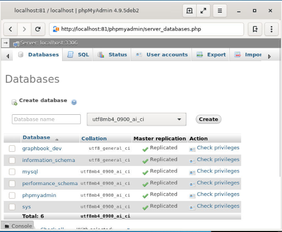
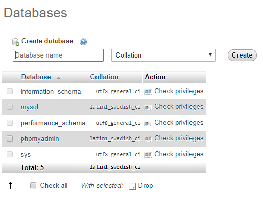
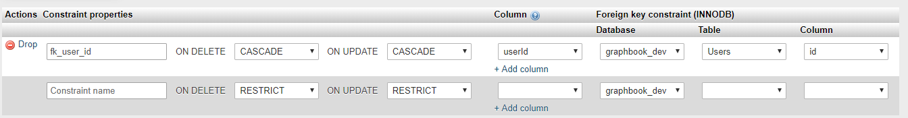
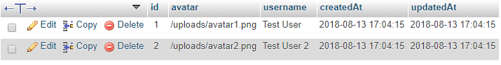
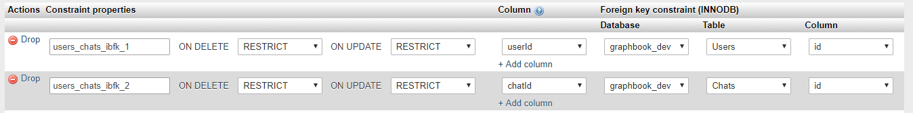

Lab 3: Connecting to The Database
==========================


This lab will cover the following points:

-   Using databases with GraphQL
-   Using Sequelize in Node.js
-   Writing database models
-   Performing database migrations with Sequelize
-   Seeding data with Sequelize
-   Using Apollo together with Sequelize


In this course, we will use SQL via Sequelize in order to see this feature
in a real-world use case. For future purposes, it will also help you to
handle problems with existing SQL-based systems.


### Lab Solution

Complete solution for this lab is available in the following directory:

`cd ~/Desktop/react-graphql-course/labs/Lab03`

Run following command to install all required packages:

`npm install`

 


### Running Solution

<span style="color:red;">Database needs to be setup first as mentioned in next steps before running the application.</span>


Run following commands to run application:

`npm run client:build`

`npm run server`


MySQL and phpMyAdmin
---------------------

**Start MySQL and phpMyAdmin:**

```
service mysql start

service apache2 start
```

MySQL is already installed and running. Execute the following steps to get MySQL running:

1.  Verify that mysql server is running:

```
service mysql status
```

2.  We must create a separate user for development, aside from the root
    and phpMyAdmin user. It is discouraged to use the root user at all.
    Log in to our MySQL Server with the root user in order to accomplish
    this:

```
mysql -u root
```


6.  Now, run the following SQL command. You can replace the
    [PASSWORD] string with the password that you want. It is the
    password that you will use for the database connection in your
    application, but also when logging in to phpMyAdmin. This command
    creates a user called [devuser], with root privileges that are
    acceptable for local development:

```
CREATE USER 'devuser'@'%' IDENTIFIED BY 'PASSWORD';

GRANT ALL PRIVILEGES ON *.* TO 'devuser'@'%';

FLUSH PRIVILEGES;

ALTER USER 'devuser'@'%' IDENTIFIED WITH mysql_native_password BY 'PASSWORD';
```


#### PhpMyAdmin


1.  Start apache server :

```
service apache2 start
```

We can now visit phpMyAdmin under [http://localhost:81/phpmyadmin]
and log in with the newly created user. It should look like the
following screenshot:





Creating a database in MySQL
----------------------------

Before we begin with the implementation of our back end, we need to add
a new database that we can use.

You are free to do this via the command line or phpMyAdmin. As we have
just installed phpMyAdmin, we are going to use it, of course.

You can run raw SQL commands in the [SQL] tab of
phpMyAdmin. The corresponding command to create a new database looks as
follows:

```
CREATE DATABASE graphbook_dev CHARACTER SET utf8 COLLATE utf8_general_ci;
```


Otherwise, you can follow the next steps to use the graphical method. In
the left-hand panel, click on the [New] button.

You will be presented with a screen like the following. It shows all
databases including their collation of your MySQL server:





Enter a database name, such as [graphbook\_dev], and then choose
the [uft8\_general\_ci] collation. After doing so, click on
[Create].

You will see a page that says `No tables found in database`, which is correct (for now). This will change
later, when we have implemented our database models, such as posts and
users.


Integrating Sequelize into our stack
====================================

Install Sequelize in your project via [npm]. We will also install
a second package, called [mysql2]:

```
npm install --save sequelize@4.42.0 mysql2@1.6.4
```


The `mysql2` package allows Sequelize to speak with our MySQL
server. Sequelize is just a wrapper around the various libraries for the
different database systems.


Let\'s start by setting Sequelize up in our backend.


Connecting to a database with Sequelize
---------------------------------------

The first step is to initialize the connection from Sequelize to our
MySQL server. To do this, we will create a new folder and file, as
follows:

```
mkdir src/server/database
touch src/server/database/index.js
```


Inside of the `index.js` database, we will establish a connection
to our database with Sequelize. Internally, Sequelize relies on the
[mysql2] package, but we do not use it on our own, which is very
convenient:

```
import Sequelize from 'sequelize';

const sequelize = new Sequelize('graphbook_dev', 'devuser', 'PASSWORD', {
 host: 'localhost',
  dialect: 'mysql',
  operatorsAliases: false,
  pool: {
    max: 5,
    min: 0,
    acquire: 30000,
    idle: 10000,
  },
});

export default sequelize;
```


As you can see, we require Sequelize from the [node\_modules], and
then create an instance of it. 


Using a configuration file with Sequelize
-----------------------------------------

For this, create a new `index.js` file inside a separate folder
(called [config]), next to the [database] folder:

```
mkdir src/server/config
touch src/server/config/index.js
```


Your sample configuration should look like the following code, if you
have followed the instructions for creating a MySQL database. The only
thing that we did here was to copy our current configuration into a new
object indexed with the [development] or [production]
environment:

```
module.exports = {
  "development": {
    "username": "devuser",
    "password": "PASSWORD",
    "database": "graphbook_dev",
    "host": "localhost",
    "dialect": "mysql",
    "operatorsAliases": false,
    "pool": {
      "max": 5,
      "min": 0,
      "acquire": 30000,
      "idle": 10000
    }
  },
  "production": {
    "host": process.env.host,
    "username": process.env.username,
    "password": process.env.password,
    "database": process.env.database,
    "logging": false,
    "dialect": "mysql",
    "operatorsAliases": false,
    "pool": {
      "max": 5,
      "min": 0,
      "acquire": 30000,
      "idle": 10000
    }
  }
}
```

We can remove the configuration that we hardcoded earlier and replace
the contents of our `index.js` database file to require our
[configFile], instead.

This should look like the following code snippet:

```
import Sequelize from 'sequelize';
import configFile from '../config/';

const env = process.env.NODE_ENV || 'development';
const config = configFile[env];

const sequelize = new Sequelize(config.database, config.username, 
 config.password, config);

const db = {
  sequelize,
};

export default db;
```


In the preceding code, we are using the [NODE\_ENV] environmental
variable to get the environment that the server is running in. We read
the [config] file and pass the correct configuration to the
Sequelize instance. 

The Sequelize instance is then exported for use throughout our
application. We use a special [db] object for this. You will see
why we are doing this later on.

Next, you will learn how to generate and write models and migrations for
all of the entities that our application will have.


Writing database models
=======================

Currently, we have two GraphQL entities: [User] and [Post].

Sequelize lets us create a database schema for each of our GraphQL
entities. The schema is validated when inserting or updating rows in our
database. We already wrote a schema for GraphQL in the [schema.js]
file used by Apollo Server, but we need to create a second one for our
database. The field types, as well as the fields themselves, can vary
between the database and the GraphQL schema.

GraphQL schemas can have more fields than our database model, or vice
versa. Perhaps you do not want to export all data from your database
through the API, or maybe you generate data for your GraphQL API on the
fly, when requesting data.

Let\'s create the first model for our posts. Create two new folders (one
called [models], and the other, [migrations]) next to the
[database] folder:

```
mkdir src/server/models
mkdir src/server/migrations
```


Creating each model in a separate file is much cleaner than having one
big file for all models.


Your first database model
-------------------------

Sequelize CLI is already installed globally. allows us to generate the model automatically. This can be done by running the following command:

```
sequelize model:generate --models-path src/server/models --migrations-path src/server/migrations --name Post --attributes text:text
```

<span style="color:red;">Note: Lab solution already has migrations created. You will get an error if you are running command from solution folder. This error can be ignored.</span>


Sequelize expects us to run the command in the folder in which we have
run [sequelize init], by default. Our file structure is a bit
different, because we have two layers with [src/server]. For this
reason, we specify the path manually, with the first two parameters:
[\--models-path] and [\--migrations-path].

The [\--name] parameter gives our model a name under which it can
be used. The [\--attributes] option specifies the fields that the
model should include.


This command creates a [post.js] model file in your [models]
folder, and a database migration file, named
[XXXXXXXXXXXXXX-create-post.js], in your [migrations]
folder. The [X] is the timestamp when generating the files with
the CLI. You will see how migrations work in the next section.

The following model file was created for us:

```
'use strict';

module.exports = (sequelize, DataTypes) => {
  var Post = sequelize.define('Post', {
    text: DataTypes.TEXT
  }, {});

  Post.associate = function(models) {
    // associations can be defined here
  };

  return Post;
};
```


We are using the [define] Sequelize function to create a database
model:

-   The first parameter is the name of the database model.
-   The second option is the field configuration for this model.


A post object has the [id], [text], and [user]
properties. The user will be a separate model, as seen in the GraphQL
schema. Consequently, we only need to configure the [id] and
[text] as columns of a post.

The [id] is the key that uniquely identifies a data record from
our database. The [text] column is just a MySQL [TEXT] field, which allows
us to write pretty long posts.


Let\'s take a look at the migration file that is also created by the
CLI.


Your first database migration
-----------------------------

Our first migration file creates a [Posts] table and adds all required columns, as follows:

```
'use strict';

module.exports = {
  up: (queryInterface, Sequelize) => {
    return queryInterface.createTable('Posts', {
      id: {
        allowNull: false,
        autoIncrement: true,
        primaryKey: true,
        type: Sequelize.INTEGER
      },
      text: {
        type: Sequelize.TEXT
      },
      createdAt: {
        allowNull: false,
        type: Sequelize.DATE
      },
      updatedAt: {
        allowNull: false,
        type: Sequelize.DATE
      }
    });
  },
  down: (queryInterface, Sequelize) => {
    return queryInterface.dropTable('Posts');
  }
};
```

The `id` and `text` column are
created, as well as two additional `datetime` columns, to save the
creation and update time.

The `id` field has set `autoIncrement` and
`primaryKey` to `true`. The `id` will count upward,
from one to nearly infinite, for each post in our table. This `id`
uniquely identifies posts for us. Passing `allowNull` with
`false` disables the feature to insert a row with an empty field
value.

To execute this migration, we use the Sequelize CLI again, as follows:

```
sequelize db:migrate --migrations-path src/server/migrations --config src/server/config/index.js
```


Look inside of phpMyAdmin. Here, you will find the new table, called
[Posts]. The structure of the table should look as follows:


All of the fields were created as we desired.

Furthermore, two additional fields, [createdAt] and
[updatedAt], were created. These two fields are what are called
timestamps, and are used to tell when a row was either created or
updated. The fields were created by Sequelize automatically. If you do
not want this, you can set the [timestamps] property in the model
to [false].

Every time that you use Sequelize and its migration feature, you will
have an additional table, called [SequelizeMeta]. The contents of
the table should look as follows:


Importing models with Sequelize
-------------------------------

Create an `index.js` file in the [models] folder, and fill
in the following code:

```
import Sequelize from 'sequelize';
if (process.env.NODE_ENV === 'development' || true) {
  require('babel-plugin-require-context-hook/register')()
}

export default (sequelize) => {
  let db = {};

  const context = require.context('.', true, /^\.\/(?!index\.js).*\.js$/, 
   'sync')
  context.keys().map(context).forEach(module => {
    const model = module(sequelize, Sequelize);
    db[model.name] = model;
  });

  Object.keys(db).forEach((modelName) => {
    if (db[modelName].associate) {
      db[modelName].associate(db);
    }
  });

  return db;
};
```


This file will also be generated when running [sequelize init],
but we have split up the setup of the database connection and this part
into different files. Usually, this would happen in just one file.

To summarize what happens in the preceding code, we search for all files
ending with [.js] in the same folder as the current file, and load
them all with the [require.context] statement. In development, we
must execute the [babel-plugin-require-context-hook/register] hook
to load the [require.context] function at the top. This package
must be installed with [npm], with the following command:

```
npm install --save-dev babel-plugin-require-context-hook@1.0.0
```


We need to load the plugin with the start of our development server, so,
open the [package.json] file and edit the server script, as
follows:

```
nodemon --exec babel-node --plugins require-context-hook --watch src/server src/server/index.js
```


When the plugin is loaded and we run the
[require(\'babel-plugin-require-context-hook/register\')()]
function, the [require.context] method is available for us.

Now, we want to use our models. Go back to the `index.js` database
file and import all models through the aggregation `index.js` file
that we just created:

```
import models from '../models';
```


Before exporting the [db] object at the end of the file, we need
to run the [models] wrapper to read all model [.js] files.
We pass our Sequelize instance as a parameter, as follows:

```
const db = {
  models: models(sequelize),
  sequelize,
};
```


The new database object in the preceding command has [sequelize]
and [models] as a property. Under [models], you can find the
[Post] model, and every new model that we are going to add later.

The database `index.js` file is ready, and can be used now. You
should import this file only once, because it can get messy when
creating multiple instances of Sequelize. The pool functionality won\'t
work correctly, and we will end up with more connections than the
maximum of five that we specified earlier.

We create the global database instance in the `index.js` file of
the root server folder. Add the following code:

```
import db from './database';
```


We require the [database] folder and the `index.js` file
inside this folder. Loading the file instantiates the Sequelize object,
including all database models.

Going forward, we want to query some data from our database via the
GraphQL API that we implemented in Lab 2.

Seeding data with Sequelize
===========================

We should fill the empty [Posts] table with our fake data. To
accomplish this, we will use Sequelize\'s feature for seeding data to
our database.

Create a new folder, called [seeders]:

```
mkdir src/server/seeders
```


Now, we can run our next Sequelize CLI command, in order to generate a
boilerplate file:

```
sequelize seed:generate --name fake-posts --seeders-path src/server/seeders
```


Seeders are great for importing test data into a database for
development. Our [seed] file has the timestamp and the words
[fake-posts] in the name, and should look as follows:

```
'use strict';

module.exports = {
  up: (queryInterface, Sequelize) => {
    /*
      Add altering commands here.
      Return a promise to correctly handle asynchronicity.
      
      Example:
      return queryInterface.bulkInsert('Person', [{
        name: 'John Doe',
        isBetaMember: false
      }], {});
    */
  },
  down: (queryInterface, Sequelize) => {
    /*
      Add reverting commands here.
      Return a promise to correctly handle asynchronicity.
 
      Example:
      return queryInterface.bulkDelete('Person', null, {});
    */
  }
};
```


As you can see in the preceding code snippet, nothing is done here. It
is just an empty boilerplate file. We need to edit this file to create
the fake posts that we already had in our backend. This file looks like
our migration from the previous section. Replace the contents of the
file with the following code:

```
'use strict';

module.exports = {
  up: (queryInterface, Sequelize) => {
    return queryInterface.bulkInsert('Posts', [{
      text: 'Lorem ipsum 1',
      createdAt: new Date(),
      updatedAt: new Date(),
    },
    {
      text: 'Lorem ipsum 2',
      createdAt: new Date(),
      updatedAt: new Date(),
    }],
    {});
  },
  down: (queryInterface, Sequelize) => {
    return queryInterface.bulkDelete('Posts', null, {});
  }
};
```

Execute all of the seeds from the [seeders] folder with the
following command:

```
sequelize db:seed:all --seeders-path src/server/seeders --config src/server/config/index.js
```

The following screenshot shows a filled [Posts] table:


The demo posts are now inside of our database.

We will cover how to use Sequelize with our Apollo Server, and how to
add the relationship between the user and their posts, in the next
section.


Using Sequelize with Apollo
===========================

The database object is initialized upon starting the server within the
root `index.js` file. We pass it from this global location down to
the spots where we rely on the database. This way, we do not import the
database file repeatedly, but have a single instance that handles all
database queries for us.


Global database instance
------------------------

To pass the database down to our GraphQL resolvers, we create a new
object in the server `index.js` file:

```
import db from './database';

const utils = {
  db,
};
```


We create a [utils] object directly under the [import]
statement of the [database] folder.

The [utils] object holds all of the utilities that our services
might need access to. This can be anything, from third-party tools, to
our MySQL, or any other database, such as in the preceding code.

Replace the line where we import the [services] folder, as
follows:

```
import servicesLoader from './services';
const services = servicesLoader(utils);
```


The preceding code might look weird to you, but what we are doing here
is executing the function that is the result of the [import]
statement, and passing the [utils] object as a parameter. We must
do this in two separate lines, as the [import] syntax does not
allow it in just one line; so, we must first import the function
exported from the [services] folder into a separate variable.

Until now, the return value of the [import] statement was a simple
object. We have to change this to match our requirements.

To do this, go to the services `index.js` file and change the
contents of the file, as follows:

```
import graphql from './graphql';

export default utils => ({
  graphql: graphql(utils),
});
```


We surrounded the preceding [services] object with a function,
which was then exported. That function accepts only one parameter, which
is our [utils] object.

That object is then given to a new function, called `graphql`.
Every service that we are going to use has to be a function that accepts
this parameter. It allows us to hand over any property that we want to
the deepest point in our application.

When executing the preceding exported function, the result is the
regular [services] object we used before. We only wrapped it
inside of a function to pass the [utils] object.

The `graphql` import that we are doing needs to accept the
[utils] object.

Open the `index.js` file from the `graphql` folder and
replace everything but the [require] statements at the top with
the following code:

```
export default (utils) => {
  const executableSchema = makeExecutableSchema({
    typeDefs: Schema,
    resolvers: Resolvers.call(utils),
  });
 
  const server = new ApolloServer({
    schema: executableSchema,
    context: ({ req }) => req,
  });
 
  return server;
};
```


Again, we surrounded everything with a function that accepts the
[utils] object. The aim of all this is to have access to the
database within our GraphQL resolvers.

To accomplish this, we are using the [Resolvers.call] function of
JavaScript. The function allows us to set the owner object of the
exported [Resolvers] function. What we are saying here is that the
scope of the [Resolvers] is the [utils] object.

So, within the [Resolvers] function, accessing [this] now
gives us the [utils] object. At the moment, the [Resolvers]
are just a simple object, but because we use the [call] method, we
must also return a function from the [resolvers.js] file.

Surround the [resolvers] object in this file with a function, and
return the [resolvers] object from inside of the function:

```
export default function resolver() { 
  ...
  return resolvers;
}
```


We cannot use the arrow syntax, as before. ES6 arrow syntax would
automatically take a scope, but we want the [call] function to
take over here.

An alternative way of doing this would be to also hand over the
[utils] object as a parameter. I think the way that we have chosen
is a bit cleaner, but handle it as you like.


Running the first database query
--------------------------------

Now, we want to finally use the database. Add the following code to the
top of the [export default function resolver] statement:

```
const { db } = this;
const { Post } = db.models;
```


The [this] keyword is the owner of the current method, and holds
the [db] object, as stated previously. We extract the database
models from the [db] object that we built in the previous section.


We can query all posts through the Sequelize model, instead of returning
the fake posts from before. Replace the [posts] property within
the [RootQuery] with the following code:

```
posts(root, args, context) {
  return Post.findAll({order: [['createdAt', 'DESC']]});
},
```

A typical news feed, such as on Twitter or Facebook, orders the posts
according to the creation date. That way, you have the newest posts at
the top and the oldest at the bottom. Sequelize expects an array of
arrays as a parameter of the order property that we pass as the first
parameter to the [findAll] method. The results are ordered by the
creation date.


As we are not using the demo [posts] array anymore, you can remove
it from the [resolvers.js] file.

You can start the server with `npm run server` and execute the
GraphQL posts query from Lab 2 again. The output will look as
follows:

```
{
  "data": {
    "posts": [{
      "id": 1,
      "text": "Lorem ipsum 1",
      "user": null
    },
    {
      "id": 2,
      "text": "Lorem ipsum 2",
      "user": null
    }]
  }
}
```


The [id] and [text] fields look fine, but the [user]
object is [null]. This happened because we did not define a user
model or declare a relationship between the user and the post model. We
will change this in the next section.


One-to-one relationships in Sequelize
=====================================

We need to associate each post with a user, to fill the gap that we have
created in our GraphQL response. A post has to have an author. It would
not make sense to have a post without an associated user.

First, we will generate a [User] model and migration. We will use
the Sequelize CLI again, as follows:

```
sequelize model:generate --models-path src/server/models --migrations-path src/server/migrations --name User --attributes avatar:string,username:string
```


The migration file creates the `Users` table and adds the
`avatar` and `username` column. A data row looks like a post
in our fake data, but it also includes an autogenerated ID and two
timestamps, as you have seen before.


What every post needs, of course, is an extra field, called
`userId`. This column acts as the foreign key to reference a
unique user. Then, we can join the user relating to each post.


Updating the table structure with migrations
--------------------------------------------

We have to write a third migration, adding the [userId] column to
our [Post] table, but also including it in our database
[Post] model.

Generating a boilerplate migration file is very easy with the Sequelize
CLI:

```
sequelize migration:create --migrations-path src/server/migrations --name add-userId-to-post
```


You can directly replace the content, as follows:

```
'use strict';

module.exports = {
  up: (queryInterface, Sequelize) => {
    return Promise.all([
      queryInterface.addColumn('Posts',
        'userId',
        {
          type: Sequelize.INTEGER, 
        }),
      queryInterface.addConstraint('Posts', ['userId'], {
        type: 'foreign key',
        name: 'fk_user_id',
        references: {
          table: 'Users',
          field: 'id',
        },
        onDelete: 'cascade',
        onUpdate: 'cascade',
      }),
    ]);
  },

  down: (queryInterface, Sequelize) => {
    return Promise.all([
      queryInterface.removeColumn('Posts', 'userId'),
    ]);
  }
};
```

In the [up] migration, we are using the [queryInterface] to
first add the [userId] column to the [Posts] table.

Secondly, we add a foreign key constraint, with the
[addConstraint] function. The constraint represents the
relationship between both the user and the post entities. The
relationship is saved in the [userId] column of the Post table.

The preceding [addConstraint] function receives the [foreign
key] string as a [type] which says that the data type is the
same as the corresponding column in the [Users] table. We want to
give our constraint the custom name [fk\_user\_id], in order to
identify it later.

Then, we specify the [references] field for the [userId]
column. Sequelize requires a table, which is the [Users] table,
and the field that our foreign key relates to, which is the [id]
column of the [User] table. This is everything that is required to
get a working database relationship.

Rerun the migration, in order to see what changes occurred:

```
sequelize db:migrate --migrations-path src/server/migrations --config src/server/config/index.js
```

After running the migration, there should be a [Users] table, and
the [userId] column should be added to the [Posts] table.

Take a look at the relation view of the [Posts] table in
phpMyAdmin. You can find it under the [Structure] view,
by clicking on [Relation view]:





As you can see in the preceding screenshot, we have our foreign key
constraint. The correct name was taken, and the cascade option, too.

If you receive an error when running migrations, you can easily undo
them, as follows:

```
sequelize db:migrate:undo --migrations-path src/server/migrations --config src/server/config/index.js
```


This command undoes the most recent migrations. Always be conscious of
what you do here. Keep a backup if you are unsure whether everything
works correctly.

You can also revert all migrations at once, or only revert to one
specific migration, so that you can go back to a specific timestamp:

```
sequelize db:migrate:undo:all --to XXXXXXXXXXXXXX-create-posts.js --migrations-path src/server/migrations --config src/server/config/index.js
```


Leave out the parameter [\--to] to undo all migrations.

We have now established the database relationship, but Sequelize must
know about the relationship, too. You will learn how this is done in the
next section.


Model associations in Sequelize
-------------------------------

Now that we have the relationship configured with the foreign key, it
also needs to be configured inside of our Sequelize model.

Go back to the [Post] model file and replace the [associate]
function with the following:

```
Post.associate = function(models) {
  Post.belongsTo(models.User);
};
```


The [associate] function gets evaluated inside of our aggregating
`index.js` file, where all model files are imported.

We are using the [belongsTo] function, which tells Sequelize that
every post belongs to exactly one user. Sequelize gives us a new
function on the [Post] model, called [getUser], to retrieve
the associated user. The naming is done by convention, as you can see.
Sequelize does all of this automatically.

Do not forget to add the [userId] as a queryable field to the
[Post] model itself, as follows:

```
userId:  DataTypes.INTEGER,
```


The [User] model needs to implement the reverse association, too.
Add the following code to the [User] model file:

```
User.associate = function(models) {
  User.hasMany(models.Post);
};
```


The [hasMany] function means the exact opposite of the
[belongsTo] function. Every user can have multiple posts
associated in the Post table. It can be anything, from zero to multiple
posts.

You can compare the new data layout with the preceding one. Up to this
point, we had the posts and users inside of one big array of objects.
Now, we have split every object into two tables. Both tables connect to
each other through the foreign key. This is required every time we run
the GraphQL query to get all posts, including their authors.

So, we must extend our current [resolvers.js] file. Add the
[Post] property to the [resolvers] object, as follows:

```
Post: {
  user(post, args, context) {
    return post.getUser();
  },
},
```


The [RootQuery] and [RootMutation] were the two main
properties that we had so far. The [RootQuery] is the starting
point where all GraphQL queries begin.

With the old demo posts, we were able to directly return a valid and
complete response, since everything that we needed was in there already.
Now, a second query, or a [JOIN], is needed to collect all
necessary data for a complete response.

The [Post] entity is introduced to our [resolvers], where we
can define functions for every property of our GraphQL schema. Only the
user is missing in our response; the rest is there. That is why we have
added the [user] function to the resolvers.

The first parameter of the function is the [post] model instance
that we are returning inside of the [RootQuery] resolver.

Then, we use the [getUser] function that Sequelize gave us.
Executing the [getUser] function runs the correct MySQL
[SELECT] query, in order to get the correct user from the
[Users] table. It does not run a real MySQL [JOIN], but only
queries the user in a separate MySQL command. Later on, you will learn
another method for running a [JOIN] directly, which is more
efficient.

However, if you query for all posts via the GraphQL API, the user will
still be [null]. We have not added any users to the database yet,
so let\'s insert them next.


Seeding foreign key data
------------------------

The challenge of adding users is that we have already introduced a
foreign key constraint to the database. You can follow these
instructions to learn how to get it working:

1.  We use the Sequelize CLI to generate an empty [seeders] file,
    as follows:

```
sequelize seed:generate --name fake-users --seeders-path src/server/seeders
```


2.  Fill in the following code to insert the fake users:

```
'use strict';

module.exports = {
  up: (queryInterface, Sequelize) => {
    return queryInterface.bulkInsert('Users', [{
      avatar: '/uploads/avatar1.png',
      username: 'TestUser',
      createdAt: new Date(),
      updatedAt: new Date(),
    },
    {
      avatar: '/uploads/avatar2.png',
      username: 'TestUser2',
      createdAt: new Date(),
      updatedAt: new Date(),
    }],
    {});
  },
  down: (queryInterface, Sequelize) => {
    return queryInterface.bulkDelete('Users', null, {});
  }
};
```


The preceding code looks like the [seeders] file for the posts,
but instead, we are now inserting users with the correct fields. Every
user receives an auto-incremented ID by our MySQL server when inserting
a user.

3.  We must maintain the relationships as configured in our database.
    Adjust the [posts] seed file to reflect this, and add a
    [userId] to both posts in the [up] migration:

```
return queryInterface.bulkInsert('Posts', [{
  text: 'Lorem ipsum 1',
  userId: usersRows[0].id,
  createdAt: new Date(),
  updatedAt: new Date(),
},
{
  text: 'Lorem ipsum 2',
  userId: usersRows[1].id,
  createdAt: new Date(),
  updatedAt: new Date(),
}],
{});
```


We created the [users] seed file after the [post] seeders
file. This means that the posts are inserted before the users exist,
because of the timestamps of the files. Generally, this is not a
problem, but since we have introduced a foreign key constraint, we are
not able to insert posts with a [userId] when the underlying user
does not exist in our database. MySQL forbids this.

There is also another problem. The current posts in our table do not
receive a [userId], and we do not want to write a separate
migration or seed to fix those posts.

There are two options here. You can either manually truncate the tables
through phpMyAdmin and SQL statements, or you can use the Sequelize CLI.
It is easier to use the CLI, but the result will be the same either way.
The following command will undo all seeds:

```
sequelize db:seed:undo:all --seeders-path src/server/seeders --config src/server/config/index.js
```


When undoing seeds, the tables are not truncated, and therefore, the
[autoIncrement] index is not set back to one, but stays at the
current index. Reverting seeds multiple times raises the user\'s or
post\'s ID, and therefore, stops the seeds from working. The
[userId] column in the post seed cannot be hardcoded when using
the [down] migration.

You can fix this by selecting all users with a raw query in the
[post] seed file. We can pass the retrieved user IDs statically.
Replace the [up] property with the following:

```
  up: (queryInterface, Sequelize) => {
    // Get all existing users
    return queryInterface.sequelize.query(
      'SELECT id from Users;',
    ).then((users) => {
      const usersRows = users[0];
      
      return queryInterface.bulkInsert('Posts', [{
        text: 'Lorem ipsum 1',
        userId: usersRows[0].id,
        createdAt: new Date(),
        updatedAt: new Date(),
      },
      {
        text: 'Lorem ipsum 2',
        userId: usersRows[1].id,
        createdAt: new Date(),
        updatedAt: new Date(),
      }],
      {});
   });
 },
```


This way, we get all of the users first, and then select the ID
manually. This solution is not great, but it fixes the problem with the
static [userId] field in the seeds. You can undo and redo the
seeds as often as you want. There is no need to truncate the table to
get the correct [autoIncrement] index.

We have not gotten any further now, since the posts are still inserted
before the users. From my point of view, the easiest way to fix this is
to rename the seeder files. Simply adjust the timestamp of the fake user
seed file to be before the post seed file\'s timestamp, or the other way
around. Again, execute all seeds, as follows:

```
sequelize db:seed:all --seeders-path src/server/seeders --config src/server/config/index.js
```


If you take a look inside your database, you should see a filled
[Posts] table, including the [userId]. The [Users]
table should look like the following screenshot:





You can now rerun the GraphQL query, and you should see a working
association between the users and their posts, because the [user]
field is filled.

We have achieved a lot. We can serve data from our database through the
GraphQL API by matching its schema.


Mutating data with Sequelize
============================

Requesting data from our database via the GraphQL API works. Now comes
the tough part: adding a new post to the [Posts] table.

Before we start, we must extract the new database model from the
[db] object at the top of the exported function in our
[resolvers.js] file:

```
const { Post, User } = db.models;
```


Currently, we have no authentication to identify the user that is
creating the post. We will fake this step until the authentication is
implemented in a later lab.

We have to edit the GraphQL resolvers to add the new post. Replace the
old [addPost] function with the new one, as shown in the following
code snippet:

```
addPost(root, { post }, context) {
  logger.log({
    level: 'info',
    message: 'Post was created',
  });
 
  return User.findAll().then((users) => {
    const usersRow = users[0];
    
    return Post.create({
      ...post,
    }).then((newPost) => {
      return Promise.all([
        newPost.setUser(usersRow.id),
      ]).then(() => {
        return newPost;
      });
    });
  });
},
```


As always, the preceding mutation returns a promise. The promise is
resolved when the deepest query has been executed successfully. The
execution order is as follows:

1.  We retrieve all users from the database through the
    [User.findAll] method.
2.  We insert the post into our database with the [create]
    function of Sequelize. The only property that we pass is the post
    object from the original request, which only holds the text of the
    post. MySQL autogenerates the [id] of the post.

**ProTip**

Sequelize also offers a [build] function, which initializes the
model instance for us. In this case, we would have to run the
[save] method to insert the model manually. The [create]
function does this for us all at once.


3.  The post has been created, but the [userId] was not set.

You could also directly add the user ID in the [Post.create]
function. The problem here is that we did not establish the model
associations on the JavaScript side. If we return the created post model
without explicitly using [setUser] on the model instance, we
cannot use the [getUser] function until we create a new instance
of the post model.

So, to fix this problem, we run the [create] function, resolve the
promise, and then run [setUser] separately. As a parameter of
[setUser], we statically take the ID of the first user from the
[users] array.

We resolve the promise of the [setUser] function by using an array
surrounded by [Promise.all]. This allows us to add further
Sequelize methods later on. For example, you could add a category on
each post, too.

4.  The returned value is the newly created post model instance, after
    we have set the [userId] correctly.

Everything is set now. To test our API, we are going to use Postman
again. We need to change the [addPost] request. The
[userInput] that we added before is not needed anymore, because
the backend statically chooses the first user out of our database. You
can send the following request body:

```
{
  "operationName":null,
  "query": "mutation addPost($post : PostInput!) { addPost(post : $post) { 
    id text user { username avatar }}}",
  "variables":{
    "post": {
      "text": "You just added a post."
    }
  }
}
```


Your GraphQL schema must reflect this change, so remove the
[userInput] from there, too:

```
addPost (
  post: PostInput!
): Post
```


Running the [addPost] GraphQL mutation now adds a post to the
[Posts] table, as you can see in the following screenshot:


We have rebuilt the example from the last lab, but we are using a
database in our backend. To extend our application, we are going to add
two new entities.


Many-to-many relationships
==========================

Facebook provides users with various ways to interact. Currently, we
only have the opportunity to request and insert posts. As in the case of
Facebook, we want to have chats with our friends and colleagues. We will
introduce two new entities to cover this.

The first entity is called [Chat], and the second is called
[Message].

Before starting with the implementation, we need to lay out a detailed
plan of what those entities will enable us to do.

A user can have multiple chats, and a chat can belong to multiple users.
This relationship gives us the opportunity to have group chats with
multiple users, as well as private chats, between only two users. A
message belongs to one user, but every message also belongs to one chat.


Model and migrations
--------------------

When transferring this into real code, we first generate the
[Chat] model. The problem here is that we have a many-to-many
relationship between users and chats. In MySQL, this kind of
relationship requires a table, to store the relations between all
entities separately.

Those tables are called **join tables**. Instead of using a foreign key
on the chat or a user to save the relationship, we have a table called
[user\_chats]. The user\'s ID and the chat\'s ID are associated
with each other inside of this table. If a user participates in multiple
chats, they will have multiple rows in this table, with different chat
IDs.


Chat model
----------

Let\'s start by creating the [Chat] model and migration. A chat
itself does not store any data; we use it for grouping specific users\'
messages:

```
sequelize model:generate --models-path src/server/models --migrations-path src/server/migrations --name Chat --attributes firstName:string,lastName:string,email:string
```


Generate the migration for our association table, as follows:

```
sequelize migration:create --migrations-path src/server/migrations --name create-user-chats
```


Adjust the [users\_chats] migration generated by the Sequelize
CLI. We specify the user and chat IDs as attributes for our
relationship. References inside of a migration automatically create
foreign key constraints for us. The migration file should look like the
following code snippet:

```
'use strict';

module.exports = {
  up: (queryInterface, Sequelize) => {
    return queryInterface.createTable('users_chats', {
      id: {
        allowNull: false,
        autoIncrement: true,
        primaryKey: true,
        type: Sequelize.INTEGER
      },
      userId: {
        type: Sequelize.INTEGER,
        references: {
          model: 'Users',
          key: 'id'
        },
        onDelete: 'cascade',
        onUpdate: 'cascade',
      },
      chatId: {
        type: Sequelize.INTEGER,
        references: {
          model: 'Chats',
          key: 'id'
        },
        onDelete: 'cascade',
        onUpdate: 'cascade',
      },
      createdAt: {
        allowNull: false,
        type: Sequelize.DATE
      },
      updatedAt: {
        allowNull: false,
        type: Sequelize.DATE
      }
    });
  },
  down: (queryInterface, Sequelize) => {
    return queryInterface.dropTable('users_chats');
  }
};
```


A separate model file for the association table is not needed, because
we can rely on this table in the models where the association is
required. The [id] column could be left out, because the row
should be identifiable.

Associate the user to the [Chat] model via the new relation table
in the [User] model, as follows:

```
User.belongsToMany(models.Chat, { through: 'users_chats' });
```


Do the same for the [Chat] model, as follows:

```
Chat.belongsToMany(models.User, { through: 'users_chats' });
```


The [through] property tells Sequelize that the two models are
related via the [users\_chats] table. Normally, when you are not
using Sequelize and are trying to select all users and chats merged in
raw SQL, you need to maintain this association manually, and join the
three tables on your own. Sequelize\'s querying and association
capabilities are so complex, this is all done for you.

Rerun the migrations to let the changes take effect:

```
sequelize db:migrate --migrations-path src/server/migrations --config src/server/config/index.js
```


The following screenshot shows how your database should look now:


You should see two foreign key constraints in the relation view of the
[users\_chats] table. The naming is done automatically:





This setup was the tough part. Next up is the message entity, which is a
simple one-to-one relationship. One message belongs to one user and one
chat.


Message model
-------------

A message is much like a post, except that it is only readable inside of
a chat, and is not public to everyone.

Generate the model and migration file with the CLI, as follows:

```
sequelize model:generate --models-path src/server/models --migrations-path src/server/migrations --name Message --attributes text:string,userId:integer,chatId:integer
```


Add the missing references in the created migration file, as follows:

```
userId: {
  type: Sequelize.INTEGER,
  references: {
    model: 'Users',
    key: 'id'
  },
  onDelete: 'SET NULL',
  onUpdate: 'cascade',
},
chatId: {
  type: Sequelize.INTEGER,
  references: {
    model: 'Chats',
    key: 'id'
  },
  onDelete: 'cascade',
  onUpdate: 'cascade',
},
```


Now, we can run the migrations again, in order to create the
[Messages] table using the [sequelize db:migrate] Terminal
command.

```
{
  "operationName":null,
  "query": "mutation addPost($post : PostInput!) { addPost(post : $post) { 
    id text user { username avatar }}}",
  "variables":{
    "post": {
      "text": "You just added a post."
    }
  }
}
```


The references also apply to our model file, where we need to use
Sequelize\'s [belongsTo] function to get all of those convenient
model methods for our resolvers. Replace the [associate] function
of the [Message] model with the following code:

```
Message.associate = function(models) {
  Message.belongsTo(models.User);
  Message.belongsTo(models.Chat);
};
```


In the preceding code, we define that every message is related to
exactly one user and chat.

On the other side, we must also associate the [Chat] model with
the messages. Add the following code to the [associate] function
of the [Chat] model:

```
Chat.hasMany(models.Message);
```


The next step is to adjust our GraphQL API to provide chats and
messages.


Chats and messages in GraphQL
-----------------------------

We have introduced some new entities with messages and chats. Let\'s
include those in our Apollo schema. In the following code, you can see
an excerpt of the changed entities, fields, and parameters of our
GraphQL schema:

```
type User {
  id: Int
  avatar: String
  username: String
}

type Post {
  id: Int
  text: String
  user: User
}

type Message {
  id: Int
  text: String
  chat: Chat
  user: User
}

type Chat {
  id: Int
  messages: [Message]
  users: [User]
}

type RootQuery {
  posts: [Post]
  chats: [Chat]
}
```


Take a look at the following short changelog of our GraphQL schema:

-   The [User] type received an [id] field, thanks to our
    database.
-   The [Message] type is entirely new. It has a text field like a
    typical message, and user and chat fields, which are requested from
    the referenced tables in the database model.
-   The [Chat] type is also new. A chat has a list of messages
    that are returned as an array. These can be queried through the chat
    ID saved in the message table. Furthermore, a chat can have an
    unspecified number of users. The relationships between users and
    chats are saved in our separate join table, as stated previously.
    The interesting thing here is that our schema does not know anything
    about this table; it is just for our internal use, to save the data
    appropriately in our MySQL server.
-   I have also added a new [RootQuery], called [chats].
    This query returns all of a user\'s chats.

These factors should be implemented in our resolvers, too. Our resolvers
should look as follows:

```
Message: {
  user(message, args, context) {
    return message.getUser();
  },
  chat(message, args, context) {
    return message.getChat();
  },
},
Chat: {
  messages(chat, args, context) {
    return chat.getMessages({ order: [['id', 'ASC']] });
  },
  users(chat, args, context) {
    return chat.getUsers();
  },
},
RootQuery: {
  posts(root, args, context) {
    return Post.findAll({order: [['createdAt', 'DESC']]});
  },
  chats(root, args, context) {
    return User.findAll().then((users) => {
      if (!users.length) {
        return [];
      }

      const usersRow = users[0];
 
      return Chat.findAll({
        include: [{
          model: User,
          required: true,
          through: { where: { userId: usersRow.id } },
        },
        {
          model: Message,
        }],
      });
    });
  },
},
```


Let\'s go through the changes, one by one, as follows:

1.  I added the new [RootQuery], called [chats], to return
    all fields, as in our schema:
    -   Until we get a working authentication, we will statically use
        the first user when querying for all chats.
    -   We are using the [findAll] method of Sequelize and joining
        the users of any returned chat. For this, we use the
        [include] property of Sequelize on the user model within
        the [findAll] method. It runs a MySQL [JOIN], and
        not a second [SELECT] query.
    -   Setting the [include] statement to [required] runs
        an [INNER JOIN] and not a [LEFT OUTER JOIN], by
        default. Any chat that does not match the condition in the
        [through] property is excluded. In our example, the
        condition is that the user ID has to match.
    -   Lastly, we join all available messages for each chat in the same
        way, without any condition.
2.  We added the [Chat] property to the resolvers object. There,
    we ran the [getMessages] and [getUsers] functions, to
    retrieve all of the joined data. All messages are sorted by the ID
    in ascending order (to show the latest message at the bottom of a
    chat window, for example).
3.  We added the [Message] property to our resolvers.

It is important that we are using the new models here. We should not
forget to extract them from the [db.models] object inside of the
resolver function. It must look as follows:

```
const { Post, User, Chat, Message } = db.models;
```


After saving all of the files, you can start the backend (or, it should
restart automatically).

You can send this GraphQL request to test the changes:

```
{
  "operationName":null,
  "query": "{ chats { id users { id } messages { id text user { id username
  } } } }",
  "variables":{}
}
```


The response should give us an empty [chats] array, as follows:

```
{
  "data": {
    "chats": []
  }
}
```


The empty array was returned because we do not have any chats or
messages in our database. You will see how to fill it with data in the
next section.


Seeding many-to-many data
-------------------------

Testing our implementation requires data in our database. We have three
new tables, so we will create three new seeders, in order to get some
test data to work with.

Let\'s start with the chats, as follows:

```
sequelize seed:generate --name fake-chats --seeders-path src/server/seeders
```


Now, replace the new seeder file with the following code. Running the
following code creates a chat in our database. We do not need more than
two timestamps, because the chat ID is generated automatically:

```
'use strict';

module.exports = {
  up: (queryInterface, Sequelize) => {
    return queryInterface.bulkInsert('Chats', [{
      createdAt: new Date(),
      updatedAt: new Date(),
    }],
    {});
  },
  down: (queryInterface, Sequelize) => {
    return queryInterface.bulkDelete('Chats', null, {});
  }
};
```


Next, we insert the relation between two users and the new chat. We do
this by creating two entries in the [users\_chats] table where we
reference them. Now, generate the boilerplate seed file, as follows:

```
sequelize seed:generate --name fake-chats-users-relations --seeders-path src/server/seeders
```


Our seed should look much like the previous ones, as follows:

```
'use strict';

module.exports = {
  up: (queryInterface, Sequelize) => {
    const usersAndChats = Promise.all([
      queryInterface.sequelize.query(
        'SELECT id from Users;',
      ),
      queryInterface.sequelize.query(
        'SELECT id from Chats;',
      ),
    ]);
    
    return usersAndChats.then((rows) => {
      const users = rows[0][0];
      const chats = rows[1][0];
 
      return queryInterface.bulkInsert('users_chats', [{
        userId: users[0].id,
        chatId: chats[0].id,
        createdAt: new Date(),
        updatedAt: new Date(),
      },
      {
        userId: users[1].id,
        chatId: chats[0].id,
        createdAt: new Date(),
        updatedAt: new Date(),
      }],
      {});
    });
  },
  down: (queryInterface, Sequelize) => {
    return queryInterface.bulkDelete('users_chats', null, {});
  }
};
```


First, we resolve all users and chats by using [Promise.all]. This
ensures that, when the promise is resolved, all of the chats and users
are available at the same time. To test the chat functionality, we
choose the first chat and the first two users returned from the
database. We take their IDs and save them in our [users\_chats]
table. Those two users should be able to talk to each other through this
one chat later on.

The last table without any data is the [Messages] table. Generate
the seed file, as follows:

```
sequelize seed:generate --name fake-messages --seeders-path src/server/seeders
```


Again, replace the generated boilerplate code, as follows:

```
'use strict';

module.exports = {
  up: (queryInterface, Sequelize) => {
    const usersAndChats = Promise.all([
      queryInterface.sequelize.query(
        'SELECT id from Users;',
      ),
      queryInterface.sequelize.query(
        'SELECT id from Chats;',
      ),
    ]);
 
    return usersAndChats.then((rows) => {
      const users = rows[0][0];
      const chats = rows[1][0];
 
      return queryInterface.bulkInsert('Messages', [{
        userId: users[0].id,
        chatId: chats[0].id,
        text: 'This is a test message.',
        createdAt: new Date(),
        updatedAt: new Date(),
      },
      {
        userId: users[1].id,
        chatId: chats[0].id,
        text: 'This is a second test message.',
        createdAt: new Date(),
        updatedAt: new Date(),
      },
      {
        userId: users[1].id,
        chatId: chats[0].id,
        text: 'This is a third test message.',
        createdAt: new Date(),
        updatedAt: new Date(),
      }],
      {});
    });
  },
  down: (queryInterface, Sequelize) => {
    return queryInterface.bulkDelete('Messages', null, {});
  }
};
```


Now, all of the seed files should be ready. It makes sense to empty all
of the tables before running the seeds, so that you can work with clean
data. I personally like to delete all tables in the database from time
to time and rerun all of the migrations and seeds, in order to test them
from zero. Whether or not you are doing this, you should at least be
able to run the new seed.

Try to run the GraphQL [chats] query again, as follows:

```
{
  "data": {
    "chats": [{
      "id": 1,
      "users": [
        {
          "id": 1
        },
        {
          "id": 2
        }
      ],
      "messages": [
        {
          "id": 1,
          "text": "This is a test message.",
          "user": {
            "id": 1,
            "username": "Test User"
          }
        },
        {
          "id": 2,
          "text": "This is a second test message.",
          "user": {
            "id": 2,
            "username": "Test User 2"
          }
        },
        {
          "id": 3,
          "text": "This is a third test message.",
          "user": {
            "id": 2,
            "username": "Test User 2"
          }
        }
      ]}
    ]
  }
}
```


Great! Now, we can request all of the chats that a user participates in,
and get all referenced users and their messages.

Now, we also want to do that for only one chat. Follow these
instructions to get it done:

1.  Add a [RootQuery] chat that takes a [chatId] as a
    parameter:

```
chat(root, { chatId }, context) {
  return Chat.findById(chatId, {
    include: [{
      model: User,
      required: true,
    },
    {
      model: Message,
    }],
  });
},
```


With this implementation, we have the problem that all users can send a
query to our Apollo server, and in return, get the complete chat
history, even if they are not referenced in the chat. We will not be
able to fix this until we have implemented authentication.

2.  Add the new query to the GraphQL schema, under [RootQuery]:

```
chat(chatId: Int): Chat
```


3.  Send the GraphQL request to test the implementation, as follows:

```
{
  "operationName":null,
  "query": "query($chatId: Int!){ chat(chatId: $chatId) { 
    id users { id } messages { id text user { id username } } } }",
  "variables":{ "chatId": 1 }
}
```


We are sending this query, including the [chatId] as a parameter.
To pass a parameter, you must define it in the query with its GraphQL
data type. Then, you can set it in the specific GraphQL query that you
are executing, which is the [chat] query, in our case. Lastly, you
must insert the parameter\'s value in the [variables] field of the
GraphQL request.

You may remember the response from the last time. The new response will
look much like a result from the [chats] query, but instead of an
array of chats, we will just have one [chat] object.

We are missing a major feature: sending new messages or creating a new
chat. We will create the corresponding schema, and the resolvers for it,
in the next section.


Creating a new chat
-------------------

New users want to chat with their friends. Creating a new chat is
essential, of course.

The best way to do this is to accept a list of user IDs that also allows
the creation of group chats. Do this as follows:

1.  Add the [addChat] function to the [RootMutation] in the
    [resolvers.js] file, as follows:

```
addChat(root, { chat }, context) {
  logger.log({
    level: 'info',
    message: 'Message was created',
  });
  return Chat.create().then((newChat) => {
    return Promise.all([
      newChat.setUsers(chat.users),
    ]).then(() => {
      return newChat;
    });
  });
},
```


Sequelize added the [setUsers] function to the chat model
instance. It was added because of the associations using the
[belongsToMany] method in the chat model. There, we can directly
provide an array of user IDs that should be associated with the new
chat, through the [users\_chats] table.

2.  Change the schema so that you can run the GraphQL mutation. We have
    to add the new input type and mutation, as follows:

```
input ChatInput {
  users: [Int]
}

type RootMutation {
  addPost (
    post: PostInput!
  ): Post
  addChat (
    chat: ChatInput!
  ): Chat
}
```


3.  Test the new GraphQL [addChat] mutation as your request body:

```
{
  "operationName":null,
  "query": "mutation addChat($chat: ChatInput!) { addChat(chat: 
    $chat) { id users { id } }}",
  "variables":{
    "chat": {
      "users": [1, 2]
    }
  }
}
```


You can verify that everything worked by checking the users returned
inside of the [chat] object.


Creating a new message
----------------------

We can use the [addPost] mutation as our basis, and extend it. The
result accepts a [chatId] and uses the first user from our
database. Later, the authentication will be the source of the user ID:

1.  Add the [addMessage] function to the [RootMutation] in
    the [resolvers.js] file, as follows:

```
addMessage(root, { message }, context) {
  logger.log({
    level: 'info',
    message: 'Message was created',
  });
 
  return User.findAll().then((users) => {
    const usersRow = users[0];
 
    return Message.create({
      ...message,
    }).then((newMessage) => {
      return Promise.all([
        newMessage.setUser(usersRow.id),
        newMessage.setChat(message.chatId),
      ]).then(() => {
        return newMessage;
      });
    });
  });
},
```


2.  Then, add the new mutation to your GraphQL schema. We also have a
    new input type for our messages:

```
input MessageInput {
  text: String!
  chatId: Int!
}

type RootMutation {
  addPost (
    post: PostInput!
  ): Post
  addChat (
    chat: ChatInput!
  ): Chat
  addMessage (
    message: MessageInput!
  ): Message
}
```


3.  You can send the request in the same way as the [addPost]
    request:

```
{
   "operationName":null,
   "query": "mutation addMessage($message : MessageInput!) { 
     addMessage(message : $message) { id text }}",
   "variables":{
     "message": {
       "text": "You just added a message.",
       "chatId": 1
     }
   }
}
```


Now, everything is set. The client can now request all posts, chats, and
messages. Furthermore, users can create new posts, create new chat
rooms, and send chat messages.


Summary
=======

Our goal in this lab was to create a working backend with a database
as storage, which we have achieved pretty well. We can add further
entities and migrate and seed them with Sequelize.

In this lab, we also covered what Sequelize automates for us when
using its models, and how great it works in coordination with our Apollo
Server.

In the next lab, we will focus on how to use the Apollo React Client
library with our backend, as well as the database behind it.
