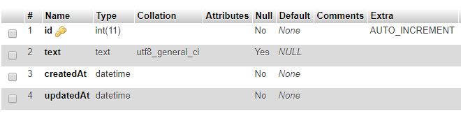
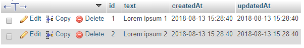
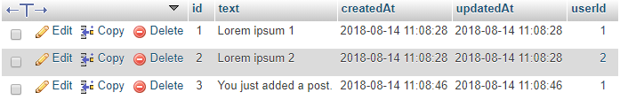
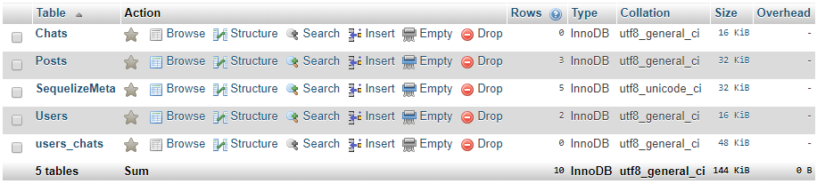

Lab 5: Connecting to The Database (DEMO)
========================================


This lab will cover the following points:

- Using databases with GraphQL
- Writing database models
- Using Apollo together with Sequelize

#### Start MySQL and phpMyAdmin

```
service mysql start

service apache2 start
```

#### Lab Solution

Complete solution for this lab is available in the following directory:

`cd ~/Desktop/react-graphql-intro/labs/Lab05`

Run following command to install all required packages:

`npm install`

 


#### Running Solution

Run following commands to run application:

`npm run client:build`

`npm run server`

<span style="color:red;">Note!</span> Database migrations and seeds have been executed already. Run the lab solution and optionally also go through lab to understand changes done to integrate application with MYSQL database.


MySQL and phpMyAdmin
---------------------

MySQL is already installed and running. Execute the following steps to get MySQL running:

1.  Verify that mysql server is running:

```
service mysql status
```

2.  User called `devuser` has been created for development with password `PASSWORD`.


#### PhpMyAdmin (Optional)

We can now visit phpMyAdmin under [http://localhost:81/phpmyadmin]
and log in with the devuser. It should look like the following screenshot:


Connecting to a database with Sequelize
---------------------------------------

Inside of the `index.js` database, we have established a connection
to our database with Sequelize. Internally, Sequelize relies on the
[mysql2] package, but we do not use it on our own, which is very
convenient:

```
import Sequelize from 'sequelize';

const sequelize = new Sequelize('graphbook_dev', 'devuser', 'PASSWORD', {
 host: 'localhost',
  dialect: 'mysql',
  operatorsAliases: false,
  pool: {
    max: 5,
    min: 0,
    acquire: 30000,
    idle: 10000,
  },
});

export default sequelize;
```


Using a configuration file with Sequelize
-----------------------------------------

For this, we have created a new `index.js` file inside a separate folder
(called `config`), next to the `database` folder in following directory:

**Action:** Review File: `~/Desktop/react-graphql-intro/labs/Lab05/src/server/config/index.js`


```
module.exports = {
  "development": {
    "username": "devuser",
    "password": "PASSWORD",
    "database": "graphbook_dev",
    "host": "localhost",
    "dialect": "mysql",
    "operatorsAliases": false,
    "pool": {
      "max": 5,
      "min": 0,
      "acquire": 30000,
      "idle": 10000
    }
  },
  "production": {
    "host": process.env.host,
    "username": process.env.username,
    "password": process.env.password,
    "database": process.env.database,
    "logging": false,
    "dialect": "mysql",
    "operatorsAliases": false,
    "pool": {
      "max": 5,
      "min": 0,
      "acquire": 30000,
      "idle": 10000
    }
  }
}
```

We can remove the configuration that we hardcoded earlier and replace
the contents of our `index.js` database file to require our
[configFile], instead.

**Action:** Review File: `~/Desktop/react-graphql-intro/labs/Lab05/src/server/database/index.js`

This should look like the following code snippet:

```
import Sequelize from 'sequelize';
import configFile from '../config/';

const env = process.env.NODE_ENV || 'development';
const config = configFile[env];

const sequelize = new Sequelize(config.database, config.username, 
 config.password, config);

const db = {
  sequelize,
};

export default db;
```


Writing database models
=======================

Currently, we have two GraphQL entities: [User] and [Post].
We have created the first model for our posts. Created two new folders (one
called [models], and the other, [migrations]) next to the
[database] folder:

**Action:** Review Folder: `~/Desktop/react-graphql-intro/labs/Lab05/src/server/models`


Database migrations
--------------------

Database migrations have been executed already in MYSQL database:

**Action:** Review Folder: `~/Desktop/react-graphql-intro/labs/Lab05/src/server/migrations`

Look inside of phpMyAdmin. Here, you will find table, called
[Posts]. The structure of the table should look as follows:



Every time that you use Sequelize and its migration feature, you will
have an additional table, called [SequelizeMeta]. The contents of
the table should look as follows:


Importing models with Sequelize
-------------------------------

**Action:** Review File: `~/Desktop/react-graphql-intro/labs/Lab05/src/server/models/index.js`

Review `index.js` file in the [models] folder, it will have following code:

```
import Sequelize from 'sequelize';
if (process.env.NODE_ENV === 'development' || true) {
  require('babel-plugin-require-context-hook/register')()
}

export default (sequelize) => {
  let db = {};

  const context = require.context('.', true, /^\.\/(?!index\.js).*\.js$/, 
   'sync')
  context.keys().map(context).forEach(module => {
    const model = module(sequelize, Sequelize);
    db[model.name] = model;
  });

  Object.keys(db).forEach((modelName) => {
    if (db[modelName].associate) {
      db[modelName].associate(db);
    }
  });

  return db;
};
```

To summarize what happens in the preceding code, we search for all files
ending with [.js] in the same folder as the current file, and load
them all with the [require.context] statement. In development, we
must execute the [babel-plugin-require-context-hook/register] hook
to load the [require.context] function at the top.

**Action:** Review File: `~/Desktop/react-graphql-intro/labs/Lab05/src/server/database/index.js`

Now, we want to use our models. Go back to the `index.js` database
file and import all models through the aggregation `index.js` file
that we just created:

```
import models from '../models';
```

Before exporting the [db] object at the end of the file, we need
to run the [models] wrapper to read all model [.js] files.
We pass our Sequelize instance as a parameter, as follows:

```
const db = {
  models: models(sequelize),
  sequelize,
};
```


We create the global database instance in the `index.js` file of
the root server folder. Add the following code:

```
import db from './database';
```

Also, add following code in `index.js`:

```
import servicesLoader from './services';

const utils = {
    db,
};
const services = servicesLoader(utils);
```


Seeding data with Sequelize
===========================

Seeds have been executed already in MYSQL database:

**Action:** Review Folder: `~/Desktop/react-graphql-intro/labs/Lab05/src/server/seeders`

The following screenshot shows a filled [Posts] table:




You can start the server with following commands:

```
cd ~/Desktop/react-graphql-intro/labs/Lab05

npm run server
```

After that, execute the GraphQL posts query from Lab 4 again:

```
{
  posts {
    id
    text
    user {
      avatar
      username
    }
  }
}
```

The output will look as follows:

```
{
  "data": {
    "posts": [{
      "id": 1,
      "text": "Lorem ipsum 1",
      "user": null
    },
    {
      "id": 2,
      "text": "Lorem ipsum 2",
      "user": null
    }]
  }
}
```


Mutating data with Sequelize
============================

Requesting data from our database via the GraphQL API works. Now comes
the tough part: adding a new post to the [Posts] table.

Before we start, we must extract the new database model from the
[db] object at the top of the exported function in our
[resolvers.js] file:

```
const { Post, User } = db.models;
```


We have to edit the GraphQL resolvers to add the new post. Replace the
old [addPost] function with the new one, as shown in the following
code snippet:

```
addPost(root, { post }, context) {
  logger.log({
    level: 'info',
    message: 'Post was created',
  });
 
  return User.findAll().then((users) => {
    const usersRow = users[0];
    
    return Post.create({
      ...post,
    }).then((newPost) => {
      return Promise.all([
        newPost.setUser(usersRow.id),
      ]).then(() => {
        return newPost;
      });
    });
  });
},
```

**Action:** Review File: `~/Desktop/react-graphql-intro/labs/Lab05/src/server/services/graphql/resolvers.js`


As always, the preceding mutation returns a promise. The promise is
resolved when the deepest query has been executed successfully. The
execution order is as follows:

1.  We retrieve all users from the database through the
    [User.findAll] method.
2.  We insert the post into our database with the [create]
    function of Sequelize. The only property that we pass is the post
    object from the original request, which only holds the text of the
    post. MySQL autogenerates the [id] of the post.

3.  The post has been created, but the [userId] was not set.

You could also directly add the user ID in the [Post.create]
function. The problem here is that we did not establish the model
associations on the JavaScript side. If we return the created post model
without explicitly using [setUser] on the model instance, we
cannot use the [getUser] function until we create a new instance
of the post model.

So, to fix this problem, we run the [create] function, resolve the
promise, and then run [setUser] separately. As a parameter of
[setUser], we statically take the ID of the first user from the
[users] array.

We resolve the promise of the [setUser] function by using an array
surrounded by [Promise.all]. This allows us to add further
Sequelize methods later on. For example, you could add a category on
each post, too.

4.  The returned value is the newly created post model instance, after
    we have set the [userId] correctly.

Everything is set now. To test our API, we are going to use Postman
again. We need to change the [addPost] request. The
[userInput] that we added before is not needed anymore, because
the backend statically chooses the first user out of our database. You
can send the following request body:

```
{
  "operationName":null,
  "query": "mutation addPost($post : PostInput!) { addPost(post : $post) { 
    id text user { username avatar }}}",
  "variables":{
    "post": {
      "text": "You just added a post."
    }
  }
}
```


Your GraphQL schema must reflect this change, so remove the
[userInput] from there, too:

```
addPost (
  post: PostInput!
): Post
```


Running the [addPost] GraphQL mutation now adds a post to the
[Posts] table, as you can see in the following screenshot:





We have rebuilt the example from the last lab, but we are using a
database in our backend. To extend our application, we are going to add
two new entities.


Chat Table
----------

The following screenshot shows how your database should look now:





You should see two foreign key constraints in the relation view of the
[users\_chats] table. The naming is done automatically:


Chats and messages in GraphQL
-----------------------------

We have introduced some new entities with messages and chats. Let\'s
include those in our Apollo schema. In the following code, you can see
an excerpt of the changed entities, fields, and parameters of our
GraphQL schema:

```
type User {
  id: Int
  avatar: String
  username: String
}

type Post {
  id: Int
  text: String
  user: User
}

type Message {
  id: Int
  text: String
  chat: Chat
  user: User
}

type Chat {
  id: Int
  messages: [Message]
  users: [User]
}

type RootQuery {
  posts: [Post]
  chats: [Chat]
}
```

**Action:** Review File: `~/Desktop/react-graphql-intro/labs/Lab05/src/server/services/graphql/schema.js`

Take a look at the following short changelog of our GraphQL schema:

-   The [User] type received an [id] field, thanks to our
    database.
-   The [Message] type is entirely new. It has a text field like a
    typical message, and user and chat fields, which are requested from
    the referenced tables in the database model.
-   The [Chat] type is also new. A chat has a list of messages
    that are returned as an array. These can be queried through the chat
    ID saved in the message table. Furthermore, a chat can have an
    unspecified number of users. The relationships between users and
    chats are saved in our separate join table, as stated previously.
    The interesting thing here is that our schema does not know anything
    about this table; it is just for our internal use, to save the data
    appropriately in our MySQL server.
-   I have also added a new [RootQuery], called [chats].
    This query returns all of a user\'s chats.


**Action:** Review File: `~/Desktop/react-graphql-intro/labs/Lab05/src/server/services/graphql/resolvers.js`

These factors should be implemented in our resolvers, too. Our resolvers
should look as follows:

```
Message: {
  user(message, args, context) {
    return message.getUser();
  },
  chat(message, args, context) {
    return message.getChat();
  },
},
Chat: {
  messages(chat, args, context) {
    return chat.getMessages({ order: [['id', 'ASC']] });
  },
  users(chat, args, context) {
    return chat.getUsers();
  },
},
RootQuery: {
  posts(root, args, context) {
    return Post.findAll({order: [['createdAt', 'DESC']]});
  },
  chats(root, args, context) {
    return User.findAll().then((users) => {
      if (!users.length) {
        return [];
      }

      const usersRow = users[0];
 
      return Chat.findAll({
        include: [{
          model: User,
          required: true,
          through: { where: { userId: usersRow.id } },
        },
        {
          model: Message,
        }],
      });
    });
  },
},
```

You can send this GraphQL request to test the changes:

```
{
  "operationName":null,
  "query": "{ chats { id users { id } messages { id text user { id username
  } } } }",
  "variables":{}
}
```

Try to run the GraphQL [chats] query as follows:

```
{
  "data": {
    "chats": [{
      "id": 1,
      "users": [
        {
          "id": 1
        },
        {
          "id": 2
        }
      ],
      "messages": [
        {
          "id": 1,
          "text": "This is a test message.",
          "user": {
            "id": 1,
            "username": "Test User"
          }
        },
        {
          "id": 2,
          "text": "This is a second test message.",
          "user": {
            "id": 2,
            "username": "Test User 2"
          }
        },
        {
          "id": 3,
          "text": "This is a third test message.",
          "user": {
            "id": 2,
            "username": "Test User 2"
          }
        }
      ]}
    ]
  }
}
```


Great! Now, we can request all of the chats that a user participates in,
and get all referenced users and their messages.

Now, we also want to do that for only one chat. Follow these
instructions to get it done:

1.  Add a [RootQuery] chat that takes a [chatId] as a
    parameter:

```
chat(root, { chatId }, context) {
  return Chat.findById(chatId, {
    include: [{
      model: User,
      required: true,
    },
    {
      model: Message,
    }],
  });
},
```


With this implementation, we have the problem that all users can send a
query to our Apollo server, and in return, get the complete chat
history, even if they are not referenced in the chat. We will not be
able to fix this until we have implemented authentication.

2.  Add the new query to the GraphQL schema, under [RootQuery]:

```
chat(chatId: Int): Chat
```


3.  Send the GraphQL request to test the implementation, as follows:

```
{
  "operationName":null,
  "query": "query($chatId: Int!){ chat(chatId: $chatId) { 
    id users { id } messages { id text user { id username } } } }",
  "variables":{ "chatId": 1 }
}
```


We are sending this query, including the [chatId] as a parameter.
To pass a parameter, you must define it in the query with its GraphQL
data type. Then, you can set it in the specific GraphQL query that you
are executing, which is the [chat] query, in our case. Lastly, you
must insert the parameter\'s value in the [variables] field of the
GraphQL request.

You may remember the response from the last time. The new response will
look much like a result from the [chats] query, but instead of an
array of chats, we will just have one [chat] object.

We are missing a major feature: sending new messages or creating a new
chat. We will create the corresponding schema, and the resolvers for it,
in the next section.


Creating a new chat
-------------------

New users want to chat with their friends. Creating a new chat is
essential, of course.

The best way to do this is to accept a list of user IDs that also allows
the creation of group chats. Do this as follows:

**Action:** Review File: `~/Desktop/react-graphql-intro/labs/Lab05/src/server/services/graphql/resolvers.js`

1.  Add the [addChat] function to the [RootMutation] in the
    [resolvers.js] file, as follows:

```
addChat(root, { chat }, context) {
  logger.log({
    level: 'info',
    message: 'Message was created',
  });
  return Chat.create().then((newChat) => {
    return Promise.all([
      newChat.setUsers(chat.users),
    ]).then(() => {
      return newChat;
    });
  });
},
```

Sequelize added the [setUsers] function to the chat model
instance. It was added because of the associations using the
[belongsToMany] method in the chat model. There, we can directly
provide an array of user IDs that should be associated with the new
chat, through the [users\_chats] table.

2.  Change the schema so that you can run the GraphQL mutation. We have
    to add the new input type and mutation, as follows:

```
input ChatInput {
  users: [Int]
}

type RootMutation {
  addPost (
    post: PostInput!
  ): Post
  addChat (
    chat: ChatInput!
  ): Chat
}
```


3.  Test the new GraphQL [addChat] mutation as your request body:

```
{
  "operationName":null,
  "query": "mutation addChat($chat: ChatInput!) { addChat(chat: 
    $chat) { id users { id } }}",
  "variables":{
    "chat": {
      "users": [1, 2]
    }
  }
}
```


You can verify that everything worked by checking the users returned
inside of the [chat] object.


Creating a new message
----------------------

We can use the [addPost] mutation as our basis, and extend it. The
result accepts a [chatId] and uses the first user from our
database.

**Make sure to add complete code from following `resolvers.js` file in your final code.**

**Action:** Review File: `~/Desktop/react-graphql-intro/labs/Lab05/src/server/services/graphql/resolvers.js`

1.  Add the [addMessage] function to the [RootMutation] in
    the [resolvers.js] file, as follows:

```
addMessage(root, { message }, context) {
  logger.log({
    level: 'info',
    message: 'Message was created',
  });
 
  return User.findAll().then((users) => {
    const usersRow = users[0];
 
    return Message.create({
      ...message,
    }).then((newMessage) => {
      return Promise.all([
        newMessage.setUser(usersRow.id),
        newMessage.setChat(message.chatId),
      ]).then(() => {
        return newMessage;
      });
    });
  });
},
```

**Action:** Review File: `~/Desktop/react-graphql-intro/labs/Lab05/src/server/services/graphql/schema.js`

2.  Then, add the new mutation to your GraphQL schema. We also have a new input type for our messages:

```
input MessageInput {
  text: String!
  chatId: Int!
}

type RootMutation {
  addPost (
    post: PostInput!
  ): Post
  addChat (
    chat: ChatInput!
  ): Chat
  addMessage (
    message: MessageInput!
  ): Message
}
```


3.  You can send the request in the same way as the [addPost] request:

```
{
   "operationName":null,
   "query": "mutation addMessage($message : MessageInput!) { 
     addMessage(message : $message) { id text }}",
   "variables":{
     "message": {
       "text": "You just added a message.",
       "chatId": 1
     }
   }
}
```


Now, everything is set. The client can now request all posts, chats, and
messages. Furthermore, users can create new posts, create new chat
rooms, and send chat messages.


Summary
=======

Our goal in this lab was to create a working backend with a database
as storage, which we have achieved pretty well. We can add further
entities and migrate and seed them with Sequelize.

In this lab, we also covered what Sequelize automates for us when
using its models, and how great it works in coordination with our Apollo
Server.

In the next lab, we will focus on how to use the Apollo React Client
library with our backend, as well as the database behind it.
