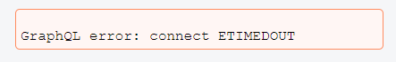
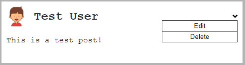
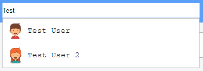
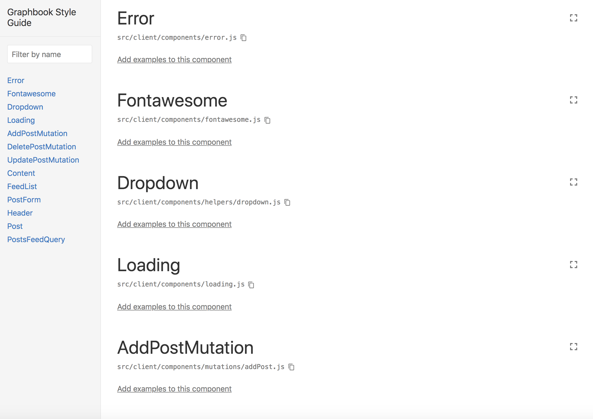
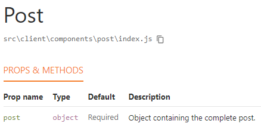
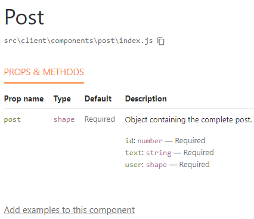
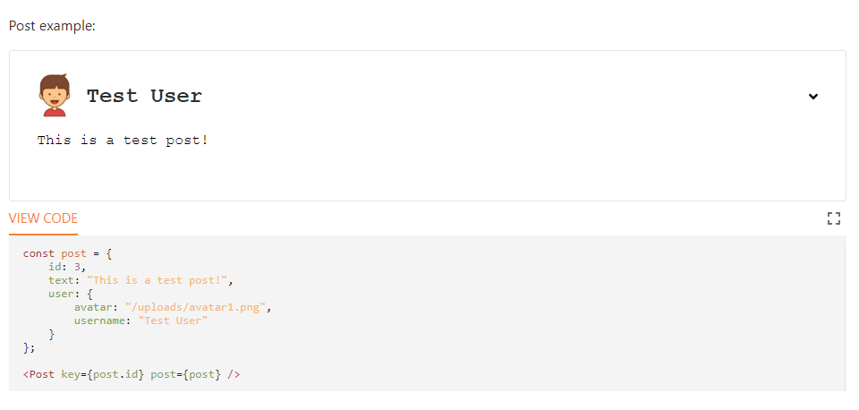

Lab 5: Reusable React Components
=========================


This lab will cover everything you need to know in order to write
efficient and reusable React components. It will cover the following
topics:

-   React patterns
-   Structured React components
-   Rendering nested components
-   The React Context API
-   The Apollo Consumer component


### Lab Solution

Complete solution for this lab is available in the following directory:

`cd ~/Desktop/react-graphql-course/labs/Lab05`


Introducing React patterns
==========================

We will go over the most commonly used patterns that React offers, as follows:

-   Controlled components
-   Stateless functions
-   Conditional rendering
-   Rendering children


Controlled components
---------------------

Let\'s start with uncontrolled input.

By definition, a component is uncontrolled whenever the value is not set
by a property through React, but only saved and taken from the real
browser DOM. The value of an input is then retrieved from a reference to
the DOM Node, and is not managed and taken from React\'s component
state.

The following code shows the post form where the user will be able to
submit new posts. I have excluded the rendering logic for the complete
feed, as it is not a part of the pattern that I want to show you:

```
import React, { Component } from 'react';
import gql from 'graphql-tag';
import { Mutation } from 'react-apollo';

const ADD_POST = gql`
  mutation addPost($post : PostInput!) {
    addPost(post : $post) {
    id
    text
    user {
      username
      avatar
    }
  }
}`;

export default class Feed extends Component {
  constructor(props) {
    super(props);
    this.textArea = React.createRef();
  }
  render() {
    const self = this;
    return (
      <div className="container">
        <div className="postForm">
          <Mutation mutation={ADD_POST}>
            {addPost => (
              <form onSubmit={e => {
                e.preventDefault();
                addPost({ variables: { post: { text: 
                  self.textArea.current.value } } });
              }}> 
                <textarea ref={this.textArea} placeholder="Write your 
                  custom post!"/>
                <input type="submit" value="Submit" />
              </form>
            )}
          </Mutation>
        </div>
      </div>
    )
  }
}
```


In this example, you can see that we no longer have a state initializer,
since the [textarea] value is stored within the real DOM Node, and
not the application state.

Now, we need a component constructor. As we stated in Lab 1, you always need to run the
[super] method inside of a constructor first.

Next, we run the [createRef] function provided by React. It
prepares the variable to accept the DOM Node as a property. In earlier
versions of React, you were required to use a callback to handle this on
your own. From version 16.3 of React, the [createRef] function
automates this process for you.

In the [render] method, the [ref] property fills in the
reference that we just created with the DOM element.

Accessing the value of the DOM Node works by using the normal JavaScript
DOM API. You can see this behavior when sending the [submit] event
of our form. The value is extracted from the
[self.textArea.current.value] field.


Stateless functions
-------------------


We have written a lot of code where stateless functions can be used very
easily; while doing so, we have also structured and improved the
readability of our React application.

Beginning with the file structure, we will create a new folder for our
new components (or stateless functions), as follows:

```
mkdir src/client/components
```


Many parts of our application need to be reworked. Create a new file for
our first stateless function, as follows:

```
touch src/client/components/loading.js
```


Currently, we display a dull and boring [Loading\...]
message when our GraphQL requests are running. Let\'s change this by
inserting the following code into the [loading.js] file:

```
import React from 'react';

export default ({color, size}) => {
  var style = {
    backgroundColor: '#6ca6fd',
    width: 40,
    height: 40,
  };

  if(typeof color !== typeof undefined) {
    style.color = color;
  }
  if(typeof size !== typeof undefined) {
    style.width = size;
    style.height = size;
  }

  return <div className="bouncer" style={style}></div>
}
```


In the preceding code, we are using a simple function in ES6 arrow
notation. It is an easy and more concise syntax for defining functions.
In the code, you can see that we are extracting the [color] and
[size] fields from the properties that our function receives.

We are building a default [style] object that represents the basic
styling for a loading spinner. You can pass the [color] and
[size] separately, in order to adjust those settings.

Lastly, we are returning a simple [div] tag with the CSS style and
the [bouncer] class.

What\'s missing here is the CSS styling. The code should look as
follows; just add it to our [style.css] file:

```
.bouncer {
  margin: 20px auto;
  border-radius: 100%; 
  -webkit-animation: bounce 1.0s infinite ease-in-out;
  animation: bounce 1.0s infinite ease-in-out;
}

@-webkit-keyframes bounce {
  0% {
    -webkit-transform: scale(0)
  }
  100% {
    -webkit-transform: scale(1.0);
    opacity: 0;
  }
}

@keyframes bounce {
  0% { 
    -webkit-transform: scale(0);
    transform: scale(0);
  }
  100% {
    -webkit-transform: scale(1.0);
    transform: scale(1.0);
    opacity: 0;
  }
}
```


Like in the previous examples, we use CSS animations to display our
loading spinner correctly, and to let it animate as pulsating.

We have now finished the stateless function. You should place it into
the existing code, wherever a loading state exists.

First, import the new loading spinner to the top of your files, as
follows:

```
import Loading from './components/loading';
```


You can then render the stateless function like any normal component, as
follows:

```
if (loading) return <Loading />;
```


Start the server with `npm run server` and the front end with [npm
run client]. You should now see a pulsating blue bubble where you
inserted it. I have tested this inside of my posts feed, and it looks
pretty good.

The advantage of stateless functions is that they are minimal and
efficient functions, rendering smaller parts of our application. The
approach perfectly integrates with React, and we can improve the code
that we have written.


Conditional rendering
---------------------

One important ability of React is rendering components or data
conditionally. We will use this intensively in the next main features
that we are going to implement.

Generally, you can accomplish conditional rendering by using the curly
brace syntax. An example of an if statement is as follows:

```
render() {
  const { shouldRender } = this.state;
 
  return (
    <div className="conditional">
      {(shouldRender === true) && (
        <p>Successful conditional rendering!</p>
      )}
    </div>
  )
}
```


This code is the simplest example of conditional rendering. We have the
[shouldRender] variable from the component state, and we use this
as our condition. When the condition is true, the second part---which is
our [Successful conditional rendering!] text---will also render.
That is because we are using the [&&] characters. The text does
not render if the condition is false.

You can replace the preceding condition with everything that you have in
mind. It can be a complex condition, such as a function returning a
Boolean value, or, just like in the preceding code, it can be a state
variable.

You will see further examples in later steps and chapters in this course.


Rendering child components
--------------------------

In all of the code that we have written so far, we have directly written
the markup like it is rendered to real HTML.

A great feature that React offers is the ability to pass children to
other components. The parent component decides what is done with its
children.

Something that we are still missing now is a good error message for our
users. So, we will use this pattern to solve the issue.

Create an [error.js] file next to the [loading.js] file in
the [components] folder, as follows:

```
import React, { Component } from 'react';

export default class Error extends Component {
  render() {
    const { children } = this.props;
    
    return (
      <div className="error message">
        {children}
      </div>
    );
  }
}
```


When passing children to another component, a new property, called
[children], is added to the properties of the component. You
specify [children] by writing normal React markup.

If you wanted to, you could perform actions, such as looping through
each child. In our example, we render the children as usual, by using
the curly braces and putting the [children] variable inside.

To start using the new [Error] component, you can simply import
it. The markup for the new component is as follows:

```
if (error) return <Error><p>{error.message}</p></Error>;
```


Add some CSS, and everything should be finished, as shown in the
following code snippet:

```
.message {
  margin: 20px auto;
  padding: 5px;
  max-width: 400px;
}

.error.message {
  border-radius: 5px;
  background-color: #FFF7F5;
  border: 1px solid #FF9566;
  width: 100%;
}
```


A working result might look as follows:





You can apply the stateless function pattern and the children pattern to
many other use cases. Which one you use will depend on your specific
scenario. In this case, you could also use a stateless function, rather
than a React component.


Structuring our React application
=================================

We have already improved some things by using React patterns. You should
do some homework and introduce those patterns wherever possible.

When writing applications, one key objective is to keep them modular and
readable, but also as understandable as possible. It is always hard to
tell when splitting code up is useful, and when it overcomplicates
things. This is something that you will learn more and more about by
writing as many applications and as much code as possible.

Let\'s begin to structure our application further.


The React file structure
------------------------

We have already saved our [Loading] and [Error] components
in the [components] folder. Still, there are many parts of our
components that we did not save in separate files, to improve the
readability of this course.

I will explain the most important solution for unreadable React code in
one example. You can implement this on your own later, for all other
parts of our application, as you should not read duplicate code.

Currently, we render the posts in our feed by mapping through all posts
from the GraphQL response. There, we directly render the corresponding
markup for all post items. Therefore, it is one big render function that
does everything at once.

To make this a bit more intuitive, we should create a new [Post]
component. Separating the components hugely improves the readability of
our posts feed. Then, we can replace the return value from the loop with
a new component, instead of real markup.

Instead of creating a [post.js] file in our [components]
folder, we should first create another [post] folder, as follows:

```
mkdir src/client/components/post
```


The [Post] component consists of multiple tiny, nested components.
A post is also a standalone GraphQL entity, making it logical to have a
separate folder. We will store all related components in this folder.

Let\'s create those components. We will start with the post header,
where the top part of a post item is defined. Create a new
[header.js] file in the [components/post] folder, as
follows:

```
import React from 'react';

export default ({post}) => 
  <div className="header">
    
    <div>
      <h2>{post.user.username}</h2>
    </div>
  </div>
```


The [header] component is just a stateless function. As you can
see, we are using a React pattern from the earlier pages of this
lab. We are only rendering the data that we already have, and we are
not storing any state here, so we are free to use a stateless function.

Up next is the post content, which represents the body of a post item.
Add the following code inside of a new file, called [content.js]:

```
import React from 'react';

export default ({post}) => 
  <p className="content">
    {post.text}
  </p>
```


The code is pretty much the same as that of the post header. At later
points, you will be free to introduce real React components or extended
markup to those two files. It is entirely open to your implementation.

The main file is a new `index.js` file in the new [post]
folder. It should look as follows:

```
import React, { Component } from 'react';
import PostHeader from './header';
import PostContent from './content';

export default class Post extends Component {
  render() {
    const { post } = this.props;
 
    return (
      <div className={"post " + (post.id < 0 ? "optimistic": "")}>
        <PostHeader post={post}/>
        <PostContent post={post}/>
      </div>
    )
  }
}
```


The preceding code represents a very basic component, but instead of
directly using markup to render a complete post item (like before), we
are using two further components for this, with [PostHeader] and
[PostContent]. Both of the components receive the [post] as
a property.

You can now use the new [Post] component in the feed list with
ease. Just replace the old code inside the loop, as follows:

```
<Post key={post.id} post={post} />
```


The improvement is that all three of the components give you a clear
overview at first glance. Inside of the loop, we return a post item. A
post item consists of a header and body content.

Still, there is room for enhancement, because the posts feed list is
cluttered.


Efficient Apollo React components
---------------------------------

We have successfully replaced the post items in our feed with a React
component, instead of raw markup.

A major part, which I dislike very much, is the Apollo [Query]
component and [Mutation] component, and how we are using these at
the moment directly inside the [render] method of our components.
I will show you a quick workaround to make these components more
readable.

Furthermore, the current solution does not allow us to reuse the query
or mutation anywhere else. We would need to add duplicate code, just to
send the same request again. A better way to structure the code would be
to have separate files for the data layer and view layer of our
client-side code.

As an example, we will fix those issues for [Feed.js] in the next
section.


The Apollo Query component
--------------------------

We will start by implementing the [Query] component. You should be
able to easily follow the instructions here, as all of the patterns and
React basics should be clear by now:

1.  Create a new [queries] folder inside of the [components]
    folder, as follows:

```
mkdir src/client/components/queries
```


2.  The query that we want to remove from our view layer is the
    [postsFeed] query. You can define the naming conventions for
    this, but I would recommend using the [RootQuery] name as the
    filename, as long as it works. So, we should create a
    [postsFeed.js] file in the [queries] folder, and insert
    the following code:

```
export default class PostsFeedQuery extends Component {
  getVariables() {
    const { variables } = this.props;
    var query_variables = {
      page: 0,
      limit: 10
    };

    if (typeof variables !== typeof undefined) {
      if (typeof variables.page !== typeof undefined) {
        query_variables.page = variables.page;
      }
      if (typeof variables.limit !== typeof undefined) {
        query_variables.limit = variables.limit;
      }
    }

    return query_variables;
  }
  render() {
    const { children } = this.props;
    const variables = this.getVariables();

    return(
      <Query query={GET_POSTS} variables={variables}>
        {({ loading, error, data, fetchMore }) => {
          if (loading) return <Loading />;
          if (error) return <Error><p>{error.message}</p></Error>;

          const { postsFeed } = data;
          const { posts } = postsFeed;

          return React.Children.map(children, function(child) {
            return React.cloneElement(child, { posts, fetchMore });
          })
        }}
      </Query>
    )
  }
}
```


Do not forget to import all of the dependencies, such as the Apollo
React client, the [Loading] and [Error] components, and
parsing the [postsFeed] GraphQL query to the [GET\_POSTS]
variable with [graphql-tag]. If you do not remember how to do
this, look inside of the implementation that we have in our [Feed]
class at the moment.

For customization reasons, the component should be able to accept other
variables, in case we want to adjust the number of parameters of our
query. The [getVariables] function overwrites the default
[query\_variables] field with any parameter given to the
component.

What\'s new in the preceding code is that we are using the **children
pass-through** pattern of React. This pattern allows us to wrap the
[PostsFeedQuery] component around many different custom
components, and it allows us to use the query response inside of these
children. That way, we keep a readable [render] method for our
user-facing components and the data layer of our React application in a
separate file.

We are using the [React.Children.map] function to loop through all
of the provided children. By running the [React.cloneElement]
method, we copy each element to a new rendered component. This enables
us to pass further properties from the result of the GraphQL request
initiated by the [Query] component. Each child receives the
[posts] and the [fetchMore] function as a property.

3.  Preparing our next component, we split the infinite scroll area into
    a second file. Place a [feedlist.js] into the
    [components/posts] folder, as follows:

```
import React, { Component } from 'react';
import InfiniteScroll from 'react-infinite-scroller';
import Post from './';

export default class FeedList extends Component {
  state = {
    page: 0,
    hasMore: true
  }
  loadMore = (fetchMore) => {
    const self = this;
    const { page } = this.state;
    fetchMore({
      variables: {
        page: page+1,
      },
      updateQuery(previousResult, { fetchMoreResult }) {
        if(!fetchMoreResult.postsFeed.posts.length) {
          self.setState({ hasMore: false });
          return previousResult;
        }
        self.setState({ page: page + 1 });
        const newData = {
          postsFeed: {
            __typename: 'PostFeed',
            posts: [
              ...previousResult.postsFeed.posts,
              ...fetchMoreResult.postsFeed.posts
            ]
          }
        };
        return newData;
      }
    });
  }
  render() {
    const self = this;
    const { posts, fetchMore } = this.props;
    const { hasMore } = this.state;
    return (
      <div className="feed">
        <InfiniteScroll
          loadMore={() => self.loadMore(fetchMore)}
          hasMore={hasMore}
          loader={<div className="loader" key={"loader"}>Loading 
           ...</div>}
        >
          {posts.map((post, i) => 
            <Post key={post.id} post={post} />
          )}
        </InfiniteScroll>
      </div>
    );
  }
}
```


We only handle the infinite scroller of our feed here, which is also the
only part where the result of the [PostsFeedQuery] is needed. The
preceding code is much tidier than before (at least, inside of the
[render] method).

We extract the [posts] and the [fetchMore] function passed
from the [PostsFeedQuery] component. Like before, we render the
[posts] as they are passed from the parent component inside of the
infinite scroller. While scrolling, the infinite scroller executes the
[loadMore] function, which runs the [fetchMore] function
that is also received by the [PostsFeedQuery] component, in order
to get the next posts in our pagination. The data-fetching and the
rendering logic are separated from each other.

4.  To use the [PostsFeedQuery] component, we can restructure our
    [Feed.js] a bit. Remove the [Query] tag from the markup,
    as well as the [page] and [hasMore] state variables.
5.  Import the new components in the [Feed.js], as follows:

```
import FeedList from './components/post/feedlist';
import PostsFeedQuery from './components/queries/postsFeed';
```


6.  Replace the [div] tag with the [feed] class name and our
    two new components, as follows:

```
<PostsFeedQuery>
  <FeedList />
</PostsFeedQuery>
```


This code allows the [Query] component to pass all of the required
properties to the [FeedList] class.

The improvement that we implemented is that the post form is now
rendered directly before the response of the query has arrived. Only the
scroll component is rendered when the GraphQL request is finished.
Although it is more of a coincidence, it is important to note that the
form was previously not rendered until the response arrived.

If we wanted to, we could add multiple other components inside of the
[PostsFeedQuery] tag. All children receive the response
properties, as specified in our custom [Query] component. You can
make changes to the [Query] class and add further fields at any
time, and all of the corresponding files will receive the update.

Do the same for the chats to improve your skills in writing reusable
React code. How deeply you separate the components into multiple,
smaller parts will always be a design decision.

Next, we will look at the [Mutation] component, in order to submit
new posts.


The Apollo Mutation component
-----------------------------

A big part of our main [Feed.js] file still consists of rendering
the real form markup and using the Apollo Mutation component to pass and
execute the mutation within the form. We will now separate those parts:

1.  Create a new folder for all your mutations, as follows:

```
mkdir src/client/components/mutations
```


2.  Next, we want to outsource the mutation into a special file. To do
    so, create the [addPost.js] file, named after the GraphQL
    mutation itself. Insert the following code:

```
export default class AddPostMutation extends Component {
  state = {
    postContent: ''
  }
  changePostContent = (value) => {
    this.setState({postContent: value})
  }
  render() {
    const self = this;
    const { children, variables } = this.props;
    const { postContent } = this.state;
 
    return (
      <Mutation
        update = {(store, { data: { addPost } }) => {
          var query = {
            query: GET_POSTS,
          };
          if(typeof variables !== typeof undefined) {
            query.variables = variables;
          }
          const data = store.readQuery(query);
          data.postsFeed.posts.unshift(addPost);
          store.writeQuery({ ...query, data });
        }}
        optimisticResponse= {{
          __typename: "mutation",
          addPost: {
            __typename: "Post",
            text: postContent,
            id: -1,
            user: {
              __typename: "User",
              username: "Loading...",
              avatar: "/public/loading.gif"
            }
          }
        }}
        mutation={ADD_POST}>
          {addPost => 
            React.Children.map(children, function(child){
              return React.cloneElement(child, { addPost, 
              postContent, changePostContent: 
                self.changePostContent 
              });
            })
          }
      </Mutation>
    )
  }
}
```


Please import all of the dependencies at the top, and parse both the
GraphQL requests [ADD\_POST] and the [GET\_POSTS] query. The
[postsFeed] query is required, because we read all posts from the
cache by specifying the query in our [update] function which we
introduced in the previous lab.

The solution is the same as it was for the [Query] component in
the previous section. However, two things have changed, which will be
explained next.

Our [AddPostMutation] class holds the real state of the form. To
accomplish this, we hand over the [changePostContent] method to
all child components. They execute this method by giving the text area
value and setting the new state in the parent component, which is our
custom [Mutation] component.

We do this because the [optimisticResponse] requires us to pass
the current value, in order to simulate a positive response from our
server. If we kept the state within our form, the [Mutation]
component would not have access to it, and could not render the text in
the optimistic response.

Instead of giving the result of the mutation to our underlying child
components, we hand over the mutation method. The form runs this
function upon submission.

It is important to mention that the component can take a
[variables] property, which is then used to read the cached data.
It must receive the same [variables] as the [Query]
component to successfully read the data from the client\'s cache.

3.  Going on, we should build a post form component that only handles
    the creation of new posts. Just call it [form.js], and place
    it inside of the post\'s [components] folder. The code must
    look like the following snippet:

```
import React, { Component } from 'react';

export default class PostForm extends Component {
  handlePostContentChange = (event) => {
    this.props.changePostContent(event.target.value);
  }
  render() {
    const self = this;
    const { addPost, postContent } = this.props;

    return (
      <div className="postForm">
        <form onSubmit={e => {
          e.preventDefault();
          addPost({ variables: { post: { text: postContent } } 
            }).then(() => {
            self.props.changePostContent('');
          });
        }}> 
          <textarea value={postContent} onChange=
           {self.handlePostContentChange} placeholder="Write your 
            custom post!"/>
          <input type="submit" value="Submit" />
        </form>
      </div>
    )
  }
}
```


As you can see, again, we just copied the post form over to our new
file. The [handlePostContentChange] does not directly call
[setState], but executes the [changePostContent] received
from the custom [Mutation] component that we just wrote. The same
goes for the [addPost] method that we execute in the
[onSubmit] event handler of the form.

4.  Lastly, we finalize the [Feed.js] main file. It should look as
    follows:

```
import React, { Component } from 'react';
import PostsQuery from './components/queries/postsFeed';
import AddPostMutation from './components/mutations/addPost';
import FeedList from './components/post/feedlist';
import PostForm from './components/post/form';

export default class Feed extends Component {
  render() {
    const query_variables = { page: 0, limit: 10};
 
    return (
      <div className="container">
        <AddPostMutation variables={query_variables}>
          <PostForm />
        </AddPostMutation>
        <PostsQuery variables={query_variables}>
          <FeedList/>
        </PostsQuery>
      </div>
    )
  }
}
```


We have introduced the [variables] property to our custom query
and [Mutation] components. We hardcode the
[query\_variables] and pass it to both components. The
[variables] are used to read and update the data in the client\'s
cache.

This is a vast improvement, in comparison to our old implementation. It
was impossible to understand what was going to be rendered when we had
the [Query] and [Mutation] component, and all of the markup,
in just one big file. Now, you can immediately see that a mutation is
given to a form, a query is run, and the result is handed over to a
list, which renders the post items.

Every part is saved in a separate file, so you can edit each of them
without affecting the other components. You can test all changes by
starting the back end with `npm run server` and the front end with
`npm run client`.

The application is more stable and readable, and the new features are
more comfortable to implement. However, there are still some areas for
improvement. For example, we have the [postsFeed] GraphQL query
defined in multiple files, and we parse it at multiple locations. A good
alternative would be to store the queries together in one big file, or
to store each of them in a separate file. Both solutions would allow us
to edit the query at only one location, instead of editing multiple
locations when just one query has changed. You can implement this on
your own, as it is not very complicated.

Always keep an eye open for possible improvements to your application.

I recommend that you also make the equivalent changes to the chat
entity, making the code more understandable. The following is a list of
things that you should do:

-   Split the mutations and queries from the [Chat.js] into
    separate files.
-   Create a component for the chat panel.
-   Create a component for the chat items in the chat panel.
-   Create a component for the window bar at the bottom of the browser
    window.
-   Create a component for the chat windows. A chat window consists of
    three very basic components:
    -   A top bar component, handling the title, the closing function,
        and later bar actions.
    -   A message feed, much like the one that we have for our posts.
        There are features that we have to implement first, such as
        reverse ordering and pagination.
    -   An input component, making it possible to save the state to a
        [Mutation] component and send new messages. You can also
        handle other input formats, such as smileys, here. There are
        great packages that allow for the easy customization of input.
-   Cut down the main [Chats.js] file to a minimum, loading only
    the wrapping subcomponents panel and the chat windows bar.

When you have finished all of these tasks, you can compare your results
with the code provided in this course. While doing so, you may notice some
parts where you can improve your code. There is nothing wrong with
recommending ways to improve the code, so feel free to notify me if I
could improve my code, too.


Extending Graphbook
===================

Our social network is still a bit rough. Aside from the fact that we are
still missing authentication, all of the features are pretty basic;
writing and reading the posts and messages is nothing exceptional.

If you compare it to Facebook, there are many things that we need to do.
Of course, we cannot rebuild Facebook in its totality, but the usual
features should be there. From my point of view, we should cover the
following features:

-   Adding a drop-down menu to the posts, in order to allow for deleting
    or updating the content.
-   Creating a global user object with the React Context API.
-   Using Apollo Consumer as an alternative to the React Context API.
-   Implementing a top bar as the first component rendered above all of
    the views. We can search for users in our database from a search
    bar, and we can show the logged-in user from the global user object.

We will begin by looking at the first feature.


The React context menu
----------------------

You should be able to write the React context menu pretty much on your
own. All of the required React patterns have been explained, and
implementing the mutations should be clear by now.

Before we begin, we will lay out the plan that we want to follow:

-   Rendering a simple icon with [FontAwesome]
-   Building React helper components
-   Handling the [onClick] event and setting the correct component
    state
-   Using the conditional rendering pattern to show the drop-down menu,
    if the component state is set correctly
-   Adding buttons to the menu and binding mutations to them

Continue reading to find out how to get the job done.

The following is a preview screenshot, showing how the final implemented
feature should look:





We will now start with the first task of setting up [FontAwesome]
for our project.


FontAwesome in React
--------------------

As you may have noticed, we have not installed FontAwesome yet. Let\'s
fix this with [npm]:

```
npm i --save @fortawesome/fontawesome-svg-core @fortawesome/free-solid-svg-icons @fortawesome/free-brands-svg-icons @fortawesome/react-fontawesome
```


Graphbook relies on the preceding four packages to import the
FontAwesome icons into our front end code.

**ProTip**

FontAwesome provides multiple configurations for use with React. The
best, most production-ready approach is to import only the icons that we
are explicitly going to use. For your next project or prototype, it
might make sense to get started with the simplest approach. You can find
all of the information on the official GitHub page, at
<https://github.com/FortAwesome/react-fontawesome#get-started>.[](https://github.com/FortAwesome/react-fontawesome#get-started)


Creating a separate file for FontAwesome will help us to have a clean
import. Save the following code under the [fontawesome.js] file,
inside of the [components] folder:

```
import { library } from '@fortawesome/fontawesome-svg-core';
import { faAngleDown } from '@fortawesome/free-solid-svg-icons';

library.add(faAngleDown);
```


First, we import the [library] object from the FontAwesome core
package. For our specific use case, we only need one arrow image, called
[angle-down]. Using the [library.add] function, we register
this icon for later use.

**ProTip**

There are many versions of FontAwesome. In this course, we are using
FontAwesome 5, with the free icons only. More premium icons can be
bought on the official FontAwesome web page. You can find an overview of
all of the icons, and a detailed description of each, in the icon
gallery at
<https://fontawesome.com/icons?d=gallery>.[](https://fontawesome.com/icons?d=gallery)


The only place where we need this file is within our root [App.js]
file. It ensures that all of our custom React components can display the
imported icons. Add the following import statement to the top:

```
import './components/fontawesome';
```


No variable is required to save the exported methods, since there won\'t
be any. We want to execute this file in our application only once.

When you reach the point when your application needs a complete set of
icons, you can get all of the icons grouped directly from the
[\@fortawesome/free-brands-svg-icons] package, which we also
installed.

Nevertheless, you could also import a [close] icon from
FontAwesome and replace the simple [x] that we used for our chat
window. This is not a part of this lab, but you should be able to
handle it on your own.

Next, we are going to create a [Dropdown] helper component.


React helper components
-----------------------

Production-ready applications need to be polished as much as possible.
Implementing reusable React components is one of the most important
things to do.

You should notice that drop-down menus are a common topic when building
client-side applications. They are global parts of the front end and
appear everywhere throughout our components.

It would be best to separate the actual menu markup that we want to
display from the code, which handles the event-binding and showing the
menu.

I always call this kind of code in React **helper components**. They are
not implementing any business logic, but give us the opportunity to
reuse drop-down menus or other features wherever we want.

Logically, the first step is to create a new folder to store all of the
helper components, as follows:

```
mkdir src/client/components/helpers
```


Create a new file, called [dropdown.js], as the helper component:

```
import React, { Component } from 'react';

export default class Dropdown extends Component {
  state = {
    show: false
  }
  handleClick = () => {
    const { show } = this.state;
    this.setState({show: !show});}
  render() {
    const { trigger, children } = this.props;
    const { show } = this.state;
 
    return(
      <div className="dropdown">
        <div>
          <div className="trigger" onClick={this.handleClick}>
            {trigger}
          </div>
          { show &&
            <div className="content">
              {children}
            </div>
          }
        </div>
      </div>
    )
  }
}
```


We do not require much code to write a drop-down component. It is also
pretty efficient, since this works with nearly every scenario that you
can think of.

We use basic event-handling in the preceding code. When the trigger
[div] tag is clicked, we update the [show state] variable.
Inside of the [div] trigger, we also render a property called
[trigger]. A [trigger] can be anything from a regular text
or HTML tag to a React component. It can be passed through the parent
components, in order to customize the look of the drop-down component.

In addition to the [trigger] property, we are using two well-known
React patterns:

-   Conditional rendering, when the [show] variable is true
-   Rendering children given by the parent component

This solution allows us to fill in the menu items that we want to render
directly as children of the [Dropdown] component, which, as
mentioned previously, is displayed after clicking on the trigger. In
this case, the [show state] variable is true.

However, one thing is still not completely correct here. If you test the
drop-down component by providing a simple text or icon as a trigger and
another text as the content, you should see that the [Dropdown]
only closes when clicking on the trigger again; it does not close when
clicking anywhere else in our browser, outside of the drop-down menu.

This is one scenario where the React approach encounters problems. There
is no DOM Node event, like [onClickOutside], so we cannot directly
listen to the outside click events of any DOM Node, such as our
drop-down menu. The conventional approach is to bind an event listener
to the complete document. Clicking anywhere in our browser closes the
drop-down menu.

**ProTip**

There are many cases when it might make sense to leave the React
approach and use the DOM directly, through the standard JavaScript
interface.\
\
Read this article on *Medium* to get a better understanding:
<https://medium.com/@garrettmac/reactjs-how-to-safely-manipulate-the-dom-when-reactjs-cant-the-right-way-8a20928e8a6>


Replace the [handleClick] method and add the
[componentWillUnmount] React method, as follows:

```
componentWillUnmount() {
  document.removeEventListener('click', this.handleClick, true);
}
handleClick = () => {
  const { show } = this.state;
 
  this.setState({show: !show}, () => {
    if(!show) {
      document.addEventListener('click', this.handleClick);
    } else {
      document.removeEventListener('click', this.handleClick);
    }
  });
}
```


When clicking on the trigger button, we add the click event listener to
the whole document with the [addEventListener] function of
JavaScript. This way, the [handleClick] function is re-executed
when clicking anywhere.

When clicking on the drop-down trigger, or anywhere in the DOM, the
event listener is removed again, by using the
[removeEventListener] function.

Do not forget to remove all of the manually created event listeners
whenever a component is unmounted and removed from the DOM. Forgetting
this can lead to many errors, since the [handleClick] method will
no longer be available from the event listener that it tries to call.

As mentioned previously, this is the part where React fails at least a
little bit, although it is not the fault of React. The DOM and
JavaScript do not have the right abilities.

We can finally use our helper component and display the context menus
for posts, but first, we need to prepare all of the menu items and
components that we want to render.


The GraphQL updatePost mutation
-------------------------------

A mutation is always located at two points in our code. One part is
written inside of our GraphQL API in the back end, and the other one is
written in our front end code.

We should start with the implementation on the back end side, as
follows:

1.  There is a new mutation that we need to insert into our schema, as
    follows:

```
updatePost (
  post: PostInput!
  postId: Int!
): Post
```


2.  Once it is inside of our schema, the implementation to execute the
    mutation will follow. Copy the following code over to the
    [resolvers.js] file, in the [RootMutation] field:

```
updatePost(root, { post, postId }, context) {
  return Post.update({
    ...post,
  },
  {
    where: {
      id: postId
    }
  }).then((rows) => {
    if(rows[0] === 1) {
      logger.log({
        level: 'info',
        message: 'Post ' + postId + ' was updated',
      });
       
      return Post.findById(postId);
    }
  });
},
```


The only special thing here is that we need to specify which posts we
want to update. This is done by having the [where] property inside
of the function call. The first parameter of the [update] function
receives the post that should be updated. Because we currently do not
have authentication implemented yet, we cannot verify the user updating
the post, but for our example, this is no problem.

When updating a post, we are required to fetch the post from our
database again, in order to return the row. This is a limitation of
Sequelize when working with MySQL server. If you are running Postgres,
for example, you can remove this part and directly return the post,
without a special, separate query.

We can now focus on the front end again.

Recall how we implemented the previous mutations; we always created
reusable React components for them. We should do the same for the
[update] mutation.

Create a new file, called [updatePost.js], inside of the
[mutations] folder:

1.  As always, you have to import all of the dependencies. They should
    be the same as in the other mutations. This includes the
    [GET\_POSTS] query, because we are going to read and update
    the cached data stored behind this query.
2.  Add the new [updatePost] mutation to the new file, as follows:

```
const UPDATE_POST = gql`
  mutation updatePost($post : PostInput!, $postId : Int!) {
    updatePost(post : $post, postId : $postId) {
      id
      text
    }
  }
`;
```


3.  Create an [UpdatePostMutation] class, as follows:

```
export default class UpdatePostMutation extends Component {
  state = {
    postContent: this.props.post.text
  }
  changePostContent = (value) => {
    this.setState({postContent: value})
  }
}
```


As you can see, the [postContent] is not just an empty string, but
is taken from the properties, because updating a post requires that the
post already exists and so does the text of it.

4.  A React component always needs a [render] method. This one is
    going to be a bit bigger:

```
render() {
  const self = this;
  const { children } = this.props;
  const { postContent } = this.state;
  
  const postId = this.props.post.id;
  const variables = { page: 0, limit: 10};
 
  return (
    <Mutation
      update = {(store, { data: { updatePost } }) => {
        var query = {
          query: GET_POSTS,
        };
        if(typeof variables !== typeof undefined) {
          query.variables = variables;
        }
        const data = store.readQuery(query);
        for(var i = 0; i < data.postsFeed.posts.length; i++) {
          if(data.postsFeed.posts[i].id === postId) {
            data.postsFeed.posts[i].text = updatePost.text;
            break;
          }
        }
        store.writeQuery({ ...query, data });
      }}
      optimisticResponse= {{
        __typename: "mutation",
        updatePost: {
          __typename: "Post",
          text: postContent,
        }
      }}
      mutation={UPDATE_POST}>
        {updatePost => 
          React.Children.map(children, function(child){
            return React.cloneElement(child, { updatePost, 
            postContent, postId, changePostContent: 
            self.changePostContent });
          })
        }
    </Mutation>
  )
}
```


There are some differences from the other mutations that we have
implemented before. The changes are as follows:

-   We read the children and post id from the component\'s properties.
    Furthermore, we extract the [postContent] state variable.
-   We have hardcoded the variables. This is not a good approach,
    however. It would be better to receive this from the parent
    component, too, but for this example, it is fine.
-   The [update] method now searches through the cache and reads
    and updates the post\'s text when a post with a matching id is
    found.
-   All underlying children accept the [updatePost] method and the
    [postId].

This lab is all about reusable React components. To make use of our
mutation, we need to have a form allowing us to edit a post. We will
handle this within the [Post] component itself, because we want to
edit the post in place, and do not want to open a modal or a specific
[Edit] page. Go to your post\'s `index.js` file and
exchange it with the new one, as follows:

```
import React, { Component } from 'react';
import PostHeader from './header';
import PostContent from './content';
import PostForm from './form';
import UpdatePostMutation from '../mutations/updatePost';

export default class Post extends Component {
  state = {
    editing: false
  }
  changeState = () => {
    const { editing } = this.state;
    this.setState({ editing: !editing });
  }
  render() {
    const { post } = this.props;
    const { editing } = this.state;
    return (
      <div className={"post " + (post.id < 0 ? "optimistic": "")}>
        <PostHeader post={post} changeState={this.changeState}/>
        {!editing && <PostContent post={post}/>}
        {editing &&
          <UpdatePostMutation post={post}>
            <PostForm changeState={this.changeState}/>
          </UpdatePostMutation>
        }
      </div>
    )
  }
}
```


We should quickly go over the changes, one by one, as follows:

-   We are importing the [update] mutation that we just wrote at
    the top.
-   We added an [editing] state variable. Based on this variable,
    we decide whether we show the normal [PostContent] component
    or our [PostForm].
-   We are using conditional rendering based on the [editing]
    variable, in order to switch between the standard and update form.
-   The [changeState] function lets us switch between both states.
-   Our [PostHeader] and the [PostForm] receive the new
    function, allowing them to control its parent state.
-   Our [PostForm] is wrapped inside of our mutation. The form
    then receives the mutation\'s [updatePost] function.

We already have a post form that we can reuse with some adjustments, as
you can see in the following code snippet. To use our standard post
submission form as an update form, we must make some small adjustments.
Open and edit the [form.js] file, as follows:

```
import React, { Component } from 'react';

export default class PostForm extends Component {
  handlePostContentChange = (event) => {
    this.props.changePostContent(event.target.value);
  }
  render() {
    const self = this;
    const { addPost, updatePost, postContent, postId } = this.props;

    return (
      <div className="postForm">
        <form onSubmit={e => {
          e.preventDefault();
        
          if(typeof updatePost !== typeof undefined) {
            updatePost({ variables: { post: { text: postContent }, 
            postId } }).then(() => {
              self.props.changeState();
            });
          } else {
            addPost({ variables: { post: { text: postContent } } 
            }).then(() => {
              self.props.changePostContent('');
            });
          }
        }}> 
          <textarea value={postContent} onChange=
          {self.handlePostContentChange} placeholder="Write your custom 
            post!"/>
          <input type="submit" value="Submit" />
        </form>
      </div>
    )
  }
}
```


We are reading the [updatePost] mutation from the component
properties. If it is defined, we can assume that the parent component is
our [UpdatePostMutation] component, so we can run the
[updatePost] mutation with the [postContent] and
[postId] variables. If not, we will just run the [addPost]
mutation, like before.

The critical thing to note is that, upon finishing the request, we are
running the [changeState] function, which switches our
[Post] component back to the normal text mode, and also hides the
form.

Where did it all begin? We wanted to have a context menu that allowed us
to update the post.

Go to your post [header] file. The header is a great place to
insert the drop-down component, as follows:

```
import React from 'react';
import Dropdown from '../helpers/dropdown';
import { FontAwesomeIcon } from '@fortawesome/react-fontawesome';

export default ({post, changeState}) => 
  <div className="header">
    
    <div>
      <h2>{post.user.username}</h2>
    </div>
    <Dropdown trigger={<FontAwesomeIcon icon="angle-down" />}>
      <button onClick={changeState}>Edit</button>
    </Dropdown>
  </div>
```


FontAwesome is useful now. The drop-down trigger is displayed in the
same row as the username.

Our drop-down component receives a [trigger] component, which is
just a FontAwesome icon. Furthermore, the only child that our drop-down
component has, for now, is a simple button. When it is clicked, it
changes the parent [Post] component\'s editing state and makes the
update post form visible, instead of the normal post content.

Nothing works without the magic of CSS. All of the CSS takes up a lot of
space, so you should look it up in the official Git repository of this
book. If you have added the new CSS, you should be able to see a small
icon on the right-hand border of each post. Clicking on it makes a small
drop-down menu visible, including the \'Edit\' button, as shown at the
beginning of this section. The user is now able to make in-place edits
of posts with the post update form.

Something that we have not spoken about is user rights. At the moment,
the user can edit everybody\'s posts, even if the user is not the author
of the post. That is a problem that we will look into in the next
lab, when we have implemented authentication.


The Apollo deletePost mutation
------------------------------

A basic drop-down menu, with one item, is there. We should add a second
menu item to complete the drop-down menu.

This task is something that you can do as homework, in your own time.
All of the techniques to get a [delete] mutation running have been
explained.

For historical reasons, I want to cover the full CRUD workflow. After
this lab, you will be able to handle pretty advanced CRUD operations
with Apollo, GraphQL, and React.

Just follow my instructions to get the [delete] action working:

1.  Edit the GraphQL schema. The [deletePost] mutation needs to go
    inside of the [RootMutation] object. The new [Response]
    type serves as a return value, as deleted posts cannot be returned
    because they do not exist. Note that we only need the [postId]
    parameter, and do not send the complete post:

```
type Response {
  success: Boolean
}

deletePost (
  postId: Int!
): Response
```


2.  Add the missing GraphQL resolver function. The code is pretty much
    the same as from the update resolver, except that only a number is
    returned by the [destroy] method of Sequelize, not an array.
    It represents the number of deleted rows. We return an object with
    the [success] field. This field indicates whether our front
    end should throw an error:

```
deletePost(root, { postId }, context) {
  return Post.destroy({
    where: {
      id: postId
    }
  }).then(function(rows){
    if(rows === 1){
      logger.log({
        level: 'info',
        message: 'Post ' + postId + 'was deleted',
      });
      return {
        success: true
      };
    }
    return {
      success: false
    };
  }, function(err){
    logger.log({
      level: 'error',
      message: err.message,
    });
  });
},
```


In short, our GraphQL API is now able to accept the [deletePost]
mutation. We do not verify which user sends this mutation so for our
example posts be deleted by anyone.

The next step is to create the [DeletePostMutation] component.
Always ensure that you name your components uniquely, and in a
self-explanatory manner. Let\'s start by implementing the
[deletePost] mutation for the client, as follows:

1.  Create the [deletePost.js] file within the [mutations]
    folder.
2.  Just like with the [update] mutation, require all
    dependencies.
3.  Add the new [deletePost] mutation, as follows:

```
const DELETE_POST = gql`
  mutation deletePost($postId : Int!) {
    deletePost(postId : $postId) {
      success
    }
  }
`;
```


4.  Lastly, insert the new component\'s code:

```
export default class DeletePostMutation extends Component {
  render() {
    const { children } = this.props;
    const postId = this.props.post.id;
    const variables = { page: 0, limit: 10};
 
    return (
     <Mutation
      update = {(store, { data: { deletePost: { success } } }) => {
          if(success) {
            var query = {
              query: GET_POSTS,
            };
            if(typeof variables !== typeof undefined) {
              query.variables = variables;
            }
            const data = store.readQuery(query);
            for(var i = 0; i < data.postsFeed.posts.length; i++) {
              if(data.postsFeed.posts[i].id === postId) {
                break;
              }
            }
            data.postsFeed.posts.splice(i, 1);
            store.writeQuery({ ...query, data });
          }
        }}
        mutation={DELETE_POST}>
          {deletePost => 
            React.Children.map(children, function(child){
              return React.cloneElement(child, { deletePost, postId 
               });
            })
          }
      </Mutation>
    )
  }
}
```


We are saving a lot of code. There is no state that we are saving inside
of the component, and no [optimisticReponse]. I have removed the
optimistic update for the UI, since it is not intuitive if the requests
fail. This would make your post disappear and reappear again.

The [update] routine searches for the post from the cache and
removes it by splicing the array and saving the edited array again. We
should add the new item to the drop-down menu now.

Again, our drop-down menu needs a new item. Follow these instructions to
add it:

1.  Open the [header.js] file and import the following mutation:

```
import DeletePostMutation from '../mutations/deletePost';
```


2.  Instead of directly adding the new button to our header, we will
    create another stateless function, as follows:

```
const DeleteButton = ({deletePost, postId}) => 
  <button onClick={() => {
    deletePost({ variables: { postId } })
  }}>
    Delete
  </button>
```


Comparing the preceding code to our post form, the button needs to
trigger the delete mutation. The form component did this via its props,
so we are doing it here, too. There is no real difference, but now you
can see how to handle such issues with stateless functions.

3.  Insert both the mutation and the delete button into the
    [header] function, below the \'Edit\' button, as follows:

```
<DeletePostMutation post={post}>
  <DeleteButton />
</DeletePostMutation>
```


You have now seen two approaches to sending mutations, as follows:

-   Our form initiates the [update] mutation. The form is made
    visible from a drop-down component, which is a child component of
    the header of our leading [Post] component.
-   The [delete] mutation is sent directly upon clicking the
    button within the drop-down menu.

I expect that you are now prepared for advanced scenarios, where
communication between multiple components on different layers is
required. Consequently, when starting the server and client you should
be presented with the preview image that I gave you when starting this
section.

To get some more practice, we will repeat this for another use case in
the next section.


The React application bar
-------------------------

In contrast with Facebook, we do not have an outstanding application
bar. It is fixed to always stay at the top of the browser window, above
all parts of the Graphbook. You will be able to search for other users,
see notifications, and see the logged-in user inside of the application
bar, after going through this section.

The first thing that we will implement is the simple search for users
and the information about the logged-in user. We will begin with the
search component, because it is really complex.

The following screenshot shows a preview of what we are going to build:




It looks pretty basic, but what we are doing here is binding the
[onChange] event of an input and re-fetching the query every time
the value changes. Logically, this rerenders the search list in
accordance with the responses from our GraphQL API.

Starting with the API, we need to introduce a new entity.

Just like with our [postsFeed] query, we will set up pagination
from the beginning, because later, we might want to offer more advanced
functionalities, such as loading more items while scrolling through the
search list.

Edit the GraphQL schema and fill in the new [RootQuery] and type,
as follows:

```
type UsersSearch {
  users: [User]
}

usersSearch(page: Int, limit: Int, text: String!): UsersSearch
```


The [UsersSearch] type expects one special parameter, which is the
search text. Without the text parameter, the request would not make much
sense. You should remember the [page] and [limit] parameters
from the [postsFeed] pagination.

Furthermore, the [resolver] function looks pretty much the same as
the [postsFeed] resolver function. You can add the following code
straight into the [resolvers.js] file, as follows:

```
usersSearch(root, { page, limit, text }, context) {
  if(text.length < 3) {
    return {
      users: []
    };
  }
  var skip = 0;
  if(page && limit) {
    skip = page * limit;
  }
  var query = {
    order: [['createdAt', 'DESC']],
    offset: skip,
  };
  if(limit) {
    query.limit = limit;
  }
  query.where = {
    username: {
      [Op.like]: '%' + text + '%'
    }
  };
  return {
    users: User.findAll(query)
  };
},
```


You should note that the first condition asks whether the provided text
is larger than three characters. We do this to avoid sending too many
unnecessary queries to our database. Searching for every user where the
username consists of just one or two characters would result in
providing us with nearly every user. Of course, this could have been
done on the front end, too, but various clients could use our API, so we
need to make sure that the back end makes this small improvement as
well.

We send the [query] object to our database through Sequelize. The
code works pretty much like the [postsFeed] resolver function from
before, except that we are using a Sequelize operator. We want to find
every user where the username includes the entered text, without
specifying whether it is at the start, middle, or end of the name.
Consequently, we will use the [Op.like] operator, which Sequelize
parses into a pure SQL [LIKE] query, giving us the results we
want. The [%] is used in MySQL to represent an unspecified number
of characters. To enable this operator, we must import the
[sequelize] package and extract the [Op] object from it, as
follows:

```
import Sequelize from 'sequelize';
const Op = Sequelize.Op;
```


Going further, we can implement the client-side code as follows:

1.  Create a file called [searchQuery.js] within the
    [queries] folder. We are creating a separate query component
    file for reusability reasons.


2.  Import all of the dependencies, and parse the new GraphQL query with
    the [graphql-tag] package. Note that we have three parameters.
    The [text] field is a required property for the
    [variables] that we send with our GraphQL request:

```
import React, { Component } from 'react';
import { Query } from 'react-apollo';
import Loading from '../loading';
import Error from '../error';
import gql from 'graphql-tag';

const GET_USERS = gql`
  query usersSearch($page: Int, $limit: Int, $text: String!) { 
    usersSearch(page: $page, limit: $limit, text: $text) { 
      users {
        id
        avatar
        username
      }
    }
  }
`;
```


3.  Paste in the [UsersSearchQuery] class, as shown in the
    following code. In comparison to the [PostsFeedQuery] class, I
    have added the text property to the variables and handed over the
    [refetch] method to all subsequent children:

```
export default class UsersSearchQuery extends Component {
  getVariables() {
    const { variables } = this.props;
    var query_variables = {
      page: 0,
      limit: 5,
      text: ''
    };
    if (typeof variables !== typeof undefined) {
      if (typeof variables.page !== typeof undefined) {
        query_variables.page = variables.page;
      }
      if (typeof variables.limit !== typeof undefined) {
        query_variables.limit = variables.limit;
      }
      if (typeof variables.text !== typeof undefined) {
        query_variables.text = variables.text;
      }
    }
    return query_variables;
  }
  render() {
    const { children } = this.props;
    const variables = this.getVariables();
    const skip = (variables.text.length < 3);
    return(
      <Query query={GET_USERS} variables={variables} skip={skip}>
        {({ loading, error, data, fetchMore, refetch }) => {
          if (loading || error || typeof data === typeof undefined) 
          return null;
 
          const { usersSearch } = data;
          const { users } = usersSearch;
          return React.Children.map(children, function(child){
            return React.cloneElement(child, { users, fetchMore, 
            variables, refetch });
          });
        }}
      </Query>
    )
  }
}
```


As mentioned previously, we only want to send the query when the entered
text is equal to or longer than three characters. Here, we use the
[skip] property of the Apollo query component. If the [skip]
parameter is set to true, the execution of the GraphQL request is
skipped.

4.  Continuing with our plan, we will create the application bar in a
    separate file. Create a new folder, called [bar], below the
    [components] folder and the `index.js` file. Fill it in
    with the following code:

```
import React, { Component } from 'react';
import SearchBar from './search';

export default class Bar extends Component {
  render() {
    return (
      <div className="topbar">
        <div className="inner">
          <SearchBar/>
        </div>
      </div>
    );
  }
}
```


This file works as a wrapper for all of the components we want to render
in the application bar; it does not implement any custom logic. We have
already imported the [SearchBar] component which we must create.

5.  The [SearchBar] class lives inside of a separate file. Just
    create a [search.js] file in the [bar] folder, as
    follows:

```
import React, { Component } from 'react';
import UsersSearchQuery from '../queries/searchQuery';
import SearchList from './searchList';

export default class SearchBar extends Component {
  state = {
    text: ''
  }
  changeText = (event) => {
    this.setState({text: event.target.value});
  }
  render() {
    const { text } = this.state;
    return (
      <div className="search">
        <input type="text" onChange={this.changeText} value={text} 
        />
        <UsersSearchQuery variables={{text}}>
          <SearchList />
        </UsersSearchQuery>
      </div>
    );
  }
}
```


We are storing the current input value inside of a state variable,
called [text]. Every time the text is changed, the
[UsersSearchQuery] component is rerendered with the new
[text] property. Inside of the query component, the value is
merged into the variables and sent with a GraphQL request. The result is
then handed over to the [SearchList] component, which is a child
of the [UsersSearchQuery] class.

6.  Next, we will implement the [SearchList]. This behaves like
    the posts feed, but only renders something if a response is given
    with at least one user. The list is displayed as a drop-down menu
    and is hidden whenever the browser window is clicked on. Create a
    file called [searchList.js] inside of the [bar] folder,
    with the following code:

```
import React, { Component } from 'react';
export default class SearchList extends Component {
  closeList = () => {
    this.setState({showList: false});
  }
  state = {
    showList: this.checkLength(this.props.users),
  }
  componentWillReceiveProps(props) {
    this.showList(props.users);
  }
  checkLength(users) {
    if(users.length > 0) {
      document.addEventListener('click', this.closeList);
      return true;
    } else {
      return false;
    }
  }
  showList(users) {
    if(this.checkLength(users)) {
      this.setState({showList: true});
    } else {
      this.closeList();
    }
  }
  componentWillUnmount() {
    document.removeEventListener('click', this.closeList);
  }
  render() {
    const { users } = this.props;
    const { showList } = this.state;
    return (
      showList && 
        <div className="result">
          {users.map((user, i) => 
            <div key={user.id} className="user">
              
              <span>{user.username}</span>
            </div>
          )}
        </div>
    )
  }
}
```


We are using the [componentWillReceiveProps] function here, which
is executed whenever the parent component sets new properties on the
current one. In this case, we check whether the properties include at
least one user, and then set the state accordingly, in order to make the
drop-down menu visible. The drop-down menu is hidden when clicked on, or
when an empty result is given. The users come directly from the
[UsersSearchQuery] component.

There are just two things to do now, as follows:

1.  You should copy the CSS from the official GitHub repository of this
    lab in order to get the correct styling; or, you can do it on
    your own
2.  You need to import the bar wrapper component inside of the
    [App] class and render it between React Helmet and the news
    feed

The first feature of our application bar is now complete.

Let\'s continue and take a look at React\'s Context API, the Apollo
Consumer feature, and how to store data globally in our React front end.


The React Context API versus Apollo Consumer
--------------------------------------------

There are two ways to handle global variables in the stack that we are
using at the moment. These are the new React Context API and the Apollo
Consumer functionality.

From version 16.3 of React, there is a new Context API that allows you
to define global providers offering data through deeply nested
components. These components do not require your application to hand
over the data through many components, from the top to the bottom of the
React tree. Instead, it uses so-called consumers and providers. These
are useful when you set up the user object at a global point of your
application, and you can access it from anywhere. In earlier versions of
React, you needed to pass the property down from component to component
to get it to the correct component at the bottom of the React component
tree.

An alternative approach to the React Context API is the Apollo Consumer.
It is a specific implementation for Apollo. The React Context API is a
general way of doing things, for Apollo or anything else that you can
imagine.

The great thing about the Apollo Consumer is that it enables you to
access the Apollo cache and use it as data storage. Using the Apollo
Consumer saves you from handling all of the data, but you are also not
required to implement the provider itself; you can consume the data
wherever you want.

Both of the approaches will result in the following output:


The best option is to show you the two alternatives right away, so that
you can identify your preferred method.


The React Context API
---------------------

We will start with the React method for storing and accessing global
data in your front end.


To get started, create a folder called [context] below the
[components] folder. In that folder, create a [user.js]
file, where we can set up the Context API.

We will go over every step, one by one, as follows:

-   As always, we need to import all of the dependencies. Furthermore,
    we will set up a new empty context. The [createContext]
    function will return one provider and consumer to use throughout the
    application, as follows:

```
import React, { Component, createContext } from 'react';
const { Provider, Consumer } = createContext();
```


-   Now, we want to use the provider. The best option here is to create
    a special [UserProvider] component. Later, when we have
    authentication, we can adjust it to do the GraphQL query, and then
    share the resultant data in our front end. For now, we will stick
    with fake data. Insert the following code:

```
export class UserProvider extends Component {
  render() {
    const { children } = this.props;
    const user = {
      username: "Test User",
      avatar: "/uploads/avatar1.png"
    };
    return (
      <Provider value={user}>
        {children}
      </Provider>
    );
  }
}
```


-   In the preceding code, we render the [Provider] component from
    Apollo and wrap all of the children in it. There is a
    [Consumer] component that reads from the [Provider]. We
    will set up a special [UserConsumer] component that takes care
    of passing the data to the underlying components by cloning them
    with React\'s [cloneElement] function:

```
export class UserConsumer extends Component {
  render() {
    const { children } = this.props;
    return (
      <Consumer>
        {user => React.Children.map(children, function(child){
          return React.cloneElement(child, { user });
        })}
      </Consumer>
    )
  }
}
```


We will export both classes directly under their names.

We need to introduce the provider at an early point in our code base.
The best approach is to import the [UserProvider] in the
[App.js] file, as follows:

```
import { UserProvider } from './components/context/user';
```


Use the provider as follows, and wrap it around all essential
components:

```
<UserProvider>
  <Bar />
  <Feed />
  <Chats />
</UserProvider>
```


Everywhere in the [Bar], [Feed], and [Chats]
components, we can now read from the provider.

As stated previously, we want to show the logged-in user, with their
name, inside the application.

The component using the data is the [UserBar]. We need to create a
[user.js] file inside of the [bar] folder. We could also
have written the [UserBar] class as a stateless function, but we
might need to extend this component in a later lab. Insert the
following code:

```
import React, { Component } from 'react';
export default class UserBar extends Component {
  render() {
    const { user } = this.props;
    if(!user) return null;
    return (
      <div className="user">
        
        <span>{user.username}</span>
      </div>
    );
  }
}
```


For the moment, we render a simple user container inside of the
application bar, from the data of the [user] object.

To get the user data into the [UserBar] component, we need to use
the [UserConsumer] component, of course.

Open the `index.js` file for the top bar and add the following
code to the [render] method, next to the [SearchBar]
component:

```
<UserConsumer>
  <UserBar />
</UserConsumer>
```


Obviously, you need to import both of the components at the top of the
file, as follows:

```
import UserBar from './user';
import { UserConsumer } from '../context/user';
```


You have now successfully configured and used the React Context API to
save and read data globally.

The solution that we have is a general approach that will work for all
scenarios that you can think of, including Apollo. Nevertheless, we
should cover the solution offered by Apollo itself.


Apollo Consumer
---------------

Nearly all of the code that we have written can stay as it was in the
previous section. We just need to remove the [UserProvider] from
the [App] class, because it is not needed anymore for the Apollo
Consumer.

Open up the [user.js] in the [context] folder and replace
the contents with the following code:

```
import React, { Component } from 'react';
import { ApolloConsumer } from 'react-apollo';

export class UserConsumer extends Component {
  render() {
    const { children } = this.props;
    return (
      <ApolloConsumer>
        {client => {
          // Use client.readQuery to get the current logged in user.
          const user = {
            username: "Test User",
            avatar: "/uploads/avatar1.png"
          };
          return React.Children.map(children, function(child){
            return React.cloneElement(child, { user });
          });
        }}
      </ApolloConsumer>
    )
  }
}
```


As you can see, we import the [ApolloConsumer] from the
[react-apollo] package. This package enables us to get access to
the Apollo Client that we set up in Lab 4,
*Integrating React into the Back end with Apollo*.

The problem we have here is that we do not have a [CurrentUser]
query, which would respond with the logged-in user from the GraphQL; so,
we are not able to run the [readQuery] function. You would
typically run the query against the internal cache of Apollo, and be
able to get the user object easily. Once we have implemented
authentication, we will fix this problem.

For now, we will return the same fake object as we did with the React
Context API. The Apollo Client replaces the [Provider] that we
used with the React Context API.


Let\'s get started with the configuration for React Styleguidist.


Setting up React Styleguidist
-----------------------------

React Styleguidist and our application rely on webpack. Just follow
these instructions to get a working copy of it:

1.  Install React Styleguidist using [npm], as follows:

```
npm install --save-dev react-styleguidist@8.0.6
```


2.  Usually, the folder structure is expected to be
    [src/components], but we have a [client] folder between
    the [src] and [components] folder. So, we must configure
    React Styleguidist to let it understand our folder structure. Create
    a [styleguide.config.js] in the root folder of the project to
    configure it, as follows:

```
const path = require('path')
module.exports = {
  components: 'src/client/components/**/*.js',
  require: [
    path.join(__dirname, 'assets/css/style.css')
  ]
  webpackConfig: require('./webpack.client.config')
}
```


We export an object containing all of the information needed for React
Styleguidist. In addition to specifying the [components] path, we
also require our main CSS style file. You will see why this can be
useful later in this lab. We must define the [webpackConfig]
option, because our [config] file has a custom name that is not
found automatically.

Styleguidist provides two ways to view the documentation. One is to
build the documentation statically, in production mode, with this
command:

```
npx styleguidist build
```


This command creates a [styleguide] folder inside of the HTML
files for our documentation. It is an excellent method when releasing
new versions of your application, so that you can save and back up those
files with each version.

The second method, for development cases, lets Styleguidist run and
create the documentation on the fly, using webpack:

```
npx styleguidist server
```


You can view the results under [http://localhost:6060]. The
documentation should look like the following screenshot:





In the left-hand panel, all of the components are listed in the order of
our folder structure. You will always have an excellent overview of the
existing components this way.

In the main panel, each component is explained in detail. You may have
noticed that the components are missing further information. We will
change that next.


React PropTypes
---------------

There are two React features that we did have covered yet, as follows:

-   If your components have optional parameters, it can make sense to
    have default properties in the first place. To do this, you can
    specify [defaultProps] as a static property, in the same way
    as with the state initializers.
-   The important part is the [propTypes] field, which you can
    fill for all of your components with the custom properties that they
    accept.

A new package is required to define the property types, as follows:

```
npm install --save prop-types@15.6.2
```


This package includes everything that we need to set up our property
definitions.

Now, open your [Post] component\'s `index.js` file. We need
to import the new package at the top of the [Post] component\'s
`index.js` file:

```
import PropTypes from 'prop-types';
```


Next, we will add the new field to our component, above the state
initializers:

```
static propTypes = {
  /** Object containing the complete post. */
  post: PropTypes.object.isRequired,
}
```


The preceding code should help everyone to understand your component a
bit better. Every developer should know that a [post] object is
required for this component to work.

The [PropTypes] package offers various types that we can use. You
can access each type with [PropTypes.X]. If it is a required
property, you can append the word [isRequired] in the same way as
in the preceding code.

Not only does React now throw an error inside of our console when the
property does not exist, but React Styleguidist is also able to show
which properties are needed, as you can see in the following screenshot:





However, what is a [post] object? What kind of fields does it
include?

The best way to document a [post] object is to define which
properties a post should include, at least for this specific component.
Replace the property definition, as follows:

```
static propTypes = {
  /** Object containing the complete post. */
  post: PropTypes.shape({
    id: PropTypes.number.isRequired,
    text: PropTypes.string.isRequired,
    user: PropTypes.shape({
      avatar: PropTypes.string.isRequired,
      username: PropTypes.string.isRequired,
    }).isRequired
  }).isRequired,
}
```


Here, we use the [shape] function. It allows you to hand over a
list of fields that the object contains. Each of those is given a type
from the [PropTypes] package.

The output from React Styleguidist now looks like the following
screenshot:





All of the fields that we specified are listed separately. At the time
of writing this course, React Styleguidist does not offer a recursive view
of all properties. As you can see, the user object inside of the
[post] object is not listed with its properties, but it is only
listed as a second shape. If you need this feature, you can, of course,
implement it yourself, and send a [pull] request on the official
GitHub repo, or switch to another tool.


One last great feature of React Styleguidist is that you can enter
examples for every component. You can also use markdown to add some more
descriptions.

For our [Post] component, we need to create an [index.md]
file, next to the `index.js` file in the [post] folder.
React Styleguidist proposes creating either a [Readme.md] or
[Post.md] file, but those did not work for me. The
[index.md] file should look as follows:


````
Post example:

```js
  const post = {
    id: 3,
    text: "This is a test post!",
    user: {
      avatar: "/uploads/avatar1.png",
      username: "Test User"
    }
  };

  <Post key={post.id} post={post} />
```
````


React Styleguidist automatically rerenders the documentation and
generates the following output:





Now, you can see why it was useful to use the CSS style. Not only can
React Styleguidist document the code, but it can also execute it within
the documentation. Like in the preceding code, providing the correct
properties inside of the [post] object enables us to see how the
component should look, including the correct styling.

This example shows how reusable our [Post] component is, since it
is usable without having to run the Apollo query. The drop-down
component is not working, though, because the whole application setup is
incorrect, including the required Apollo Client.

The basics should be clear by now. Continue to read up on this topic,
because there are more things to learn.


Summary
=======

Through this lab, you have gained a lot of experience in writing a
React application. You have applied multiple React patterns to different
use cases, such as children passing through a pattern and conditional
rendering.

You also learned how to use the React Context API, in comparison with
the Apollo Consumer feature, to retrieve the currently logged-in user in
our application.

In the next lab, you will learn how to implement authentication in
your back end and use it in the front end.

